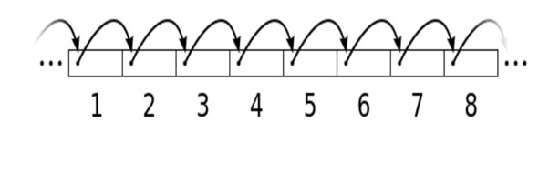
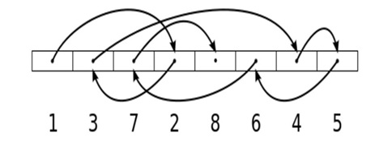

# RA1. Acceso a ficheros

!!! info "RA1"
    Desarrolla aplicaciones que gestionan información almacenada en ficheros identificando el campo de aplicación de los mismos y utilizando clases específicas.


<span class="mi_h3">Revisiones</span>

|Revisión | Fecha      | Descripción|
|---------|------------|-------------|
|1.0 | 13-07-2026 | Adaptación de los materiales a markdown|


## 1. Introducción

Un **fichero o archivo** es una unidad de almacenamiento de datos en un sistema informático. Es un conjunto de información (secuencia de bytes) organizada y almacenada en un dispositivo de almacenamiento (disco duro, memoria USB o un servidor en la nube). Los datos guardados en ficheros persisten más allá de la ejecución de la aplicación que los trata. La utilización de ficheros es una alternativa sencilla y eficiente a las bases de datos.

<span class="mi_h3">Características de un fichero</span>

- **Nombre:** Cada fichero tiene un nombre único dentro de su directorio.
- **Extensión:** Indica su tipo (`.txt` para texto, `.jpg` para imágenes, etc.).
- **Ubicación:** Directorios (carpetas) dentro del sistema de ficheros.
- **Contenido:** Texto, imágenes, vídeos, código fuente, bases de datos, etc.
- **Permisos de acceso:** Se pueden configurar para permitir o restringir la lectura, escritura o ejecución a determinados usuarios o programas.

<span class="mi_h3">Tipos de ficheros</span>

- **De texto:** Formato legible por humanos (`.txt`, `.csv`, `.json`, `.xml`). Por ejemplo: un catálogo de especies en formato CSV o JSON.
- **Binarios:** Formato no legible directamente (`.exe`, `.jpg`, `.mp3`, `.dat`). Por ejemplo: fotografías de hojas y flores en alta resolución.
- **De código fuente:** Contienen instrucciones escritas en lenguajes de programación (`.java`, `.kt`, `.py`).
- **De configuración:** Almacenan parámetros de configuración de programas (`.ini`, `.conf`, `.properties`, `.json`).
- **De bases de datos:** Se utilizan para almacenar grandes volúmenes de datos estructurados (`.db`, `.sql`).
- **Historial:** De eventos o errores en un sistema (`.log`).

<span class="mi_h3">API para manejo de ficheros</span>

`java.nio` (New IO) es una API que permite mejorar el rendimiento, así como simplificar el manejo de muchas operaciones. Funciona a través de interfaces y clases para que la máquina virtual Java tenga acceso a ficheros, atributos de ficheros y sistemas de ficheros. En los siguientes apartados veremos cómo trabajar con ella.


<span class="mi_h3">Formas de acceso</span>

El acceso a ficheros es una tarea fundamental en la programación, ya que permite leer y escribir datos persistentes. Según sus características y necesidades, existen dos formas principales de acceder a un fichero:

**Acceso secuencial**

- Los datos se procesan en orden, desde el principio hasta el final del fichero.
- Es el más común y sencillo.
- Se usa cuando se desea leer todo el contenido o recorrer registro por registro. Por ejemplo: lectura de un catálogo de plantas línea por línea, o de un fichero binario de taxonomía registro a registro.



**Acceso aleatorio**

- Permite saltar a una posición concreta del fichero sin necesidad de leer lo anterior.
- Es útil cuando los registros tienen un tamaño fijo y se necesita eficiencia (por ejemplo, ir directamente a los datos de la planta número 100 de un fichero indexado).
- Requiere técnicas más avanzadas como el uso de `FileChannel`, `SeekableByteChannel` o `RandomAccessFile`.





## 2. Gestión de ficheros y directorios

La gestión de ficheros y directorios se realiza a través de `Path` y `Files`.

**Path**

Representa una **ruta** en el sistema de ficheros (ej. `/home/botanico/rosa.png` o `C:\herbario\docs\clasificacion.txt`). Un objeto `Path` es una dirección y no significa que el fichero o directorio exista realmente en el disco.

| Método | Descripción                                                                                                        |
| :--- |:-------------------------------------------------------------------------------------------------------------------|
| `Path.of(String)` | Crea un objeto `Path` a partir de un String de ruta, auqnue puede admitir más parámetros `Path.of(first, more...)`.                         |
| `toString()` | Devuelve la ruta como un String (se llama por defecto desde `println`).                                            |
| `toAbsolutePath()` | Devuelve la ruta absoluta del `Path`.                                                                              |
| `fileName()` | Devuelve el nombre del fichero o directorio final de la ruta (por ejemplo, el nombre de la planta o el documento). |

<span class="mis_ejemplos">Ejemplo 1</span>

El siguiente código demuestra cómo crear y mostrar distintos tipos de rutas (no intenta acceder a los ficheros o directorios, por tanto pueden existir o no):

```kotlin
import java.nio.file.Path

fun main() {
    rutas()
}

fun rutas() {
    // Path relativo al directorio del proyecto (carpeta de muestras)
    val rutaRelativa: Path = Path.of("muestras", "orquidea.jpg")

    // Path absoluto en Windows
    val rutaAbsolutaWin: Path = Path.of("C:", "Herbario", "Especies", "Helechos")

    // Path absoluto en Linux/macOS
    val rutaAbsolutaNix: Path = Path.of("/home/botanico/jardin/flora_mediterranea")

    println("Ruta relativa: " + rutaRelativa) // Muestra la ruta relativa
    println("Ruta absoluta: " + rutaRelativa.toAbsolutePath()) // Ruta completa
    println("Ruta absoluta Windows: " + rutaAbsolutaWin)
    println("Ruta absoluta Linux: " + rutaAbsolutaNix)
}
```

!!! success "Prueba y analiza el ejemplo"
    Prueba el código de ejemplo y verifica que la salida por consola es:

    ```text
    Ruta relativa: muestras\orquidea.jpg
    Ruta absoluta: D:\kot\ficheros\muestras\orquidea.jpg
    Ruta absoluta Windows: C:\Herbario\Especies\Helechos
    Ruta absoluta Linux: /home/botanico/jardin/flora_mediterranea
    ```


**Files**

Es una clase de utilidad con las acciones (borrar, copiar, mover, leer, etc.) que podemos realizar sobre las rutas (`Path`). Algunos de sus principales métodos son:

| Método | Descripción                                                                                                                                                                                                                                                            |
| :--- |:-----------------------------------------------------------------------------------------------------------------------------------------------------------------------------------------------------------------------------------------------------------------------|
| `exists()`, `isDirectory()`, `isRegularFile()`, `isReadable()` | Verificar la existencia y accesibilidad de un elemento botánico o carpeta.                                                                                                                                                                                             |
| `list()`, `walk()` | Listar el contenido de un directorio.                                                                                                                                                                                                                                  |
| `readAttributes()` | Obtener atributos (tamaño del archivo de imagen, fecha de registro de la muestra, etc.).                                                                                                                                                                               |
| `createDirectory()` | Crear un directorio. Solo crea el directorio final y espera que todo el "camino" hasta él ya exista.                                                                                                                                                                   |
| `createDirectories()` | Crea un directorio y también los directorios padre si no existen (ej. crear `/plantas/terrestres/helechos/`). Es la forma más segura.                                                                                                                                  |
| `createFile()` | Crear un nuevo fichero.                                                                                                                                                                                                                                                |
| `delete()` | Borrar un fichero o directorio (lanza una excepción si el borrado falla). Lanza `NoSuchFileException` si el fichero o directorio no existe. También lanza `DirectoryNotEmptyException` si intentas borrar un directorio no vacío. Es más seguro usar `deleteIfExists()`. |
| `move(origen, destino)` | Mover o renombrar un fichero o directorio (por ejemplo, reclasificar una especie).                                                                                                                                                                                     |
| `copy(origen, destino)` | Copiar un fichero o directorio. Si el destino ya existe, se puede sobrescribir utilizando `copy(Path, Path, REPLACE_EXISTING)`. Si se copia un directorio, no se copiará su contenido (el nuevo directorio estará vacío).                                              |


<span class="mis_ejemplos">Ejemplo 2</span>

Partimos de una carpeta llamada `muestras` donde guardamos fotos, descripciones de texto y registros de audio de la naturaleza sin ningún orden. Este programa organizará automáticamente los archivos en subcarpetas según su formato (extensión) para que el herbario quede perfectamente estructurado.

> Puedes descargar la carpeta del ejemplo comprimida desde el siguiente enlace: [muestras.zip](recursos/muestras.zip){:muestras.zip}). La carpeta debe estar ubicada en la raíz del proyecto de IntelliJ (al mismo nivel que la carpeta `src` y que el archivo `build.gradle.kts`).


```kotlin

import java.nio.file.Path
import java.nio.file.Files
import java.nio.file.StandardCopyOption
import kotlin.io.path.extension // Extensión de Kotlin para obtener la extensión

fun main() {
    organizar()
}

fun organizar(){
    // 1. Ruta de la carpeta de muestras botánicas a organizar
    val carpeta = Path.of("muestras")

    println("--- Iniciando la clasificación botánica en la carpeta: " + carpeta + " ---")
    try {
        // 2. Recorrer la carpeta desordenada y utilizar .use para asegurar el cierre de recursos
        Files.list(carpeta).use { streamDePaths ->
            streamDePaths.forEach { pathFichero ->
                // 3. Solo nos interesan los ficheros de muestras, ignoramos subcarpetas
                if (Files.isRegularFile(pathFichero)) {

                    // 4. Obtener la extensión del fichero (ej: "jpg", "txt", "mp3")
                    val extension = pathFichero.extension.lowercase()
                    if (extension.isBlank()) {
                        println("-> Ignorando fichero sin tipo: " + pathFichero.fileName)
                        return@forEach // Salta a la siguiente muestra
                    }

                    // 5. Crear la ruta de destino dentro de la carpeta correspondiente
                    val carpetaDestino = carpeta.resolve(extension)

                    // 6. Crear el directorio de destino de la categoría si no existe
                    if (Files.notExists(carpetaDestino)) {
                        println("-> Creando nueva sección para ficheros: ." + extension)
                        Files.createDirectories(carpetaDestino)
                    }

                    // 7. Mover la muestra botánica a su nueva ubicación clasificada
                    val pathDestino = carpetaDestino.resolve(pathFichero.fileName)
                    Files.move(pathFichero, pathDestino, StandardCopyOption.REPLACE_EXISTING)
                    println("-> Clasificando " + pathFichero.fileName + " en la carpeta [." + extension + "]")
                }
            }
        }
        println("\n--- ¡Clasificación del herbario completada con éxito! ---")
    } catch (e: Exception) {
        println("\n--- Ocurrió un error durante la clasificación de muestras ---")
        e.printStackTrace()
    }
}
```


!!! success "Prueba y analiza el ejemplo"
    Prueba el código de ejemplo y verifica que la salida por consola es:

    ```text
    --- Iniciando la clasificación botánica en la carpeta: muestras ---
    -> Creando nueva sección para ficheros: .txt
    -> Clasificando flor.txt en la carpeta [.txt]
    -> Clasificando arbusto.txt en la carpeta [.txt]
    -> Creando nueva sección para ficheros: .jpg
    -> Clasificando 20191106_071048.jpg en la carpeta [.jpg]
    -> Clasificando 20191101_071830.jpg en la carpeta [.jpg]
    -> Creando nueva sección para ficheros: .mp3
    -> Clasificando pad-harmonious-and-soothing-voice-like-background.mp3 en la carpeta [.mp3]
    -> Clasificando dark-cinematic-atmosphere.mp3 en la carpeta [.mp3]
    -> Creando nueva sección para ficheros: .mp4
    -> Clasificando 293968_small.mp4 en la carpeta [.mp4]
    -> Creando nueva sección para ficheros: .pdf
    -> Clasificando lorem-ipsum-1.pdf en la carpeta [.pdf]
    -> Clasificando lorem-ipsum-2.pdf en la carpeta [.pdf]
    
    --- ¡Clasificación del herbario completada con éxito! ---
    ```


<span class="mi_h3">Técnicas para recorrer un directorio</span>

Como hemos visto en el clasificador anterior, recorrer directorios para "mirar" o gestionar su contenido es clave. Aquí analizamos los diferentes métodos para hacerlo:

**1. `Files.list(path)`:** Lista únicamente el contenido del directorio especificado **sin acceder a las subcarpetas**. Es ideal para operaciones superficiales (como nuestra clasificación anterior, donde solo queríamos trabajar a primer nivel).

- **Ventajas:**
    * Rápido y eficiente al no ser recursivo.
    * Control preciso, operando solo en el primer nivel del directorio.
    * Devuelve un `Stream` de Java que permite usar operadores funcionales (`filter`, `map`, etc.) de forma segura con `.use`.

- **Inconvenientes:**
    * No explora subdirectorios.
    * Para recorrer un árbol completo, se necesita implementar la recursividad manualmente.

**2. `Files.walk(path)`:** Recorre un directorio y todo su contenido **recursivamente**. Entra en cada subcarpeta y en sus subcarpetas de manera sucesiva. Es extremadamente útil para búsquedas globales en el herbario (ej. buscar fotos de flores en cualquier rincón del proyecto, borrar reportes temporales o contar ficheros de registros).

- **Ventajas:**
    * Recorre árboles de directorios completos (recursivo) de forma muy sencilla.
    * Extremadamente potente para búsquedas profundas o para aplicar operaciones en cascada.
    * Devuelve un `Stream`, permitiendo un filtrado muy expresivo.
  
- **Inconvenientes:**
    * Puede ser lento y consumir más memoria en estructuras gigantescas con miles de subcarpetas y ficheros.
    * Es una herramienta excesiva ("overkill") si solo necesitas leer el nivel superior.

**3. `Files.newDirectoryStream(path)`:** Es similar a `Files.list()`, pues lista solo el contenido inmediato. La diferencia es que no devuelve un `Stream` de Java 8, sino un `DirectoryStream`, una versión más antigua optimizada para bucles tradicionales `for`.

- **Ventajas:**
    * Utiliza un bucle for-each tradicional, que puede resultar más familiar a nivel sintáctico.
  
- **Inconvenientes:**
    * **¡PELIGRO!** Requiere cerrar el recurso manualmente (`.close()`). Si se olvida, provoca fugas de recursos (*resource leaks*).
    * Es menos expresivo que los Streams, ya que no se pueden encadenar operadores funcionales fácilmente.
    * Es preferible utilizar `Files.list().use { ... }`.


<span class="mis_ejemplos">Ejemplo 3:</span>

Despues de clasificar nuestros archivos, queremos crear un listado para ver como ha quedado la estructura de nuestra carpeta `muestras`. Necesitamos listar cada una de las subcarpetas de clasificación y ver qué muestras hay dentro de cada una de ellas de forma jerárquica.

```kotlin
import java.nio.file.Path
import java.nio.file.Files

fun main() {
    listado()
}

fun listado(){
    val carpetaPrincipal = Path.of("muestras")

    println("--- Estructura final del Herbario Digital con Files.walk() ---")
    try {
        Files.walk(carpetaPrincipal).use { stream ->
            // Ordenar el stream para una visualización ordenada por categorías
            stream.sorted().forEach { path ->
                // Calcular profundidad para la indentación
                // Restamos el número de componentes de la ruta base para que la raíz no tenga sangrado
                val profundidad = path.nameCount - carpetaPrincipal.nameCount
                val indentacion = "\t".repeat(profundidad)

                // Determinamos si es una sección (categoría/directorio) o un registro (fichero)
                val prefijo = if (Files.isDirectory(path)) "[CATEGORÍA]" else "[MUESTRA]"

                // No imprimimos la propia carpeta raíz, solo su contenido clasificado
                if (profundidad > 0) {
                    println("$indentacion$prefijo ${path.fileName}")
                }
            }
        }
    } catch (e: Exception) {
        println("\n--- Ocurrió un error durante la generación del informe botánico ---")
        e.printStackTrace()
    }
}
```

!!! success "Prueba y analiza el ejemplo"
    Prueba el código de ejemplo y verifica que la salida por consola es:

    ```text
    --- Estructura final del Herbario Digital con Files.walk() ---
        [CATEGORÍA] jpg
            [MUESTRA] 20191101_071830.jpg
            [MUESTRA] 20191106_071048.jpg
        [CATEGORÍA] mp3
            [MUESTRA] dark-cinematic-atmosphere.mp3
            [MUESTRA] pad-harmonious-and-soothing-voice-like-background.mp3
        [CATEGORÍA] mp4
            [MUESTRA] 293968_small.mp4
        [CATEGORÍA] pdf
            [MUESTRA] lorem-ipsum-1.pdf
            [MUESTRA] lorem-ipsum-2.pdf
        [CATEGORÍA] txt
            [MUESTRA] arbusto.txt
            [MUESTRA] flor.txt
    ```


## 3. Ficheros de texto

Los ficheros de texto son legibles directamente por humanos y son una buena opción para guardar información después de cerrar el programa. A continuación se muestran algunas clases y métodos para leer y escribir información en ellos:

| Método | Descripción |
| :--- | :--- |
| `Files.readAllLines(path)` | Devuelve un `List<String>`. Se utiliza para leer todas las líneas de un fichero. |
| `Files.exists(path)` | Verifica la existencia de un fichero o directorio. |
| `split()`, `trim()`, `toIntOrNull()` | Métodos habituales de String para procesar y limpiar el texto leído. |
| `Files.write(path, lines)` | Escribe una lista de líneas (`List<String>`) en un fichero. |
| `StandardOpenOption.READ` | Abre un fichero en modo lectura. |
| `StandardOpenOption.WRITE` | Abre un fichero en modo escritura. |
| `StandardOpenOption.APPEND` | Agrega contenido al final del fichero sin borrar lo anterior. |
| `StandardOpenOption.CREATE` | Si el fichero no existe, lo crea automáticamente. |
| `StandardOpenOption.TRUNCATE_EXISTING` | Si el fichero ya existe, borra su contenido antes de escribir. |
| `Files.newBufferedReader(Path)` <br> `Files.newBufferedWriter(Path)` | Métodos más eficientes para el manejo de ficheros grandes mediante búferes de memoria. |
| `Files.readString(Path)` <br> `Files.writeString(Path, String)` | Permite realizar la lectura o escritura completa del contenido del fichero como un único bloque de texto (disponible desde Java 11+). |

Dentro de los ficheros de texto existen **ficheros de texto plano** (sin ningún tipo de estructura interna) como los TXT y **ficheros de texto estructurado** (en los que la información sigue una organización) como pueden ser CSV, JSON o XML.


<span class="mis_ejemplos">Ejemplo 4: Escritura y lectura de ficheros de texto plano</span>

El siguiente ejemplo muestra como leer y escribir información en un ficheros de texto plano `.txt`.

```kotlin
import java.nio.file.Files
import java.nio.charset.StandardCharsets

fun main() {
    textoPlano()
}


fun textoPlano(){

    // Ruta del fichero con el que vamos a trabajar
    val ruta = Path.of("muestras/anotacion.txt")

    Files.createDirectories(ruta.parent) // Crea la carpeta "muestras" si no existe

    // Escritura de una línea writeString (si no existe lo crea y si existe lo vacía)
    val anotacion = "Cuidados de orquídeas realizados."
    Files.writeString(ruta, anotacion, StandardOpenOption.CREATE, StandardOpenOption.TRUNCATE_EXISTING)

    // Lectura rápida de todo el bloque con readString
    val contenidoCompleto = Files.readString(ruta)
    println("--- 1. Contenido del fichero leído con readString: ---")
    println(contenidoCompleto)


    // Escritura de múltiples líneas en un fichero de texto con Files.write
    val lineas = listOf(
        "\n1. Regar cuando las raíces se observen de color grisáceo.",
        "2. Mantener en un espacio con luz indirecta.",
        "3. Evitar corrientes de aire."
    )
    Files.write(ruta, lineas, StandardCharsets.UTF_8, StandardOpenOption.APPEND)

    // Lectura con readAllLines (devuelve una lista línea por línea)
    val lineasLeidas = Files.readAllLines(ruta)
    println("\n--- 2. Contenido leído con readAllLines: ---")
    for (linea in lineasLeidas) {
        println(linea)
    }

    

    // Escribir registros de actividad (Logs) con Buffered Writer
    Files.newBufferedWriter(ruta, StandardOpenOption.APPEND).use { writer ->
        writer.write("[SISTEMA] Invernadero automatizado iniciado...\n")
        writer.write("[SENSOR] Nivel de humedad óptimo detectado (75%).\n")
    }

    // Lectura secuencial eficiente con newBufferedReader
    println("\n--- 3. Contenido leído con newBufferedReader: ---")
    Files.newBufferedReader(ruta).use { reader ->
        reader.lineSequence().forEach { linea ->
            println(linea)
        }
    }
}
```


!!! success "Prueba y analiza el ejemplo"
    Prueba el código de ejemplo y verifica que la salida por consola es:

    ```text
    --- 1. Contenido del fichero leído con readString: ---
    Cuidados de orquídeas realizados.

    --- 2. Contenido leído con readAllLines: ---
    Cuidados de orquídeas realizados.
    1. Regar cuando las raíces se observen de color grisáceo.
    2. Mantener en un espacio con luz indirecta.
    3. Evitar corrientes de aire.

    --- 3. Contenido leído con newBufferedReader: ---
    Cuidados de orquídeas realizados.
    1. Regar cuando las raíces se observen de color grisáceo.
    2. Mantener en un espacio con luz indirecta.
    3. Evitar corrientes de aire.
      [SISTEMA] Invernadero automatizado iniciado...
      [SENSOR] Nivel de humedad óptimo detectado (75%).
    ```


## 4. Ficheros de intercambio de información

Los ficheros de texto en los que la información está estructurada y organizada de una manera predecible permiten que distintos sistemas la lean y entiendan de forma automática. Estos tipos de ficheros se utilizan habitualmente en el desarrollo de software para intercambiar datos entre diferentes aplicaciones. Los formatos más comunes y estandarizados son **CSV, JSON y XML**.

Para poder llevar a cabo este intercambio, es necesario extraer la información del fichero de origen. Este proceso no suele realizarse línea por línea manualmente, sino que el contenido del fichero se lee (parsea) y se traduce a objetos utilizando técnicas de **serialización y deserialización**:

- **Serialización:** Proceso de convertir un objeto en memoria (por ejemplo, una clase `Planta` o `Especie`) en una representación textual (como una cadena JSON o XML) que se puede almacenar en un fichero o enviar a través de una red.
- **Deserialización:** El proceso inverso; consiste en leer un fichero estructurado (JSON, XML, etc.) y reconstruir el objeto original en la memoria del programa para poder trabajar con él de forma estructurada.


A continuación se describen los 3 formatos de intercambio de información basados en texto más comunes, con ejemplos de lectura y escritura integrando un proyecto gestionado con **Gradle**.


<span class="mi_h3">4.1. CSV (Comma-Separated Values)</span>

Los ficheros **CSV** son archivos de texto plano con valores separados por un delimitador predeterminado (una coma, punto y coma, tabulador, etc.). Son la herramienta ideal para exportar e importar datos tabulares desde software como Excel, Google Sheets o gestores de bases de datos relacionales.

En Kotlin, se pueden procesar con librerías tradicionales como *OpenCSV* o mediante alternativas más modernas e idiomáticas como **Kotlin-CSV** (la cual utilizaremos).

**Métodos principales de Kotlin-CSV:**

| Método | Descripción                                                                                                                                                                                            | Ejemplo de uso |
| :--- |:-------------------------------------------------------------------------------------------------------------------------------------------------------------------------------------------------------| :--- |
| `readAll(File)` | Lee todo el fichero CSV y devuelve una lista de listas de cadenas (`List<List<String>>`), donde cada sublista representa una fila.                                                                     |
| `readAllWithHeader(File)` | Lee el fichero CSV utilizando la primera línea como cabecera. Devuelve una lista de mapas (`List<Map<String, String>>`), ideal para acceder a los valores por el nombre de su columna.                 |
| `open { readAllAsSequence() }` | Abre el archivo y procesa las filas como una secuencia (`Sequence`). Es el método más eficiente y recomendado para ficheros CSV de gran tamaño, ya que no carga todo el contenido en memoria de golpe. |
| `writeAll(data, File)` | Escribe una colección completa de filas (lista de listas de cadenas) en el fichero CSV de una sola vez.                                                                                                |
| `writeRow(row, File)` | Escribe una única fila (lista de cadenas) al final del fichero CSV indicado.                                                                                                                           |
| `writeAllWithHeader(data, File)` | Escribe los datos en el fichero CSV generando automáticamente una fila de cabecera en base a las claves del mapa proporcionado.                                                                        |
| `delimiter` | Permite personalizar el carácter delimitador que separa los campos del CSV (por defecto es la coma `,`, pero se puede cambiar. Ejemplo: `csvReader { delimiter = ';' }`                                |


<span class="mis_ejemplos">Ejemplo 5: Lectura y escritura de ficheros CSV</span>

Partimos de un fichero llamado `plantas.csv` almacenado dentro de la carpeta `datos` de nuestro proyecto con la siguiente información:

```text
1;Aloe Vera;Aloe barbadensis miller;7;0.6
2;Lavanda;Lavandula angustifolia;3;1.0
3;Helecho de Boston;Nephrolepis exaltata;5;0.9
4;Bambú de la suerte;Dracaena sanderiana;4;1.5
5;Girasol;Helianthus annuus;2;3.0
```

Como puedes observar el carácter delimitador que separa los campos del CSV es un punto y coma (`;`) y los campos que representan la estructura de una planta son los siguientes:

-   `id_planta` (Int)
-   `nombre_comun` (String)
-   `nombre_cientifico` (String)
-   `riego` (Int - frecuencia en días)
-   `altura` (Double - altura máxima en metros)


> Puedes descargar el fichero desde este enlace: [plantas.csv](recursos/plantas.csv){:plantas.csv} y guardarlo en una carpeta llamada `datos` que deberás crear en la raíz del proyecto de IntelliJ (al mismo nivel que la carpeta `src` y que el archivo `build.gradle.kts`).


Para que nuestra aplicación pueda utilizar las funciones de la librería **Kotlin-CSV** hemos de configurar la dependencia correspondiente en el archivo `build.gradle.kts`. Esta es la línea que hay que añadir:

```kotlin
dependencies {
    implementation("com.github.doyaaaaaken:kotlin-csv-jvm:1.9.1")
}
```

> Recuerda hace clic en el botón de sincronizar dependencias para que **Gradle** se las descargue o no podrás utilizar sus funciones.

El siguiente código lee la información del fichero `plantas.csv`, la muestra por pantalla y la escribe en otro fichero llamado `plantas2.csv` dentro de la misma carpeta.

```kotlin
import java.nio.file.Path
import java.io.File
import java.nio.file.Files

import com.github.doyaaaaaken.kotlincsv.dsl.csvReader
import com.github.doyaaaaaken.kotlincsv.dsl.csvWriter

// Data class que modela la estructura de la planta
data class Planta(
    val idPlanta: Int,
    val nombreComun: String,
    val nombreCientifico: String,
    val riego: Int,
    val altura: Double
)

fun main() {
    gestionCSV()
}

fun gestionCSV(){

    val entradaCSV = Path.of("datos/plantas.csv")
    val salidaCSV = Path.of("datos/plantas2.csv")

    // Leer los datos estructurados del CSV y guardarlos en una lista de objetos Planta
    val datos: List<Planta> = leerDatosCSV(entradaCSV)

    // Mostrar por consola la información deserializada
    println("--- Información de la lista de objetos Planta")
    for (dato in datos) {
        println("  - ID: ${dato.idPlanta}, Nombre común: ${dato.nombreComun}, Científico: ${dato.nombreCientifico}, Riego: cada ${dato.riego} días, Altura: ${dato.altura}m")
    }

    // Guardar una copia procesada en un nuevo fichero CSV
    escribirCSV(salidaCSV, datos)

}

fun leerDatosCSV(ruta: Path): List<Planta> {
    var plantas: List<Planta> = emptyList()

    if (!Files.isReadable(ruta)) {
        println("Error: No se puede leer el fichero en la ruta: $ruta")
    } else {
        val reader = csvReader {
            delimiter = ';'
        }

        // Leemos todas las filas del CSV (devuelve List<List<String>>)
        val filas: List<List<String>> = reader.readAll(ruta.toFile())

        // Convertimos las filas de texto en objetos Planta válidos
        plantas = filas.mapNotNull { columnas ->
            if (columnas.size >= 5) {
                try {
                    val id = columnas[0].toInt()
                    val nombreComun = columnas[1]
                    val nombreCientifico = columnas[2]
                    val riego = columnas[3].toInt()
                    val altura = columnas[4].toDouble()
                    Planta(id, nombreComun, nombreCientifico, riego, altura)
                } catch (e: Exception) {
                    println("Fila inválida ignorada: $columnas -> Error: ${e.message}")
                    null
                }
            } else {
                println("Fila con formato incompleto ignorada: $columnas")
                null
            }
        }
    }
    println("--- Información leída con éxito de: $ruta")
    return plantas
}

fun escribirCSV(ruta: Path, plantas: List<Planta>) {
    try {
        val fichero: File = ruta.toFile()
        csvWriter {
            delimiter = ';'
        }.writeAll(
            plantas.map { planta ->
                listOf(
                    planta.idPlanta.toString(),
                    planta.nombreComun,
                    planta.nombreCientifico,
                    planta.riego.toString(),
                    planta.altura.toString()
                )
            },
            fichero
        )
        println("--- Información guardada con éxito en: $fichero")
    } catch (e: Exception) {
        println("Error al escribir el fichero CSV: ${e.message}")
    }
}
```


!!! success "Prueba y analiza el ejemplo"
    Prueba el código de ejemplo y verifica que la salida por consola es:

    ```text
    --- Información leída con éxito de: datos\plantas.csv
    --- Información de la lista de objetos Planta
    - ID: 1, Nombre común: Aloe Vera, Cientéfico: Aloe barbadensis miller, Riego: cada 7 días, Altura: 0.6m
    - ID: 2, Nombre común: Lavanda, Cientéfico: Lavandula angustifolia, Riego: cada 3 días, Altura: 1.0m
    - ID: 3, Nombre común: Helecho de Boston, Cientéfico: Nephrolepis exaltata, Riego: cada 5 días, Altura: 0.9m
    - ID: 4, Nombre común: Bambú de la suerte, Cientéfico: Dracaena sanderiana, Riego: cada 4 días, Altura: 1.5m
    - ID: 5, Nombre común: Girasol, Cientéfico: Helianthus annuus, Riego: cada 2 días, Altura: 3.0m
    --- Información guardada con éxito en: datos\plantas2.csv
    ```


!!! warning "Práctica 1: crea la base de tu proyecto"
    En esta práctica daremos forma a la base de nuestro proyecto. Diseñaremos nuestra estructura de datos principal, crearemos nuestro primer fichero de datos en formato **CSV** y programaremos un menú para que el usuario interactúe con la aplicación por consola. A medida que avancemos iremos añadiendo funciones a este proyecto.

    **Realiza los siguientes pasos:**

    1. **Crea tu proyecto:** Elige la temática de tu proyecto de entre las propuestas por la profesora y busca un nombre. Luego crea el proyecto desde intelliJ para programar con Kotlin y Gradle.
    2. **Diseña tu data class:** Define una `data class` en Kotlin que represente un elemento individual de tu colección. Debe incluir obligatoriamente un identificador único o ID (`Int`), un nombre descriptivo (`String`) y al menos tres atributos adicionales (uno de ellos debe ser de tipo `Double`).
    3. **Crea tu fichero de datos inicial:** Genera manualmente un fichero con extensión `.csv` con al menos 5 registros que cumplan con la estructura de tu *data class*. Utiliza el punto y coma (`;`) como delimitador y guárdalo dentro de una carpeta llamada `datos` que deberás crear en la raíz de tu proyecto (al mismo nivel que la carpeta `src` y que el archivo `build.gradle.kts`).
    4. **Crea un menú de consola interactivo:** Programa un bucle en tu función `main()` que mantenga la aplicación en ejecución y muestre un menú en la consola con las siguientes opciones:

        ```text
        --------------------------------------        
        ----------- MENÚ PRINCIPAL -----------
        --------------------------------------
        1. Leer datos desde CSV
        0. Salir
        ```

    5. **Implementa la lectura del CSV:** Cuando el usuario seleccione la opción `1`, llama a una función, por ejemplo, `leerCSV()` que compruebe la existencia del fichero y, si existe, lo lea, deserialice las líneas a objetos de tu *data class* y muestre la lista formateada por consola.

    **Aspectos Técnicos Obligatorios:**

    - Se añaden las librerías necesarias en las dependencias del archivo `build.gradle.kts`.
    - El menú debe repetirse hasta que el usuario decida salir (opción 0). Si el usuario introduce letras, espacios en blanco o números fuera del rango del menú, el programa debe mostrar un aviso amigable y volver a mostrar las opciones sin detener su ejecución.
    - Se utilizan las clases `java.nio.file.Path` y `java.nio.file.Files` para gestionar rutas y se comprueba que los ficheros existen antes de leerlos.
    - Se gestionan adecuadamente las excepciones y la aplicación no se detiene inesperadamente.
    - Se controlan fallos de formato (ej. datos corruptos al parsear números) para asegurar que el programa no cae de forma inesperada si un fichero contiene errores.


<span class="mi_h3">4.2. XML (eXtensible Markup Language)</span>

Los ficheros **XML** son estructurados y extensibles. Se organizan utilizando un sistema de etiquetas jerárquicas anidadas similar al HTML. Permiten la validación estructural mediante esquemas (XSD) y son muy demandados en entornos empresariales consolidados (sistemas *legacy*).

Para interactuar con XML en Kotlin, utilizaremos el ecosistema **Jackson XML** (`XmlMapper`), que automatiza el mapeo directo de clases a etiquetas.

**Métodos clave de `XmlMapper`:**

| Método | Descripción                                                                                     |
| :--- |:------------------------------------------------------------------------------------------------|
| `readValue(File, Class<T>)` | Parsea un fichero físico XML y lo transforma en un objeto o estructura en memoria.              |
| `writeValue(File, Object)` | Guarda la representación XML de un objeto de forma directa en un fichero del sistema.           |
| `writeValueAsString(Object)` | Convierte el objeto a formato de texto plano estructurado como XML (String).                    |
| `registerModule(Module)` | Registra extensiones como `KotlinModule` para dar soporte nativo a tipos específicos de Kotlin. |
| `enable(SerializationFeature.INDENT_OUTPUT)` | Activa el formateado legible (identación/tabulado) para las salidas escritas.                   |


<span class="mis_ejemplos">Ejemplo 6: Lectura y escritura de ficheros XML</span>


Partimos de un fichero llamado `plantas.xml` almacenado dentro de la carpeta `datos` de nuestro proyecto con la siguiente información:

```xml
<plantas>
    <planta>
        <id_planta>1</id_planta>
        <nombre_comun>Aloe Vera</nombre_comun>
        <nombre_cientifico>Aloe barbadensis miller</nombre_cientifico>
        <frecuencia_riego>7</frecuencia_riego>
        <altura_maxima>0.6</altura_maxima>
    </planta>
    <planta>
        <id_planta>2</id_planta>
        <nombre_comun>Lavanda</nombre_comun>
        <nombre_cientifico>Lavandula angustifolia</nombre_cientifico>
        <frecuencia_riego>3</frecuencia_riego>
        <altura_maxima>1.0</altura_maxima>
    </planta>
</plantas>
```


> Puedes descargar el fichero desde este enlace: [plantas.xml](recursos/plantas.xml){:plantas.xml} y guardarlo en una carpeta llamada `datos` que deberás crear en la raíz del proyecto de IntelliJ (al mismo nivel que la carpeta `src` y que el archivo `build.gradle.kts`).


Para que nuestra aplicación pueda utilizar las funciones de la librería **Jackson XML** (`XmlMapper`) hemos de configurar la dependencia correspondiente en el archivo `build.gradle.kts`. Estas son las líneas que hay que añadir:


```kotlin
dependencies {
    implementation("com.fasterxml.jackson.dataformat:jackson-dataformat-xml:2.17.0")
    implementation("com.fasterxml.jackson.module:jackson-module-kotlin:2.17.0")
}
```

> Recuerda hace clic en el botón de sincronizar dependencias para que **Gradle** se las descargue o no podrás utilizar sus funciones.


El siguiente código lee la información del fichero `plantas.xml`, la muestra por pantalla y la escribe en otro fichero llamado `plantas2.xml` dentro de la misma carpeta.

```kotlin
import java.nio.file.Path
import java.io.File
import java.nio.file.Files

import com.fasterxml.jackson.dataformat.xml.XmlMapper
import com.fasterxml.jackson.dataformat.xml.annotation.JacksonXmlRootElement
import com.fasterxml.jackson.dataformat.xml.annotation.JacksonXmlElementWrapper
import com.fasterxml.jackson.dataformat.xml.annotation.JacksonXmlProperty
import com.fasterxml.jackson.module.kotlin.readValue
import com.fasterxml.jackson.module.kotlin.registerKotlinModule

// Clase que modela los nodos individuales <planta>
data class PlantaXML(
    @JacksonXmlProperty(localName = "id_planta")
    val idPlanta: Int,
    @JacksonXmlProperty(localName = "nombre_comun")
    val nombreComun: String,
    @JacksonXmlProperty(localName = "nombre_cientifico")
    val nombreCientifico: String,
    @JacksonXmlProperty(localName = "frecuencia_riego")
    val riego: Int,
    @JacksonXmlProperty(localName = "altura_maxima")
    val altura: Double
)

// Clase contenedora que representará la etiqueta raíz <plantas>
@JacksonXmlRootElement(localName = "plantas")
data class PlantasWrapper(
    @JacksonXmlElementWrapper(useWrapping = false)
    @JacksonXmlProperty(localName = "planta")
    val listaPlantas: List<PlantaXML> = emptyList()
)

fun main() {
    gestionXML()
}


fun gestionXML(){

    val entradaXML = Path.of("datos/plantas.xml")
    val salidaXML = Path.of("datos/plantas2.xml")

    val datos = leerDatosXML(entradaXML)

    println("--- Información de la lista de objetos PlantaXML")
    for (planta in datos) {
        println(" - ID: ${planta.idPlanta}, Común: ${planta.nombreComun}, Riego: cada ${planta.riego} días")
    }

    escribirDatosXML(salidaXML, datos)
}


fun leerDatosXML(ruta: Path): List<PlantaXML> {
    var contenedor = PlantasWrapper(emptyList())

    if (!Files.isReadable(ruta)) {
        println("Error: No se puede leer el fichero en la ruta: $ruta")
    } else {
        val fichero = ruta.toFile()
        val xmlMapper = XmlMapper().registerKotlinModule()

        // Leemos el XML directamente sobre la clase contenedora wrapper
        contenedor = xmlMapper.readValue(fichero)
        println("--- Información leída con éxito de: $ruta")
    }
    return contenedor.listaPlantas
}

fun escribirDatosXML(ruta: Path, plantas: List<PlantaXML>) {
    try {
        val fichero = ruta.toFile()
        val contenedor = PlantasWrapper(plantas)
        val xmlMapper = XmlMapper().registerKotlinModule()

        // Generamos el XML formateado con saltos de línea y tabuladores para que sea legible
        val xmlString = xmlMapper.writerWithDefaultPrettyPrinter().writeValueAsString(contenedor)
        fichero.writeText(xmlString)

        println("--- Información guardada en XML: $fichero")
    } catch (e: Exception) {
        println("Error al guardar XML: ${e.message}")
    }
}
```


!!! success "Prueba y analiza el ejemplo"
    Prueba el código de ejemplo y verifica que la salida por consola es:

    ```text
    --- Información leída con éxito de: datos\plantas.xml
    --- Información de la lista de objetos PlantaXML
     - ID: 1, Común: Aloe Vera, Riego: cada 7 días
     - ID: 2, Común: Lavanda, Riego: cada 3 días
     - ID: 3, Común: Helecho de Boston, Riego: cada 5 días
     - ID: 4, Común: Bambú de la suerte, Riego: cada 4 días
     - ID: 5, Común: Girasol, Riego: cada 2 días
    --- Información guardada en XML: datos\plantas2.xml    
    ```


!!! warning "Práctica 2: amplía tu proyecto"
    En esta práctica añadiremos un fichero de datos en formato **CSV** y ampliaremos el menú con una opción para leer su contenido.

    **Realiza los siguientes pasos:**

    1. **Crea tu fichero XML:** Genera manualmente un fichero con extensión `.xml` con al menos 5 registros que cumplan con la estructura de tu *data class*.
    2. **Amplia el menú:** Añade una opción para leer el XML.

        ```text
        --------------------------------------        
        ----------- MENÚ PRINCIPAL -----------
        --------------------------------------
        1. Leer datos desde CSV
        2. Leer datos desde XML
        0. Salir
        ```

    3. **Implementa la lectura del XML:** Cuando el usuario seleccione la opción `2`, llama a una función, por ejemplo, `leerXML()` que compruebe la existencia del fichero y, si existe, lo lea, deserialice las líneas a objetos de tu *data class* y muestre la lista formateada por consola.

    **Aspectos Técnicos Obligatorios:** revisa que se sigan cumpliendo los de la páctica anterior.
    


<span class="mi_h3">4.3. JSON (JavaScript Object Notation)</span>

Los ficheros **JSON** son formatos de intercambio ligeros, ágiles y sencillos de leer por humanos. Se estructuran mediante colecciones de pares clave-valor y listas ordenadas. Son la base fundamental para el consumo de APIs REST, configuraciones del sistema y entornos de bases de datos no relacionales como MongoDB.

En Kotlin, se procesan usando la biblioteca oficial **kotlinx.serialization**, que destaca por ser extremadamente rápida, segura en tiempos de compilación e independiente de la plataforma.

**Métodos clave de `kotlinx.serialization`:**

| Método / Ejemplo | Descripción |
| :--- | :--- |
| `Json.encodeToString(objeto)` | Traduce cualquier objeto de memoria a formato de cadena de texto JSON. |
| `Json.decodeFromString<T>(jsonString)` | Deserializa una cadena de texto JSON y la convierte de vuelta en un objeto tipado. |
| `Json { prettyPrint = true }` | Configuración del formateador para generar salidas JSON ordenadas e indentadas. |


<span class="mis_ejemplos">Ejemplo 7: Lectura y escritura de ficheros JSON</span>

Partimos de un fichero llamado `plantas.json` almacenado dentro de la carpeta `datos` de nuestro proyecto con la siguiente información:

```json
[
  {
    "id_planta": 1,
    "nombre_comun": "Aloe Vera",
    "nombre_cientifico": "Aloe barbadensis miller",
    "frecuencia_riego": 7,
    "altura_maxima": 0.6
  },
  {
    "id_planta": 2,
    "nombre_comun": "Lavanda",
    "nombre_cientifico": "Lavandula angustifolia",
    "frecuencia_riego": 3,
    "altura_maxima": 1.0
  }
]
```

> Puedes descargar el fichero desde este enlace: [plantas.json](recursos/plantas.json){:plantas.json} y guardarlo en una carpeta llamada `datos` que deberás crear en la raíz del proyecto de IntelliJ (al mismo nivel que la carpeta `src` y que el archivo `build.gradle.kts`).


Para que nuestra aplicación pueda utilizar las funciones de la librería **kotlinx.serialization** hemos de configurar la dependencia correspondiente en el archivo `build.gradle.kts`. Estas son las líneas que hay que añadir:


```kotlin
plugins {
    kotlin("plugin.serialization") version "1.9.0" // Requerido para la autogeneración de serializadores
}

dependencies {
    implementation("org.jetbrains.kotlinx:kotlinx-serialization-json:1.6.0")
}
```

> Recuerda hace clic en el botón de sincronizar dependencias para que **Gradle** se las descargue o no podrás utilizar sus funciones.


El siguiente código lee la información del fichero `plantas.json`, la muestra por pantalla y la escribe en otro fichero llamado `plantas2.json` dentro de la misma carpeta.


```kotlin
import java.nio.file.Files
import java.nio.file.Path

import kotlinx.serialization.*
import kotlinx.serialization.json.*

// Anotamos la data class indicando que es serializable para el compilador de Kotlin
@Serializable
data class PlantaJSON(
    @SerialName("id_planta") val idPlanta: Int,
    @SerialName("nombre_comun") val nombreComun: String,
    @SerialName("nombre_cientifico") val nombreCientifico: String,
    @SerialName("frecuencia_riego") val riego: Int,
    @SerialName("altura_maxima") val altura: Double
)

fun main() {
    gestionJSON()
}

fun gestionJSON(){
    val entradaJSON = Path.of("datos/plantas.json")
    val salidaJSON = Path.of("datos/plantas2.json")

    val datos = leerJSON(entradaJSON)
    println("--- Información de la lista de objetos PlantaJSON")
    for (planta in datos) {
        println(" - ID: ${planta.idPlanta}, Común: ${planta.nombreComun}, Altura: ${planta.altura}m")
    }

    escribirJSON(salidaJSON, datos)
}


fun leerJSON(ruta: Path): List<PlantaJSON> {

    var plantas: List<PlantaJSON> = emptyList()

    if (!Files.isReadable(ruta)) {
        println("Error: No se puede leer el fichero en la ruta: $ruta")
    } else {

        // Leemos el contenido completo del JSON como String
        val jsonString = Files.readString(ruta)

        // Convertimos de texto JSON a una lista de objetos Planta
        plantas = Json.decodeFromString<List<PlantaJSON>>(jsonString)
        println("--- Información leída con éxito de: $ruta")
    }
    return plantas
}

fun escribirJSON(ruta: Path, plantas: List<PlantaJSON>) {
    try {
        // Configuramos el formateador con la opción 'prettyPrint' activa
        val jsonConfigurador = Json { prettyPrint = true }
        val jsonString = jsonConfigurador.encodeToString(plantas)

        Files.writeString(ruta, jsonString)
        println("--- Información guardada en: $ruta")
    } catch (e: Exception) {
        println("Error al guardar JSON: ${e.message}")
    }
}
```

!!! success "Prueba y analiza el ejemplo"
    Prueba el código de ejemplo y verifica que la salida por consola es:

    ```text
    --- Información leída con éxito de: datos\plantas.json
    --- Información de la lista de objetos PlantaJSON
     - ID: 1, Común: Aloe Vera, Altura: 0.6m
     - ID: 2, Común: Lavanda, Altura: 1.0m
     - ID: 3, Común: Helecho de Boston, Altura: 0.9m
     - ID: 4, Común: Bambú de la suerte, Altura: 1.5m
     - ID: 5, Común: Girasol, Altura: 3.0m
    --- Información guardada en: datos\plantas2.json
    ```


!!! warning "Práctica 3: amplía tu proyecto"
    En esta práctica añadiremos un fichero de datos en formato **JSON** y ampliaremos el menú con una opción para leer su contenido.

    **Realiza los siguientes pasos:**

    1. **Crea tu fichero JSON:** Genera manualmente un fichero con extensión `.json` con al menos 5 registros que cumplan con la estructura de tu *data class*.
    2. **Amplia el menú:** Añade una opción para leer el JSON.

        ```text
        --------------------------------------        
        ----------- MENÚ PRINCIPAL -----------
        --------------------------------------
        1. Leer datos desde CSV
        2. Leer datos desde XML
        3. Leer datos desde JSON
        0. Salir
        ```

    3. **Implementa la lectura del JSON:** Cuando el usuario seleccione la opción `3`, llama a una función, por ejemplo, `leerJSON()` que compruebe la existencia del fichero y, si existe, lo lea, deserialice las líneas a objetos de tu *data class* y muestre la lista formateada por consola.

    **Aspectos Técnicos Obligatorios:** revisa que se sigan cumpliendo los de la páctica anterior.


<span class="mi_h3">4.4. Conversiones entre ficheros</span>

Cada uno de los formatos analizados cuenta con virtudes y flaquezas particulares en función del contexto (velocidad, legibilidad, flexibilidad). Convertir entre CSV, JSON y XML permite aprovechar las ventajas de cada uno en nuestro herbario digital.

El flujo estandarizado para realizar conversiones no consiste en transformar un formato de texto en otro de forma directa (lo que aumentaría la complejidad y fragilidad del código), sino en utilizar las clases de Kotlin como un **paso intermedio universal**:

```text
Formato Origen (ej. CSV) ➔ Objetos Kotlin en Memoria ➔ Formato Destino (ej. JSON)
```


!!! warning "Práctica 4: amplía tu proyecto"

    1. **Amplia el menú con las opciones de la 4 a la 9 para que quede de la siguietne manera:**

        ```text
        --------------------------------------        
        ----------- MENÚ PRINCIPAL -----------
        --------------------------------------
        1. Leer datos desde CSV
        2. Leer datos desde XML
        3. Leer datos desde JSON
        4. Convertir JSON a CSV
        5. Convertir JSON a XML
        6. Convertir XML a JSON 
        7. Convertir XML a CSV
        8. Convertir CSV a JSON
        9. Convertir CSV a XML
        0. Salir
        ```

    2. **Implementa las nuevas opciones de menú:** Cuando el usuario seleccione la opción del menú, llama a la función correspondente que compruebe la existencia del fichero, lo lea, deserialice las líneas a objetos de tu *data class* y lo convierta en el formato de destino (guarda el fichero de conversión con un nombre distintos a los utilizados anteriormente).

    **Aspectos Técnicos Obligatorios:** revisa que se sigan cumpliendo los de la páctica anterior.


!!! danger "Entrega parcial"
    Entrega en Aules un solo archivo comprimido en formato `.zip` que contenga únicamente las carpetas `src` y `datos` de tu proyecto.

    **IMPORTANTE:**

      - El proyecto no debe contener código que no se utilice, ni restos de pruebas de los ejemplos y no debe estar separado por prácticas. Debe ser un proyecto totalmente funcional.

      - No se debe entregar el proyecto entero ni archivos que no se solicitan en el enunciado.

      - Se realizarán preguntas sobre el proyecto para verificar su autoría.  


## 5. Ficheros binarios y formas de acceso

Los ficheros binarios (como `.exe`, `.jpg`, `.mp3`, `.dat` o `.bin`) no son legibles directamente por humanos. La información se guarda en formato binario (ceros y unos), lo que permite un almacenamiento óptimo, rápido y de alta eficiencia.

A continuación tenemos una tabla comparativa con algnos tipos de ficheros vistos en puntos anteriores y algunos tipos binarios:

| Extensión | Contenido típico | Comentario didáctico                                                                                                                                                                                       |
| :--- | :--- |:-----------------------------------------------------------------------------------------------------------------------------------------------------------------------------------------------------------|
| **`.txt`** | Texto plano | Legible en cualquier editor de texto. Muy fácil de modificar manualmente por el usuario.                                                                                                                   |
| **`.csv`** | Valores separados por comas o punto y coma | Formato tabular ligero. Ideal para hojas de cálculo o importaciones iniciales.                                                                                                                             |
| **`.dat`** | Binario o texto genérico | "Fichero de datos" clásico de sistemas legacy. No aclara directamente por su nombre si contiene texto o bytes crudos.                                                                                      |
| **`.bin`** | Binario puro | Contiene información organizada directamente en bytes. No se puede abrir directamente en texto sin ver caracteres extraños, pero es el formato óptimo para almacenamiento estructurado de alta eficiencia. |


> **IMPORTANTE:** los ficheros binarios no son fichero de texto plano y por tanto no pueden abrirse con editores de código en modo texto normal como Bloc de Notas o TextEdit ya que se verán caracteres extraños, símbolos y espacios.

En los siguientes apartados veremos cómo manejar ficheros de imágenes y de datos. Para estos últimos, aprenderemos a acceder a su información de dos maneras: de forma secuencial (leyendo en orden desde el principio hasta el final del fichero) o de forma aleatoria (saltando directamente a la posición o registro específico que nos interesa).

<span class="mi_h3">5.1. Ficheros binarios de imágenes</span>

Las imágenes son ficheros binarios con estructuras de metadatos complejas estandarizadas (`.jpg`, `.png`, `.bmp`) que representan píxeles organizados en un plano bidimensional.

Para interactuar con ellas en Java y Kotlin, utilizamos principalmente dos elementos en equipo:

- **`BufferedImage`:** Es una clase que representa la imagen **en la memoria RAM**. Funciona como una "cuadrícula o lienzo" donde cada celda es un píxel con su propio color (en formato RGB o escala de grises). Modificamos o leemos los píxeles directamente sobre este lienzo.
- **`ImageIO`:** Es la clase de utilidad encargada de realizar las operaciones de **entrada/salida (E/S)**. Se encarga de traducir el fichero físico del disco (compreso en JPG o PNG) a un objeto `BufferedImage` en memoria (lectura), o viceversa (escritura).


**Métodos clave para el manejo de imágenes**

| Elemento / Método | Tipo | Descripción                                                                                                                               | Ejemplo de uso |
| :--- | :--- |:------------------------------------------------------------------------------------------------------------------------------------------| :--- |
| **`ImageIO.read(File)`** [36] | *Lectura* | Carga una imagen desde el disco duro y la transforma en un objeto `BufferedImage` en memoria RAM [36].                                    | `val img = ImageIO.read(File("hoja.jpg"))` |
| **`ImageIO.write(BufferedImage, format, File)`** [36] | *Escritura* | Guarda el lienzo de píxeles de la memoria en un fichero físico del disco con el formato indicado [36].                                    | `ImageIO.write(img, "png", File("resultado.png"))` |
| **`BufferedImage(ancho, alto, tipo)`** | *Creación* | Crea un lienzo en blanco en memoria con las dimensiones especificadas y un tipo de color concreto (ej. `TYPE_INT_RGB`).                   | `val lienzo = BufferedImage(200, 100, BufferedImage.TYPE_INT_RGB)` |
| **`setRGB(x, y, rgb)`** | *Modificación* | Modifica el color de un píxel concreto de la cuadrícula utilizando sus coordenadas cartesianas (X, Y).                                    | `lienzo.setRGB(10, 5, Color.GREEN.rgb)` |
| **`getRGB(x, y)`** | *Consulta* | Obtiene el valor numérico del color del píxel situado en las coordenadas especificadas (X, Y).                                            | `val colorInt = lienzo.getRGB(10, 5)` |
| **`Color(rgb)`** | *Conversión* | Clase que permite decodificar el valor entero del píxel para poder extraer de forma sencilla sus componentes de color rojo, verde y azul. | `val color = Color(lienzo.getRGB(x, y))` <br> `val rojo = color.red` |


<span class="mis_ejemplos">Ejemplo 8: Generación de una imagen píxel a píxel</span>

```kotlin
import java.nio.file.Files
import java.io.File

import java.awt.Color
import java.awt.image.BufferedImage
import javax.imageio.ImageIO

fun main() {
    crearImagen()
}

fun crearImagen(){
    val ancho = 200
    val alto = 100
    val imagen = BufferedImage(ancho, alto, BufferedImage.TYPE_INT_RGB)

    // Rellenamos la imagen pixel a pixel simulando un gradiente fotosintético
    for (x in 0 until ancho) {
        for (y in 0 until alto) {
            val rojo = 0                      // Sin canales rojos
            val verde = (x * 255) / ancho     // Gradiente verde horizontal
            val azul = (y * 255) / alto       // Gradiente azul vertical

            val colorPixel = Color(rojo, verde, azul)
            imagen.setRGB(x, y, colorPixel.rgb)
        }
    }

    // Guardamos el mapa térmico resultante en disco
    val archivo = File("datos/sensor_clorofila.png")
    Files.createDirectories(archivo.toPath().parent)
    ImageIO.write(imagen, "png", archivo)
    println("Imagen simulada guardada en: ${archivo.absolutePath}")
}
```

!!! success "Prueba y analiza el ejemplo"
    Prueba el código de ejemplo y verifica que se ha creado la imagen correctamente.


<span class="mis_ejemplos">Ejemplo 9: Conversión de una imagen a escala de grises</span>

El siguiente ejemplo convierte a escala de grises la imagen generada en el ejemplo anterior.

```kotlin
import java.nio.file.Files
import java.io.File

import java.awt.Color
import java.awt.image.BufferedImage
import javax.imageio.ImageIO

import java.nio.file.Path
import java.nio.file.StandardCopyOption


fun main() {
    grises()
}

fun grises() {
    val originalPath = Path.of("datos/sensor_clorofila.png")
    val copiaPath = Path.of("datos/sensor.jpg")
    val grisPath = Path.of("datos/sensor_gris.png")

    // 1. Comprobamos la disponibilidad de la muestra original
    if (!Files.isReadable(originalPath)) {
        println("No se encuentra la muestra original en: $originalPath")
    } else {
        // 2. Duplicamos la muestra con java.nio para preservar el original intacto
        Files.createDirectories(copiaPath.parent)
        Files.copy(originalPath, copiaPath, StandardCopyOption.REPLACE_EXISTING)
        println("Muestra de respaldo creada en: $copiaPath")

        // 3. Cargamos la imagen en un búfer de memoria
        val imagen: BufferedImage = ImageIO.read(copiaPath.toFile())

        // 4. Transformación de color pixel a pixel
        for (x in 0 until imagen.width) {
            for (y in 0 until imagen.height) {
                // Capturamos el color del pixel actual
                val colorPixel = Color(imagen.getRGB(x, y))

                // Calculamos la escala de grises ponderando por sensibilidad del ojo humano
                val gris = (colorPixel.red * 0.299 + colorPixel.green * 0.587 + colorPixel.blue * 0.114).toInt()

                // Establecemos los mismos valores de brillo para los canales RGB
                val colorGris = Color(gris, gris, gris)
                imagen.setRGB(x, y, colorGris.rgb)
            }
        }

        // 5. Exportamos el resultado
        ImageIO.write(imagen, "png", grisPath.toFile())
        println("Procesamiento terminado. Muestra en gris guardada en: $grisPath")
    }
}
```

!!! success "Prueba y analiza el ejemplo"
    Prueba el código de ejemplo y verifica que se han creado las imagenes correctamente.


<span class="mi_h3">5.2. Acceso secuencial a ficheros binarios</span>

En el acceso secuencial la información se procesa en orden estricto, byte a byte o registro a registro, desde el inicio del fichero hasta llegar al final.

**Datos no estructurados**

Se utiliza cuando queremos guardar o leer bytes "tal cual", sin que sigan un formato o estándar definido. El programa que los lee debe saber de antemano qué significan. A contiunación se describen algunos métodos útiles:

| Método | Descripción |
| :--- | :--- |
| `Files.readAllBytes(Path)`  | Lee todos los bytes del fichero de golpe en un `ByteArray`. |
| `Files.write(Path, ByteArray)` | Escribe un bloque de bytes de una sola vez. |


<span class="mis_ejemplos">Ejemplo 10: Escritura y lectura de bytes crudos</span>

El siguiente ejemplo simula el guardado de una firma digital de seguridad de un lote de semillas en un fichero llamado `lote.bin` dentro de la carpeta datos

```kotlin
import java.nio.file.Path
import java.nio.file.Files

fun main() {
    lote()
}

fun lote() {
    val ruta = Path.of("datos/lote.bin")

    try {
        // Asegura que el directorio destino existe
        val directorio = ruta.parent
        if (directorio != null && !Files.exists(directorio)) {
            Files.createDirectories(directorio)
            println("Directorio creado: ${directorio.toAbsolutePath()}")
        }

        // Verifica si se tienen permisos de escritura en el directorio
        if (!Files.isWritable(directorio)) {
            println("No se tienen permisos de escritura en el directorio: $directorio")
        } else {
            // Datos en bytes a escribir (por ejemplo, códigos de control del lote)
            val datosDeControl = byteArrayOf(10, 20, 30, 40, 50)
            Files.write(ruta, datosDeControl)
            println("Fichero binario creado: ${ruta.toAbsolutePath()}")

            // Verifica si se puede leer el fichero creado
            if (!Files.isReadable(ruta)) {
                println("No se tienen permisos de lectura para el fichero: $ruta")
            } else {
                // Lectura del fichero binario
                val bytesLeidos = Files.readAllBytes(ruta)
                println("Contenido de seguridad leído (byte a byte):")
                for (b in bytesLeidos) {
                    print("$b ")
                }
                println()
            }
        }
    } catch (e: Exception) {
        println("Ocurrió un error: ${e.message}")
    } catch (e: SecurityException) {
        println("No se tienen permisos suficientes: ${e.message}")
    } 
}
```

!!! success "Prueba y analiza el ejemplo"
    Prueba el código de ejemplo verifica que el fichero se ha creado y que la salida por consola es:

    ```text
    Fichero binario creado: datos\lote.bin
    Contenido de seguridad leído (byte a byte):
    10 20 30 40 50
    ```


**Datos estructurados (tipos primitivos)**

Se utiliza cuando guardamos registros que contienen una estructura combinada de tipos primitivos (enteros, booleanos, decimales o texto) de manera consecutiva. El orden y los tamaños en bytes están estrictamente definidos, lo que permite a cualquier programa compatible leer el formato correctamente.

Las clases **`DataOutputStream`** y **`DataInputStream`** de `java.io` son las herramientas básicas para leer y escribir estos tipos de datos primitivos en ficheros binarios de forma estructurada. A continuación se describen algunos de sus métodos:


**Métodos de `DataOutputStream`**

| Método | Descripción | Tamaño en memoria |
| :--- | :--- | :--- |
| `writeInt(int)` | Escribe un entero con signo. | 4 bytes |
| `writeDouble(double)` | Escribe un número en coma flotante de precisión doble. | 8 bytes |
| `writeFloat(float)` | Escribe un número en coma flotante de precisión simple. | 4 bytes |
| `writeLong(long)` | Escribe un entero largo. | 8 bytes |
| `writeBoolean(boolean)` | Escribe un valor de verdadero o falso. | 1 byte |
| `writeChar(char)` | Escribe un carácter Unicode. | 2 bytes |
| `writeUTF(String)` | Escribe una cadena de texto precededida por su longitud en 2 bytes. | Cadena codificada en UTF-8 |
| `writeByte(int)` | Escribe un solo byte. | 1 byte |
| `writeShort(int)` | Escribe un entero corto. | 2 bytes |

**Métodos de `DataInputStream`**

| Método | Descripción |
| :--- | :--- |
| `readInt()` | Lee un entero con signo. |
| `readDouble()` | Lee un número de precisión doble (`Double`). |
| `readFloat()` | Lee un número de precisión simple (`Float`). |
| `readLong()` | Lee un entero largo (`Long`). |
| `readBoolean()` | Lee un valor booleano. |
| `readChar()` | Lee un carácter Unicode. |
| `readUTF()` | Lee una cadena de texto en formato UTF-8 modificado. |
| `readByte()` | Lee un byte. |
| `readShort()` | Lee un entero corto. |


<span class="mis_ejemplos">Ejemplo 11: Escritura y lectura estructurada con tipos primitivos</span>

El siguiente ejemplo simula el registro de la temperatura mínima, ph del suelo y código de lote en binario estructurado.

```kotlin
import java.io.DataInputStream
import java.io.DataOutputStream
import java.io.FileInputStream
import java.io.FileOutputStream
import java.nio.file.Files
import java.nio.file.Path

fun main() {
    registro()
}

fun registro() {
    val ruta = Path.of("datos/registro.dat")
    Files.createDirectories(ruta.parent)

    // --- Escritura binaria estructurada ---
    val fos = FileOutputStream(ruta.toFile())
    val out = DataOutputStream(fos)

    out.writeInt(42)               // ID de la parcela (4 bytes)
    out.writeDouble(6.8)           // Nivel de pH del suelo (8 bytes)
    out.writeUTF("ZONA-NORTE")     // Código identificador (Cadena UTF-8)

    out.close()
    fos.close()
    println("--- Fichero binario estructurado guardado correctamente.")

    // --- Lectura binaria estructurada ---
    val fis = FileInputStream(ruta.toFile())
    val input = DataInputStream(fis)

    // Leemos estrictamente en el mismo orden de escritura para no corromper la lectura
    val idParcela = input.readInt()
    val phSuelo = input.readDouble()
    val zonaLabel = input.readUTF()

    input.close()
    fis.close()

    println("Datos leídos del suelo:")
    println(" - ID Parcela: $idParcela")
    println(" - pH del Suelo: $phSuelo")
    println(" - Ubicación: $zonaLabel")
}
```

!!! success "Prueba y analiza el ejemplo"
    Prueba el código de ejemplo verifica que el fichero se ha creado y que la salida por consola es:

    ```text
    --- Fichero binario estructurado guardado correctamente.
    Datos leídos del suelo:
    - ID Parcela: 42
    - pH del Suelo: 6.8
    - Ubicación: ZONA-NORTE
    ```


<span class="mi_h3">5.3. Acceso aleatorio a ficheros binarios</span>

A diferencia del acceso secuencial, el **acceso aleatorio** nos permite situarnos (*saltar*) de forma instantánea a cualquier posición física del fichero para leer o modificar un fragmento de datos específico, sin necesidad de procesar todo lo que hay antes. Para poder utilizar esta técnica, nuestros registros en el fichero binario deben tener un **tamaño fijo en bytes**.

> Por ejemplo, si cada registro de nuestra colección botánica ocupa exactamente 32 bytes, para acceder al registro número 100 no tenemos que leer los 99 anteriores; podemos saltar directamente a la **posición de inicio** del registro número 100 calculándola: **Posición = 32 bytes × (100−1) = 3168 bytes**


Para el acceso aleatorio en la API moderna de Java/Kotlin (`java.nio`), trabajamos con tres herramientas en equipo:

1.  **`FileChannel`**: Funciona como un "canal o autopista de datos" bidireccional hacia el fichero en el disco. Es el que nos permite modificar la posición del puntero del fichero en tiempo de ejecución mediante `canal.position(long)`.
2.  **`ByteBuffer`**: Es un contenedor en la memoria RAM que empaqueta y prepara exactamente los bytes que queremos transferir (escribir) o recibir (leer) a través del canal (`FileChannel`).
3.  **`StandardOpenOption`**: Es un enumerado que funciona como el "semáforo de permisos" del canal. Le indica a `FileChannel` cómo debe abrirse el fichero (por ejemplo, si se abre solo para lectura `READ`, para escritura `WRITE`, si debe crear el fichero si no existe `CREATE` o si debe añadir los datos al final `APPEND`). Sin estas opciones de configuración, el canal no sabrá qué operaciones tiene permitido realizar sobre el disco.


A continuación se describen algunos de los métodos que utilizaremos:

**Métodos de `FileChannel`**

| Método | Descripción |
| :--- | :--- |
| `position()` | Devuelve la posición actual del puntero en el fichero (medida en bytes). |
| `position(long)` | Establece una posición exacta en bytes para la próxima lectura o escritura. |
| `truncate(long)` | Recorta o amplía el tamaño del fichero a los bytes indicados. |
| `size()` | Devuelve el tamaño total actual del fichero en bytes. |
| `read(ByteBuffer)` | Lee una secuencia de bytes del canal y los guarda en el buffer proporcionado. |
| `write(ByteBuffer)` | Escribe una secuencia de bytes desde el buffer indicado hacia el canal. |

**Métodos de `ByteBuffer`**

| Método | Descripción |
| :--- | :--- |
| `allocate(capacidad)` | Crea un nuevo buffer con una capacidad fija de bytes en memoria. |
| `wrap(byteArray)` | Crea un buffer que envuelve un array de bytes ya existente (comparten la misma memoria). |
| `put(byte)` | Escribe un byte en la posición actual del buffer. |
| `putInt(int)` | Escribe un valor entero (4 bytes). |
| `putDouble(double)` | Escribe un valor double (8 bytes). |
| `putFloat(float)` | Escribe un valor float (4 bytes). |
| `putChar(char)` | Escribe un carácter (2 bytes). |
| `putLong(long)` | Escribe un valor long (8 bytes). |
| `get()` | Lee un byte desde la posición actual del cursor. |
| `getInt()` | Lee un valor entero (4 bytes). |
| `getDouble()` | Lee un valor double (8 bytes). |
| `get(byteArray)` | Extrae bytes del buffer y los vuelca en un array de bytes de destino. |


**Métodos de control del buffer (`ByteBuffer`)**

| Método | Descripción |
| :--- | :--- |
| `position()` | Devuelve la posición actual del cursor de lectura/escritura dentro del buffer. |
| `position(int)` | Establece la posición del cursor dentro del buffer. |
| `limit()` | Devuelve el límite actual del buffer (hasta dónde se puede leer/escribir). |
| `clear()` | Limpia el buffer: resetea la posición a 0 y pone el límite al máximo (no borra los datos físicos de la memoria). |
| `flip()` | Prepara el buffer para ser leído después de haber escrito en él (establece el límite en la posición actual y devuelve el cursor a 0). |
| `rewind()` | Devuelve la posición a 0 para poder releer el buffer desde el inicio. |
| `hasRemaining()` | Devuelve `true` si aún quedan elementos por procesar entre la posición actual y el límite. |


<span class="mis_ejemplos">Ejemplo 12: Lectura y escritura en ficheros binarios de tamaño fijo</span>

En este ejemplo utilizaremos `FileChannel` y `ByteBuffer` para crear un fichero binario estructurado para nuestro herbario. Cada registro representará una planta con tres campos y ocupará exactamente **32 bytes** en total:

| Campo | Tipo | Tamaño fijo | Rango de bytes en el registro |
| :--- | :--- | :--- | :--- |
| `id_planta` | `Int` | 4 bytes | 0 – 3 |
| `nombre_comun` | `String` | 20 bytes (longitud fija) | 4 – 23 |
| `altura_maxima`| `Double`| 8 bytes | 24 – 31 |


> `nombre_comun` es una cadena almacenada en un campo de longitud fija de 20 bytes. En este ejemplo se supone codificación ASCII.


```kotlin
import java.nio.ByteBuffer
import java.nio.channels.FileChannel
import java.nio.charset.Charset
import java.nio.file.Files
import java.nio.file.Path
import java.nio.file.StandardOpenOption

data class PlantaBinaria(
    val idPlanta: Int,
    val nombreComun: String,
    val alturaMaxima: Double
)

// Definimos los tamaños del registro binario
const val TAMANO_ID = Int.SIZE_BYTES // 4 bytes
const val TAMANO_NOMBRE = 20         // 20 bytes para la cadena de texto
const val TAMANO_ALTURA = Double.SIZE_BYTES // 8 bytes
const val TAMANO_REGISTRO = TAMANO_ID + TAMANO_NOMBRE + TAMANO_ALTURA // 32 bytes en total

val archivoPath = Path.of("datos/plantas.bin")


fun main() {
    crearHerbario()
    mostrarInfo()
}


fun crearHerbario(){
    Files.createDirectories(archivoPath.parent)

    val listaSemillas = listOf(
        PlantaBinaria(1, "Rosa", 1.5),
        PlantaBinaria(2, "Girasol", 3.0),
        PlantaBinaria(3, "Margarita", 0.6)
    )

    vaciarCrearFichero()

    for (planta in listaSemillas) {
        anadirPlanta(planta.idPlanta, planta.nombreComun, planta.alturaMaxima)
    }
}


// Crea el archivo o lo vacía si ya existía
fun vaciarCrearFichero() {
    try {
        FileChannel.open(
            archivoPath,
            StandardOpenOption.WRITE,
            StandardOpenOption.CREATE,
            StandardOpenOption.TRUNCATE_EXISTING
        ).close()
        println("--- El fichero '${archivoPath.fileName}' se ha creado y está vacío.")
    } catch (e: Exception) {
        println("Error al vaciar o crear el fichero: ${e.message}")
    }
}

// Añade un registro de planta al final del fichero
fun anadirPlanta( idPlanta: Int, nombre: String, altura: Double) {
    val nuevaPlanta = PlantaBinaria(idPlanta, nombre, altura)

    try {
        FileChannel.open(
            archivoPath,
            StandardOpenOption.WRITE,
            StandardOpenOption.CREATE,
            StandardOpenOption.APPEND
        ).use { canal ->
            val buffer = ByteBuffer.allocate(TAMANO_REGISTRO)

            // 1. Escribimos el ID (4 bytes)
            buffer.putInt(nuevaPlanta.idPlanta)

            // 2. Escribimos el Nombre (20 bytes). Rellenamos con espacios si es más corto.
            val nombreBytes = nuevaPlanta.nombreComun
                .padEnd(TAMANO_NOMBRE, ' ')
                .toByteArray(Charset.defaultCharset())
            buffer.put(nombreBytes, 0, TAMANO_NOMBRE)

            // 3. Escribimos la altura (8 bytes)
            buffer.putDouble(nuevaPlanta.alturaMaxima)

            // Preparamos el buffer para volcar la información al canal
            buffer.flip()
            while (buffer.hasRemaining()) {
                canal.write(buffer)
            }
            println("- Planta '${nuevaPlanta.nombreComun.trim()}' añadida correctamente.")
        }
    } catch (e: Exception) {
        println("Error al añadir la planta: ${e.message}")
    }
}

// Lee todos los registros de manera secuencial de inicio a fin
fun leerPlantas(): List<PlantaBinaria> {
    val plantas = mutableListOf<PlantaBinaria>()

    if (!Files.isReadable(archivoPath)) return emptyList()

    FileChannel.open(archivoPath, StandardOpenOption.READ).use { canal ->
        val buffer = ByteBuffer.allocate(TAMANO_REGISTRO)

        // Cada lectura llena exactamente un registro de 32 bytes
        while (canal.read(buffer) > 0) {
            buffer.flip()

            // 1. Leemos el ID
            val id = buffer.getInt()

            // 2. Leemos los bytes del nombre y los decodificamos limpiando los espacios sobrantes
            val nombreBytes = ByteArray(TAMANO_NOMBRE)
            buffer.get(nombreBytes)
            val nombre = String(nombreBytes, Charset.defaultCharset()).trim()

            // 3. Leemos la altura
            val altura = buffer.getDouble()

            plantas.add(PlantaBinaria(id, nombre, altura))
            buffer.clear()
        }
    }
    return plantas
}

fun mostrarInfo() {
    // Mostramos la información
    println("\n--- Plantas leídas secuencialmente del fichero .bin: ---")
    val leidas = leerPlantas()
    for (p in leidas) {
        println(" - ID: ${p.idPlanta}, Nombre común: ${p.nombreComun}, Altura: ${p.alturaMaxima}m")
    }
}
```

!!! success "Prueba y analiza el ejemplo"
    Prueba el código de ejemplo y verifica que la salida por consola es:

    ```text
    --- El fichero 'plantas.bin' se ha creado y está vacío.
    - Planta 'Rosa' añadida correctamente.
    - Planta 'Girasol' añadida correctamente.
    - Planta 'Margarita' añadida correctamente.

    --- Plantas leídas secuencialmente del fichero .bin: ---
    - ID: 1, Nombre común: Rosa, Altura: 1.5m
    - ID: 2, Nombre común: Girasol, Altura: 3.0m
    - ID: 3, Nombre común: Margarita, Altura: 0.6m
    ```

**Representación Hexadecimal en Disco**

Si abrimos el fichero resultante `plantas.bin` utilizando un visor hexadecimal (como [HexEd.it](https://hexed.it/)), observaremos los registros consecutivos de 32 bytes representados de la siguiente forma:

```text
Offset    00 01 02 03 04 05 06 07 08 09 0A 0B 0C 0D 0E 0F   ASCII
-------------------------------------------------------------------------
00000000  00 00 00 01 52 6F 73 61 20 20 20 20 20 20 20 20   ....Rosa        
00000010  20 20 20 20 20 20 3F F8 00 00 00 00 00 00 00 00   ......?.........
00000020  00 00 00 02 47 69 72 61 73 6F 6C 20 20 20 20 20   ....Girasol     
00000030  20 20 20 20 20 20 40 08 00 00 00 00 00 00 00 00   ......@.........
```

- **ID (1):** Representado en los primeros 4 bytes `00 00 00 01`.
- **Nombre ("Rosa"):** Bytes en ASCII `52 6F 73 61`, seguidos de espacios `20` hasta completar los 20 bytes fijos.
- **Altura (1.5):** Representado en formato de doble precisión IEEE 754 ocupando los bytes `3F F8 00 00 00 00 00 00`.


<span class="mis_ejemplos">Ejemplo 13: Modificar el campo de un registro mediante acceso aleatorio</span>

Ahora aprovecharemos la capacidad de `FileChannel` para posicionarnos directamente sobre una propiedad de un registro concreto utilizando el ID, para actualizarla sin alterar ni leer de forma secuencial el resto del fichero.

```kotlin
fun modificarAlturaPlanta(idPlanta: Int, nuevaAltura: Double) {
    try {
        // Abrimos el canal con permisos de Lectura y Escritura
        FileChannel.open(archivoPath, StandardOpenOption.READ, StandardOpenOption.WRITE).use { canal ->
            val buffer = ByteBuffer.allocate(TAMANO_REGISTRO)
            var encontrado = false

            while (canal.read(buffer) > 0 && !encontrado) {
                // Al finalizar la lectura de un registro completo, guardamos el puntero actual
                val posicionActual = canal.position()
                buffer.flip()

                val id = buffer.getInt()
                if (id == idPlanta) {
                    encontrado = true

                    // Calculamos la posición del campo altura en bytes dentro del fichero:
                    // (Inicio de este registro) + Desplazamiento ID + Desplazamiento Nombre
                    val posicionAltura = posicionActual - TAMANO_REGISTRO + TAMANO_ID + TAMANO_NOMBRE

                    // Nos situamos en el canal exactamente sobre el campo altura
                    canal.position(posicionAltura)

                    val bufferAltura = ByteBuffer.allocate(TAMANO_ALTURA)
                    bufferAltura.putDouble(nuevaAltura)
                    bufferAltura.flip()

                    while (bufferAltura.hasRemaining()) {
                        canal.write(bufferAltura)
                    }
                }
                buffer.clear()
            }

            if (encontrado) {
                println("\n--- Altura de la planta con ID $idPlanta modificada correctamente a ${nuevaAltura}m.")
            } else {
                println("No se encontró ninguna planta con el ID: $idPlanta")
            }
        }
    } catch (e: Exception) {
        println("Error al modificar el registro: ${e.message}")
    }
}
```

Añadimos a la función `main` las líneas para llamar a la nueva función y volver a mostrar la información después de modificarla:

```kotlin
    modificarAlturaPlanta(2, 5.5)
    mostrarInfo()
```

!!! success "Prueba y analiza el ejemplo"
    Prueba el código de ejemplo y verifica que la salida por consola es:

    ```text
    --- El fichero 'plantas.bin' se ha creado y está vacío.
    - Planta 'Rosa' añadida correctamente.
    - Planta 'Girasol' añadida correctamente.
    - Planta 'Margarita' añadida correctamente.

    --- Plantas leídas secuencialmente del fichero .bin: ---
    - ID: 1, Nombre común: Rosa, Altura: 1.5m
    - ID: 2, Nombre común: Girasol, Altura: 3.0m
    - ID: 3, Nombre común: Margarita, Altura: 0.6m

    --- Altura de la planta con ID 2 modificada correctamente a 5.5m.

    --- Plantas leídas secuencialmente del fichero .bin: ---
    - ID: 1, Nombre común: Rosa, Altura: 1.5m
    - ID: 2, Nombre común: Girasol, Altura: 5.5m
    - ID: 3, Nombre común: Margarita, Altura: 0.6m
    ```


<span class="mis_ejemplos">Ejemplo 14: Eliminación de un registro binario</span>

Para eliminar un registro de un fichero binario estructurado secuencial, la técnica estándar consiste en leer el fichero de inicio a fin escribiendo en un fichero temporal `.tmp` únicamente aquellos registros que **no coincidan** con el ID a eliminar. Al terminar, borramos el original y sustituimos el fichero original por el temporal.

Esta técnica se utiliza porque eliminar físicamente un registro del centro de un fichero binario obligaría a desplazar todos los bytes posteriores y eso sería muy costoso.


Para poder sustituir el fichero original por el temporal añadimos un import a nuestro código:

```kotlin
import java.nio.file.StandardCopyOption
```

El código de la función de eliminación es el siguiente:

```kotlin
fun eliminarPlanta(idPlanta: Int) {
    val pathTemporal = Path.of(archivoPath.toString() + ".tmp")
    var plantaEncontrada = false

    try {
        FileChannel.open(archivoPath, StandardOpenOption.READ).use { canalLectura ->
            FileChannel.open(
                pathTemporal,
                StandardOpenOption.WRITE,
                StandardOpenOption.CREATE,
                StandardOpenOption.TRUNCATE_EXISTING
            ).use { canalEscritura ->
                val buffer = ByteBuffer.allocate(TAMANO_REGISTRO)

                // Cada lectura llena exactamente un registro de 32 bytes
                while (canalLectura.read(buffer) > 0) {
                    buffer.flip()
                    val id = buffer.getInt()

                    if (id == idPlanta) {
                        plantaEncontrada = true
                        // Si coincide con el ID a eliminar, lo ignoramos (no se escribe en el temporal)
                    } else {
                        // Rebobinamos el puntero del buffer para escribir el registro completo original
                        buffer.rewind()
                        canalEscritura.write(buffer)
                    }
                    buffer.clear()
                }
            }
        }

        if (plantaEncontrada) {
            // Reemplazamos el fichero original por el limpio temporal
            Files.move(pathTemporal, archivoPath, StandardCopyOption.REPLACE_EXISTING)
            println("\n**** Planta con ID $idPlanta eliminada con éxito.")
        } else {
            Files.deleteIfExists(pathTemporal)
            println("No se encontró la planta con ID: $idPlanta")
        }
    } catch (e: Exception) {
        println("Error durante la eliminación: ${e.message}")
    }
}
```

Añadimos a la función `main` las líneas para llamar a la nueva función y volver a mostrar la información después de eliminar la planta:

```kotlin
    eliminarPlanta(3)
    mostrarInfo()
```


!!! success "Prueba y analiza el ejemplo"
    Prueba el código de ejemplo y verifica que la salida por consola es:

    ```text
    --- El fichero 'plantas.bin' se ha creado y está vacío.
    - Planta 'Rosa' añadida correctamente.
    - Planta 'Girasol' añadida correctamente.
    - Planta 'Margarita' añadida correctamente.

    --- Plantas leídas secuencialmente del fichero .bin: ---
    - ID: 1, Nombre común: Rosa, Altura: 1.5m
    - ID: 2, Nombre común: Girasol, Altura: 3.0m
    - ID: 3, Nombre común: Margarita, Altura: 0.6m

    --- Altura de la planta con ID 2 modificada correctamente a 5.5m.

    --- Plantas leídas secuencialmente del fichero .bin: ---
    - ID: 1, Nombre común: Rosa, Altura: 1.5m
    - ID: 2, Nombre común: Girasol, Altura: 5.5m
    - ID: 3, Nombre común: Margarita, Altura: 0.6m

    **** Planta con ID 3 eliminada con éxito.
    --- Plantas leídas secuencialmente del fichero .bin: ---
    - ID: 1, Nombre común: Rosa, Altura: 1.5m
    - ID: 2, Nombre común: Girasol, Altura: 5.5m
    ```

!!! warning "Práctica 5: amplía tu proyecto para gestionar un fichero binario"
    En esta práctica ampliarás tu proyecto con un CRUD para gestionar la información de tu aplicación en un fichero binario de acceso aleatorio.

    **Realiza los siguientes pasos:**

    1. **Añade al menú de tu aplicación una opción más llamada `10. Gestión fichero BIN`:**

        ```text
        --------------------------------------        
        ----------- MENÚ PRINCIPAL -----------
        --------------------------------------
        1. Leer datos desde CSV
        2. Leer datos desde XML
        3. Leer datos desde JSON
        4. Convertir JSON a CSV
        5. Convertir JSON a XML
        6. Convertir XML a JSON 
        7. Convertir XML a CSV
        8. Convertir CSV a JSON
        9. Convertir CSV a XML
        10. Gestión fichero BIN 
        0. Salir
        ```


    2. **Crea un submenú para gestionar la información del fichero binario:** Al entrar en la nueva opción del menú principal debe aparecer otro menú con las opciones siguientes:

        ```text
        --------------------------------------        
        ---------- MENÚ fichero BIN ----------
        --------------------------------------
        1. Importar datos desde fichero de texto plano.
        2. Visualizar información del fichero binario.
        3. Añadir un registro nuevo
        4. Modificar un registro existente (por ID)
        5. Eliminar un registro existente (por ID)
        0. Salir
        ```

    3. **Diseña tu registro de datos:** Define las longitudes en bytes de los datos de tu registro (Int = 4 bytes, Double = 8 bytes, String = longitud fija rellenada con espacios, etc) para que coincida con la `data class` que has utilizado en las prácticas anteriores.

    4. **Implementa las funiones necesarias:**
          - Opción `1`: llamará a la función que crea un fichero `.bin` vacío y le importa los datos desde un CSV, XML o JSON (elige el que prefieras).
          - Opción `2`: llamará a la función que lee la información del fichero `.bin`y la muestra por consola.
          - Opción `3`: llamará a la función que pide los datos por consola y añade un nuevo registro con esos datos al final del fichero `.bin` (ha de pedir todos los datos por orden).
          - Opción `4`: llamará a la función que pide un ID, verifica si el registro existe y, si lo encuentra, pide alguno de sus datos para modificarlo en el fichero `.bin`.
          - Opción `5`: llamará a la función que pide un ID, verifica si el registro existe y, si lo encuentra, lo elimina del fichero `.bin`.


    **Aspectos Técnicos Obligatorios:** revisa que se sigan cumpliendo los de la páctica anterior.


## 6. Documentación

En un proyecto de software, el código fuente por sí solo no cuenta toda la historia; es fundamental crear documentación adicional. La forma estándar de hacerlo es a través de un fichero `LEEME.md` (o `README.md`) ubicado en la raíz del proyecto, es decir, al mismo nivel que `build.gradle.kts`, `settings.gradle.kts` y la carpeta `src`.

El fichero `LEEME.md` es lo primero que verá cualquier persona (incluido nuestro "yo" del futuro) que quiera entender nuestro código. Es buena práctica explicar qué hace el proyecto, cómo se utiliza y por qué se tomaron algunas decisiones de diseño (por ejemplo, *¿por qué elegimos un registro de 32 bytes?* o *¿por qué el nombre del fichero es plantas.bin?*).

Un buen fichero `LEEME.md` debería contener, como mínimo, las siguientes secciones:

-   **Nombre del proyecto y breve descripción.**
-   **Estructura de Datos:** En esta sección se explica el diseño de los datos y su representación en memoria.
-   **Instrucciones de Ejecución:** Pasos claros y sencillos para que otra persona pueda ejecutar nuestro programa.
-   **Decisiones de Diseño:** Un pequeño apartado para explicar brevemente por qué tomamos ciertas decisiones de implementación.

La extensión `.md` significa **Markdown**, que es un lenguaje de marcado ligero diseñado para escribir documentos de texto plano con formato usando caracteres simples. Podemos crearlo con cualquier editor de texto (IntelliJ, VSCode, Bloc de notas...) y guardarlo con la extensión `.md`.

**Sintaxis básica de Markdown para empezar:**

```text
# Título de Nivel 1 (Proyecto)
## Título de Nivel 2 (Sección)
### Título de Nivel 3 (Subsección)

**Texto en negrita**
*Texto en cursiva*

- Elemento de una lista
1. Elemento de una lista numerada
```

Para bloques de código, rodearlos con tres comillas invertidas (\`\`\`) y especificar el lenguaje:

\`\`\`kotlin

fun main() {
    println("Hola, Markdown!")
}

\`\`\`


<span class="mis_ejemplos">Ejemplo 15: Estructura de un fichero `LEEME.md` para el proyecto</span>

A continuación se muestra cómo debería quedar redactado el documento de documentación del proyecto final para el herbario:

````markdown
# Gestor de herbario

Este es un programa de consola desarrollado en Kotlin para gestionar un catálogo de plantas. Los datos se importan desde fuentes estructuradas y se almacenan de manera local en un fichero binario de acceso aleatorio llamado *plantas.bin*.

## 1. Estructura de datos

### **Data Class:**
```kotlin
data class Planta(
    val idPlanta: Int,
    val nombreComun: String,
    val alturaMaxima: Double
)
```

**Estructura del registro binario:**

- **id_planta**: Int - 4 bytes (desplazamiento 0 a 3)
- **nombre_comun**: String - 20 bytes (longitud fija rellenada con espacios, desplazamiento 4 a 23)
- **altura_maxima**: Double - 8 bytes (desplazamiento 24 a 31)
- **Tamaño Total del Registro**: 4 + 20 + 8 = 32 bytes

---

## 2. Instrucciones de ejecución

- **Requisitos previos**: Asegúrate de tener instalado un JDK (versión 17 o superior).
- **Compilación**: Abre el proyecto en tu IDE (ej. IntelliJ IDEA) y deja que Gradle sincronice las dependencias del archivo `build.gradle.kts`.
- **Ejecución**: Lanza la función main contenida en el archivo de entrada `Main.kt`.
- **Ficheros necesarios**: El programa buscará un fichero estructurado llamado *plantas.json* (o *plantas.csv*) dentro del directorio `datos/` en la raíz del proyecto para realizar la importación inicial de especies.

---

## 3. Decisiones de diseño

- **Elección de formato de origen**: Se optó por utilizar JSON para los datos iniciales porque es un formato estructurado estándar, altamente legible y que permite verificar fácilmente si los datos de entrada son correctos antes de convertirlos a bytes.
- **Tamaño del registro en binario**: Se definieron 20 bytes fijos para el campo del nombre de la planta. Se considera espacio suficiente para almacenar nombres comunes habituales ("Helecho de Boston", "Rosa Silvestre") sin desperdiciar almacenamiento en el disco duro.
- **Formato del fichero**: Se decidió usar un fichero `.bin` en lugar de `.txt` para el almacenamiento de herbario final para optimizar el espacio de almacenamiento y garantizar que las lecturas y escrituras por acceso aleatorio con `FileChannel` fuesen precisas gracias a la longitud de registro fija de 32 bytes.
````


!!! warning "Práctica 6: finaliza tu aplicación"
    En esta práctica añadirás el fichero LEEME.md a tu proyecto en el que explicarás tu temática, la estructura de datos que diseñaste (la data class y el registro binario incluyendo su tamaño total) y las instrucciones para ejecutar tu programa. Puedes utilizar como plantilla el ejemplo anterior.

    Aprovecha para realizar las últimas pruebas y asegurarte que la aplicación que entregas no tiene fallos.

    **Aspectos Técnicos Obligatorios:** revisa que se sigan cumpliendo los de la páctica anterior.

   


!!! danger "Entrega final"
    Entrega en Aules un solo archivo comprimido en formato `.zip` que contenga las carpetas `src` y `datos` y el archivo `LEEME.md` de tu proyecto además de los archivos.

    **IMPORTANTE:**

      - El proyecto no debe contener código que no se utilice, ni restos de pruebas de los ejemplos y no debe estar separado por prácticas. Debe ser un proyecto totalmente funcional.

      - No se debe entregar el proyecto entero ni archivos que no se solicitan en el enunciado.

      - Se realizarán preguntas sobre el proyecto para verificar su autoría.  


Calificación de la práctica


---
<span class="mi_h3">Autoría</span>

<span class="mi_autoria">
Obra realizada por Begoña Paterna Lluch. Publicada bajo licencia [Creative Commons Atribución/Reconocimiento-CompartirIgual 4.0 Internacional](https://creativecommons.org/licenses/by-sa/4.0/)
</span>
---