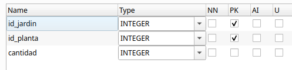
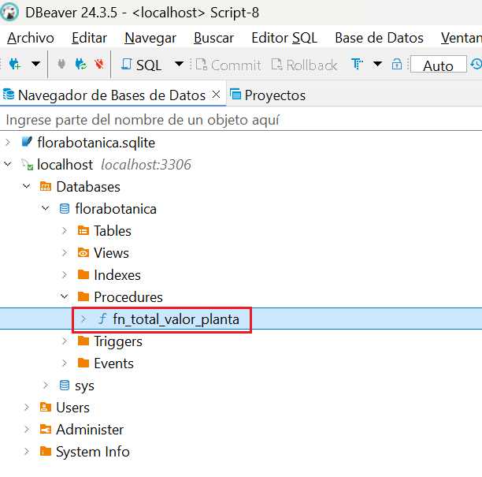
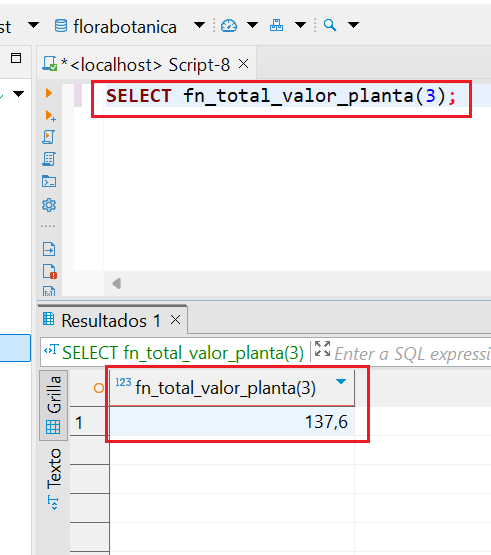
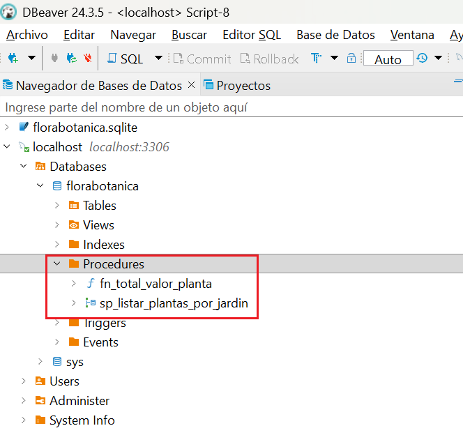
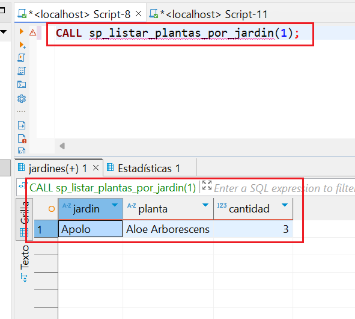
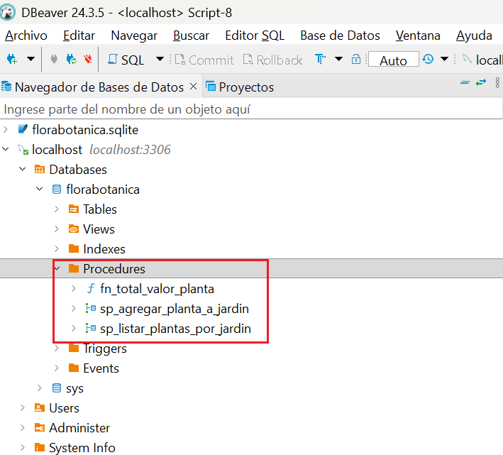
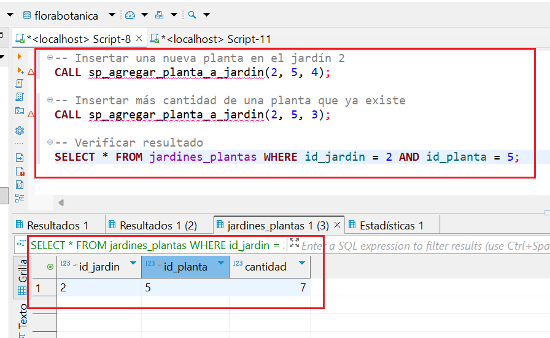

# RA2. Acceso a Bases de Datos relacionales

!!! info "RA2"
    Desarrolla aplicaciones que gestionan información almacenada en bases de datos relacionales identificando y utilizando mecanismos de conexión.


<span class="mi_h3">Revisiones</span>

| Revisión | Fecha      | Descripción                                                   |
|----------|------------|---------------------------------------------------------------|
| 1.0      | 12-08-2026 | Adaptación de los materiales a markdown                       |
| 1.1      | 19-08-2026 | Ampliación con preguntas de autoevaluación |


## 1. Introducción

Las bases de datos relacionales son esenciales en el desarrollo de aplicaciones. Su integración con una aplicación requiere realizar una **conexión** al sistema gestor de base de datos (SGBD) desde el lenguaje de programación. Este tema se centra en cómo realizar esa conexión, cómo trabajar con datos mediante sentencias SQL y cómo aplicar buenas prácticas, como el cierre de recursos, el uso de transacciones y procedimientos almacenados.

Una **base de datos relacional** es un sistema de almacenamiento de información que **organiza los datos en tablas**. Cada tabla representa una entidad (por ejemplo, **plantas o jardines**) y está compuesta por filas y columnas, donde cada fila representa un registro único y cada columna contiene un atributo específico de ese registro. Estas bases de datos (BD) siguen el **Modelo Relacional** que permite establecer vínculos o **relaciones entre diferentes tablas mediante claves primarias y foráneas**, facilitando así la integridad, la coherencia y la eficiencia en el manejo de grandes volúmenes de datos.

**Ejemplo de tabla `plantas`:**

| id_planta  | nombre_comun | nombre_cientifico       | stock | precio |
|:-----------|:-------------|:------------------------|:-------|:-------|
| 1          | Aloe Vera    | Aloe barbadensis miller | 20    | 10.5   |
| 2          | Lavanda      | Lavandula angustifolia  | 40    | 4.75   |


**Ejemplo de tabla `jardines`:**

| id_jardin | nombre | ciudad |
|:----------|:-------| :--- |
| 1         | Atenea | Castellón |
| 2         | Olimpo | Valencia |


La **clave primaria (Primary Key)** es una columna (o conjunto de columnas) que **identifica de forma única** cada fila de una tabla. En nuestro ejemplo:

- `id_planta` es la clave primaria en la tabla `plantas`.
- `id_jardin` es la clave primaria en la tabla `jardines`.

La **clave foránea o clave ajena (Foreign Key)** es una columna que **hace referencia a una clave primaria de otra tabla** para establecer una relación.

Si queremos registrar las plantas que tiene cada jardín, podemos utilizar una tabla intermedia llamada `jardines_plantas`. Esta tabla tendrá sus propias relaciones mediante claves foráneas:

* El campo `id_jardin` será una clave foránea que apunta al campo `id_jardin` de la tabla `jardines`.
* El campo `id_planta` será una clave foránea que apunta al campo `id_planta` de la tabla `plantas`.


**Ejemplo de tabla `jardines_plantas`:**

|  id_jardin | id_planta | cantidad |
|:----------| :--- |:---------|
|  1         | 1 | 8        |
|  1         | 2 | 12       |


El lenguaje **SQL (Structured Query Language)** se utiliza para gestionar bases de datos relacionales ya que gracias a él se pueden crear, modificar, consultar y eliminar datos de forma sencilla y estandarizada. Es lo que se denomina **CRUD**, es decir, **C**reate (crear), **R**ead (Leer), **U**pdate (Actualizar) y **D**elete (Borrar). Esto lo convierte en la opción preferida para una amplia variedad de aplicaciones empresariales y tecnológicas.

Algunos de sus comandos básicos son:

* **SELECT**: consultar datos
* **INSERT**: añadir registros
* **UPDATE**: modificar datos existentes
* **DELETE**: eliminar registros
* **CREATE**: definir tablas, claves, relaciones, etc.

Un ejemplo sencillo de consulta podría ser:

```sql
SELECT nombre FROM jardines WHERE ciudad = 'Valencia';
```

<span class="mi_h3">Tipos de SGBD relacionales</span>

Conocer qué **tipo de gestor de base de datos** se está utilizando es esencial para poder **conectar** correctamente desde una aplicación, ya que cada uno necesita su propio conector o driver. Podemos encontrar:

**1. Gestores independientes (cliente-servidor): PostgreSQL, MySQL, Oracle, SQL Server...**

- Sistemas robustos y escalables, ideales para entornos multi-usuario y aplicaciones web.
- Requieren un servidor dedicado y una configuración más compleja.
- Casos de uso: aplicaciones web, servicios empresariales, sistemas con alta demanda de acceso concurrente.


**2. Gestores embebidos: SQLite, H2, Derby...**

- Base de datos ligera, sin servidor, ideal para aplicaciones móviles o de escritorio donde no se requiere gestión centralizada.
- Fácil de configurar y desplegar, ya que la base de datos reside en un archivo local.
- Casos de uso: aplicaciones de escritorio, móviles, prototipos, pruebas unitarias.


## 2. Conexión a un SGBD

Cuando desarrollamos aplicaciones que trabajan con información persistente, necesitamos acceder a BD para consultar, insertar, modificar o eliminar datos. Existen dos formas principales de hacerlo desde el código:

- Acceso mediante ORM (Object-Relational Mapping).
- Acceso mediante conectores.


<span class="mi_h3">Acceso mediante ORM</span>

Un **ORM** es una herramienta que permite trabajar con la base de datos como si fuera un conjunto de objetos, evitando tener que escribir directamente SQL. El **ORM** se encarga de mapear las tablas a clases y los registros a objetos, y traduce automáticamente las operaciones del código a consultas SQL. Es ideal para trabajar de forma más productiva en aplicaciones complejas. Sus principales características son:

- Se trabaja con clases en lugar de tablas SQL.
- Ahorra mucho código repetitivo.
- Ideal para proyectos medianos o grandes que requieren mantener muchas entidades.

**Algunos ejemplos de ORMs**

ORM / Framework|	Lenguaje|	Descripción
---------------|---------|-----------------
Hibernate|	Java/Kotlin|	El ORM más utilizado con JPA
Exposed|	Kotlin|	ORM ligero y expresivo creado por JetBrains
Spring Data JPA|	Java/Kotlin|	Abstracción que automatiza el acceso a datos
Room|	Java/Kotlin|	ORM oficial para bases de datos SQLite en Android    

**JPA** (Java Persistence API) es una especificación estándar de Java que define cómo se deben mapear objetos Java (o Kotlin) a tablas de bases de datos relacionales. Es decir, permite gestionar la persistencia de datos de forma orientada a objetos, sin necesidad de escribir SQL directamente. Es el estándar utilizado por las herramientas ORM como Hibernate, EclipseLink, o Spring Data JPA.


<span class="mi_h3">Acceso mediante conectores</span>

Un **conector** (también llamado driver) es una librería software que permite que una aplicación se comunique con un gestor de base de datos (SGBD). Actúa como un puente entre nuestro código y la base de datos, traduciendo las instrucciones SQL a un lenguaje que el gestor puede entender y viceversa. Sin un conector, tu aplicación no podría comunicarse con la base de datos.

Una base de datos puede ser accedida desde diferentes orígenes o herramientas, siempre que tengamos:

- Las credenciales de acceso (usuario y contraseña)
- El host/servidor donde se encuentra la base de datos
- El motor de base de datos (PostgreSQL, MySQL, SQLite, etc.)
- Los puertos habilitados y los permisos correctos


Las principales formas de conectarse a una base de datos son las siguientes:

| Medio de conexión                         | Descripción                                                                 |
|-------------------------------------------|-----------------------------------------------------------------------------|
| Aplicaciones de escritorio             | Herramientas gráficas como **DBeaver**, **pgAdmin**, **MySQL Workbench**, **DB Browser for SQLite**. Permiten explorar, consultar y administrar BD de forma visual. |
| Aplicaciones desarrolladas en código   | Programas en **Kotlin**, **Java**, **Python**, **C#**, etc., mediante **conectores** como **JDBC**, **psycopg2**, **ODBC**, etc. para acceder a BD desde código. |
| Línea de comandos                      | Clientes como `psql` (PostgreSQL), `mysql`, `sqlite3`. Permiten ejecutar comandos SQL directamente desde terminal. |
| Aplicaciones web                        | Sitios web que acceden a BD desde el backend (por ejemplo, en Spring Boot, Node.js, Django, etc.). |
| APIs REST o servidores intermedios     | Servicios web que conectan la BD con otras aplicaciones, actuando como puente o capa de seguridad. |
| Aplicaciones móviles                   | Apps Android/iOS que acceden a BD locales (como **SQLite**) o remotas (vía **Firebase**, API REST, etc.). |
| Herramientas de integración de datos   | Software como **Talend**, **Pentaho**, **Apache Nifi** para migrar, transformar o sincronizar datos entre sistemas. |

De todas las formas posibles de interactuar con una base de datos, nos vamos a centrar en el uso de **conectores JDBC (Java Database Connectivity)**. Una aplicación (escrita en Kotlin, Java u otro lenguaje) puede leer, insertar o modificar información almacenada en una base de datos relacional si previamente se ha conectado al sistema gestor de base de datos (SGBD). **JDBC** es una API estándar de Java (y compatible con Kotlin) que permite conectarse a una BD, enviar instrucciones SQL y procesar los resultados manualmente. Es el método de más bajo nivel, pero ofrece un control total sobre lo que ocurre en la BD. Es ideal para aprender los fundamentos del acceso a datos y aprenderlo ayuda a entender mejor lo que hace un ORM por debajo.

Sus principales características son:

- El programador escribe directamente las consultas SQL.
- Requiere gestionar manualmente conexiones, sentencias y resultados.
- Se necesita un driver específico (conector) para cada SGBD:


A continuación se muestra su sintaxis general. Aunque puede variar según el SGBD con el que se trabaje. Por ejemplo en SQLite no se necesita usuario ni contraseña ya que es una base de datos local:

    jdbc:<gestor>://<host>:<puerto>/<nombre_base_datos>


También dependiendo del SGBD será necesario utilizar la dependencia adecuada en **Gradle** añadiendo las líneas correspondientes en el fichero **build.gradle.kts** dentro del bloque `dependencies { . . . }`


**Algunos ejemplos de conectores según el SGBD**

SGBD|	Conector (Driver JDBC)| 	URL de conexión típica                | Dependencia Gradle
----|-------------------------|----------------------------------------|-----------------------
PostgreSQL|	org.postgresql.Driver| jdbc:postgresql://host:puerto/nombreBD |implementation("org.postgresql:postgresql:42.7.1")
MySQL |	com.mysql.cj.jdbc.Driver| jdbc:mysql://host:puerto/nombreBD      | implementation("com.mysql:mysql-connector-j:8.3.0")
SQLite (embebido)|	org.sqlite.JDBC	| jdbc:sqlite:ruta_archivo.sqlite | implementation("org.xerial:sqlite-jdbc:3.43.0.0")


<span class="mis_ejemplos">Ejemplo 1: Conexión a SQLite</span>

El siguiente ejemplo muestra como conectar a una BD **SQLite** llamada `florabotanica.sqlite` que se encuentra en la carpeta `datos` dentro de un proyecto en **Kotlin**.


``` kotlin
import java.io.File
import java.sql.DriverManager

fun main() {
    val dbPath = "datos/florabotanica.sqlite"
    val file = File(dbPath)
    println("Ruta absoluta de la BD: ${file.absolutePath}")

    val url = "jdbc:sqlite:${dbPath}"
    DriverManager.getConnection(url).use { conn ->
        println("**** Conexión establecida correctamente")
    }
}
```

!!! success "Prueba y analiza el ejemplo"
    1. Crea un proyecto kotlin con `Gradle` y añade las dependencias para trabajar con SQLite.
    2. Descarga el fichero con la BD de ejemplo desde el siguiente enlace:
       [florabotanica.sqlite](recursos/florabotanica.sqlite){:florabotanica.sqlite} y cópialo en una carpeta llamada `datos` que deberás crear en la raíz del proyecto de IntelliJ (al mismo nivel que la carpeta `src` y que el archivo `build.gradle.kts`).
    3. Ejecuta el programa y verifica que la conexión con la BD se establece correctamente.


!!! example "Autoevaluación"
    
    **Pregunta 1: Se intenta establecer una conexión a una base de datos local SQLite utilizando JDBC de la siguiente manera:**
    
    ```kotlin
    import java.io.File
    import java.sql.DriverManager
    
    fun main() {
        val dbPath = "db_sistema/datos.sqlite"
        val url = "jdbc:sqlite:$dbPath"
        
        // Intento de conexión directa a la base de datos
        DriverManager.getConnection(url).use { conn ->
            println("Conexión establecida con éxito.")
        }
    }
    ```
    
    **Sabiendo que la carpeta llamada `db_sistema` no existe físicamente en el disco duro en el momento de iniciar el programa, ¿cuál será el comportamiento de la aplicación al ejecutarse?**
    
    A) El driver JDBC de SQLite detectará la ausencia de la ruta y creará automáticamente tanto la carpeta `db_sistema` como el archivo `datos.sqlite` antes de abrir la conexión de manera transparente.
    
    B) Se lanzará una excepción de tipo `SQLException` (causada internamente por un error de apertura de archivo tipo `SQLITE_CANTOPEN`) al no poder crear el archivo en una ruta inexistente, deteniendo la aplicación.
    
    C) El programa se conectará correctamente y guardará los datos en la memoria RAM del sistema operativo, posponiendo la creación real del directorio `db_sistema` para cuando se apague la aplicación de forma ordenada.
    
    D) Se producirá un error de compilación en Kotlin porque el driver `org.sqlite.JDBC` analiza estáticamente la cadena de la URL en tiempo de diseño y exige que todas las carpetas referenciadas existan en el disco.
    
    ??? quote "Solución"

        ❌ A) El motor embebido de SQLite tiene la capacidad de crear automáticamente el archivo físico final (`datos.sqlite`) si este no existe, pero **no** creará de forma automática las carpetas intermedias o directorios padres (como `db_sistema`) en el disco duro.
        
        ✅ B) Para poder instanciar el archivo físico de la base de datos, el sistema operativo requiere que el directorio contenedor exista previamente. Al no existir la carpeta `db_sistema`, SQLite fallará al intentar crear el archivo físico y arrojará una excepción `SQLException` (típicamente con el mensaje de error `SQLITE_CANTOPEN`). Para solucionarlo, se debe crear la carpeta contenedora en el código antes de la conexión usando, por ejemplo, `File("db_sistema").mkdirs()`.
        
        ❌ C) Al estar configurada la base de datos para residir en un archivo local en disco, SQLite requiere obligatoriamente poder abrir y escribir en dicho archivo físico para poder operar. El sistema no guardará los datos temporalmente en la memoria RAM de manera automática ante un fallo de disco, por lo que la excepción detendrá el programa de inmediato sin llegar a ejecutar el bloque interno.
        
        ❌ D) La URL de conexión JDBC es un simple parámetro de tipo `String`. Su validez y la existencia de los recursos que describe se comprueban únicamente en tiempo de ejecución (runtime), por lo que el compilador de Kotlin no detectará ningún error estático en esta línea de código.


    
    **Pregunta 2: Se intenta establecer una conexión a un sistema gestor de bases de datos independiente de la siguiente manera:**
    
    ```kotlin
    import java.sql.DriverManager
    import java.sql.SQLException
    
    fun main() {
        // Intento de conexión a un servidor MySQL local
        val url = "jdbc:mysql://localhost:3306/florabotanica"
        val usuario = "admin"
        val contrasenia = "1234"
        
        DriverManager.getConnection(url, usuario, contrasenia).use { conn ->
            println("Conexión establecida con el servidor MySQL.")
        }
    }
    ```
    
    **Sabiendo que el proyecto tiene configurada correctamente la dependencia de Gradle para MySQL, pero el servicio del servidor MySQL en la máquina local (`localhost`) se encuentra detenido (apagado), ¿cuál será el comportamiento de la aplicación al ejecutarse?**
    
    A) El driver JDBC de MySQL levantará automáticamente una instancia ligera y embebida del servidor MySQL en segundo plano para poder simular la conexión local.
    
    B) La aplicación se quedará bloqueada indefinidamente en un bucle de espera activa sin lanzar errores, esperando a que el usuario inicie manualmente el servidor MySQL en su sistema.
    
    C) Se lanzará una excepción de tipo `SQLException` (indicando un fallo de conexión física o rechazo de puerto de red), deteniendo inmediatamente la ejecución del programa.
    
    D) El programa compilará y completará su ejecución mostrando el mensaje de éxito por consola debido a que JDBC simula una conexión virtual temporal si detecta que el puerto de red está apagado.
    
    ??? quote "Solución"
    
        ❌ A) A diferencia de los gestores embebidos como SQLite, MySQL es un gestor de bases de datos robusto basado en una arquitectura cliente-servidor. Requiere un proceso de servidor dedicado y en ejecución; el driver cliente de JDBC no tiene la capacidad de levantar o arrancar el servicio del servidor por sí mismo.
        
        ❌ B) El intento de conexión a la red cuenta con un tiempo de espera límite por defecto (*timeout*). Si la conexión no se establece rápidamente, el driver desiste y lanza la excepción correspondiente; el programa nunca se quedará bloqueado indefinidamente en un bucle de espera.
        
        ✅ C) Al estar el servicio del servidor MySQL apagado, no hay ningún proceso escuchando en el puerto TCP `3306` de la máquina local. Cuando el driver intente abrir un canal de red físico, recibirá un rechazo de conexión (Connection refused) por parte del sistema de red, lo que se traducirá inmediatamente en una excepción de tipo `SQLException`, interrumpiendo la ejecución.
        
        ❌ D) JDBC no simula ni emula conexiones de manera virtual por defecto en tiempo de ejecución. Si el servidor físico de base de datos no está disponible para procesar la autenticación del usuario y la contraseña, la llamada a `DriverManager.getConnection` siempre fallará.

    


## 3. Operaciones sobre la BD

En **JDBC** (Java Database Connectivity), las operaciones sobre la base de datos se realizan  utilizando los siguientes objetos y métodos:

- **`Connection`**, establece el canal de comunicación con el SGBD (PostgreSQL, MySQL, etc.)

- Los objetos **`Statement`** y **`PreparedStatement`** se **utilizan** para enviar consultas SQL desde el programa a la base de datos. A continuación se muestra una tabla con el uso de cada uno:


| Si necesitas... | Usa... |
| :--- | :--- |
| Consultas estáticas o sin parámetros | **`Statement`** |
| Consultas con datos dinámicos proporcionados por el usuario | **`PreparedStatement`** |
| Seguridad garantizada frente a inyecciones SQL | **`PreparedStatement`** |
| Ejecutar la misma consulta muchas veces con distintos valores | **`PreparedStatement`** |
| Crear tablas (DDL) o sentencias SQL complejas que no cambian | **`Statement`** |


> Aunque las interfaces de JDBC se llaman **`Statement`** y **`PreparedStatement`**, para obtener sus instancias desde la conexión del código utilizaremos los métodos correspondientes:
> 
> - `val stmt = conexion.createStatement()`
> - `val pstmt = conexion.prepareStatement("SELECT...")`


- Los métodos **executeQuery()**, **executeUpdate()** y **execute()** se utilizan para ejecutar sentencias SQL, pero se usan en contextos diferentes. A continuación se muestra una tabla con el uso de cada uno:


Método|	Uso principal|	Tipo de sentencia SQL|	Resultado que devuelve
------|--------------|-----------------------|------------------------
**executeQuery()**|	Realizar consultas|	SELECT|	Objeto  **ResultSet** con el resultado de la consulta SQL. Permite recorrer fila a fila el conjunto de resultados, accediendo a cada campo por nombre o por posición
**executeUpdate()**|Realizar modificaciones|	INSERT, UPDATE, DELETE, DDL (CREATE, DROP, etc.)|	Entero con el número de filas afectadas
**execute()**|No se sabe de antemano qué tipo de sentencia SQL se va a ejecutar (consulta o modificación)| Sentencias SQL que pueden devolver varios resultados| Booleano **true** si el resultado es un ResultSet (SELECT) y **false** si el resultado es un entero (INSERT, UPDATE, DELETE,CREATE, ALTER)


<span class="mi_h3">Liberación de recursos</span>

Cuando una aplicación accede a una base de datos, el sistema operativo y el SGBD abren varios recursos internos que consumen memoria y canales de comunicación activos:

- **La conexión** con el servidor de bases de datos (`Connection`).
- **Las sentencias SQL** preparadas para ejecutarse (`Statement` o `PreparedStatement`).
- **El resultado** de las consultas almacenado en memoria (`ResultSet`).

En tecnologías como Java o Kotlin (usando JDBC), **estos recursos no se liberan automáticamente** al terminar de usarse. Si olvidamos cerrarlos de forma explícita, podemos provocar graves problemas en la aplicación:

- **Fugas de memoria:** acumulación de objetos en la RAM que degradan el rendimiento general.
- **Bloqueo de conexiones:** agotamiento del número máximo de conexiones que admite la base de datos, impidiendo que otros usuarios o procesos se conecten.
- **Errores inesperados:** comportamientos inestables en la aplicación al intentar operar con recursos que han quedado "huérfanos".

Para liberar estos recursos, tradicionalmente se ha seguido un enfoque manual que hoy en día ha evolucionado hacia soluciones mucho más seguras. A continuación, analizamos ambos métodos.


**Opción 1: El enfoque tradicional (cierre manual con close())**

Este es el estilo clásico heredado de Java. Consiste en declarar las variables de los recursos fuera del bloque de ejecución, inicializarlas dentro de un `try` y asegurarse de cerrarlas manualmente dentro de un bloque `finally`, el cual se ejecuta siempre, ocurra o no un error.

El orden correcto de cierre manual siempre debe ser **desde el recurso más interno hacia el más externo** (primero el resultado, luego la sentencia y finalmente la conexión). A continuación vemos un ejemplo:


<span class="mis_ejemplos">Ejemplo 2: Cierre manual con close()</span>

En este ejemplo se declara una constante con la ruta a la BD, se establece la conexión, se consultan los datos y, por último, se cierran los recursos abiertos (ResultSet, Statement y Connection) utilizando **close()** dentro de un bloque **finally**.


``` kotlin
import java.sql.Connection
import java.sql.Statement
import java.sql.ResultSet
import java.sql.DriverManager
import java.sql.SQLException

fun main() {
    val URL_BD = "jdbc:sqlite:datos/florabotanica.sqlite"

    var conn: Connection? = null
    var stmt: Statement? = null
    var rs: ResultSet? = null

    try {
        conn = DriverManager.getConnection(URL_BD)
        println("**** Conexión establecida correctamente")

        stmt = conn.createStatement()
        rs = stmt.executeQuery("SELECT * FROM plantas")

        while (rs.next()) {
            println(rs.getString("nombre_comun"))
        }
    } catch (e: SQLException) {
        println("Error al conectar o consultar la base de datos: ${e.message}")
    } catch (e: Exception) {
        e.printStackTrace()
    } finally {
        try {
            rs?.close()
            stmt?.close()
            conn?.close()
            println("*** Conexión cerrada correctamente")
        } catch (e: Exception) {
            println("Error al cerrar los recursos: ${e.message}")
        }
    }
}
```

> **IMPORTANTE:** Si el primer recurso que intentamos cerrar (`rs?.close()`) lanza una excepción, el flujo de ejecución se detendrá inmediatamente. Como consecuencia, el `Statement` y la `Connection` nunca llegarán a cerrarse, provocando un **fallo en cascada** y una fuga de recursos en el sistema.


!!! success "Prueba y analiza el ejemplo"
    Prueba el código de ejemplo y verifica que funciona correctamente.


!!! example "Autoevaluación"
    
    **Pregunta 3: Se desea implementar el enfoque clásico para conectarse a una base de datos y se escribe el siguiente bloque de código en Kotlin:**
    
    ```kotlin
    import java.sql.DriverManager
    import java.sql.SQLException
    
    fun main() {
        val URL_BD = "jdbc:sqlite:datos/florabotanica.sqlite"
        
        try {
            // Declaración e inicialización directa de variables dentro del bloque try
            val conn = DriverManager.getConnection(URL_BD)
            val stmt = conn.createStatement()
            val rs = stmt.executeQuery("SELECT * FROM plantas")
            
            while (rs.next()) {
                println(rs.getString("nombre_comun"))
            }
        } catch (e: SQLException) {
            println("Error en la base de datos: ${e.message}")
        } finally {
            // Intento de liberar manualmente los recursos
            try {
                rs?.close()
                stmt?.close()
                conn?.close()
                println("*** Recursos cerrados de manera manual")
            } catch (e: Exception) {
                println("Error al cerrar: ${e.message}")
            }
        }
    }
    ```
    
    **Al intentar compilar y ejecutar este código, ¿cuál será el resultado obtenido en el entorno de desarrollo?**
    
    A) Se producirá un error de compilación en el bloque `finally` porque las variables `rs`, `stmt` y `conn` se han declarado dentro del bloque `try` y no son visibles fuera de su ámbito (*scope*).
    
    B) El código compilará y se ejecutará con éxito debido a que los bloques `try` y `finally` comparten de forma automática el mismo contexto de variables locales.
    
    C) Se lanzará una excepción de tipo `NullPointerException` en tiempo de ejecución al intentar cerrar `rs` porque las variables no se declararon como mutables y nulables fuera del bloque.
    
    D) El compilador de Kotlin optimizará el código en segundo plano, omitiendo el bloque `finally` al detectar que las variables son locales, por lo que el programa finalizará con éxito de manera silenciosa.
    
    ??? quote "Solución"
    
        ✅ A) Las variables declaradas dentro de un bloque de ejecución (como el bloque `try`) tienen un ámbito (*scope*) restringido únicamente a ese bloque de código. Dado que el bloque `finally` es un entorno independiente, no tiene acceso a las variables creadas dentro del `try`. Por esta razón, el enfoque tradicional exige declarar las variables de recursos como nulables y mutables (`var`) fuera del bloque `try`, para poder inicializarlas dentro de este y cerrarlas de forma segura en el `finally`.
        
        ❌ B) El compilador de Kotlin (al igual que el de Java) aplica reglas estrictas de ámbito. Ninguna variable declarada dentro de las llaves de un `try` es visible o accesible desde el bloque `finally`.
        
        ❌ C) El programa no puede lanzar excepciones en tiempo de ejecución debido a que el código contiene errores de sintaxis graves (variables no declaradas en el ámbito del `finally`) que impiden que el proyecto llegue a compilarse con éxito.
        
        ❌ D) El compilador de Kotlin no realiza optimizaciones automáticas de cierre de recursos en segundo plano ni elimina bloques de código. Si el programador comete un error de ámbito de variables, el código simplemente fallará al compilar.
    

    
    **Pregunta 4: Se ha implementado una función auxiliar encargada de cerrar manualmente los recursos abiertos tras realizar una consulta en la base de datos:**
    
    ```kotlin
    import java.sql.Connection
    import java.sql.Statement
    import java.sql.ResultSet
    
    fun liberarRecursosManualmente(rs: ResultSet?, stmt: Statement?, conn: Connection?) {
        try {
            // Intento de cierre de recursos siguiendo el orden recomendado
            rs?.close()
            stmt?.close()
            conn?.close()
            println("Todos los recursos se han liberado de forma segura.")
        } catch (e: Exception) {
            println("Fallo al liberar los recursos: ${e.message}")
        }
    }
    ```
    
    **Sabiendo que el primer recurso (`rs?.close()`) lanza una excepción en tiempo de ejecución al intentar cerrarse, ¿cuál será el comportamiento de la aplicación en esta función?**
    
    A) El bloque `try` capturará de forma inteligente el fallo del `ResultSet`, ignorando la línea conflictiva y continuando secuencialmente con el cierre del `Statement` y de la `Connection` en las líneas de abajo.
    
    B) El flujo de ejecución se detendrá inmediatamente en la línea de `rs?.close()`, provocando un fallo en cascada que impedirá que las llamadas a `stmt?.close()` y `conn?.close()` se lleguen a ejecutar.
    
    C) El compilador de Kotlin detectará la fragilidad de esta estructura de antemano y obligará al programador a envolver cada método `.close()` dentro de su propio bloque `try-catch` individual para poder compilar.
    
    D) Se producirá un error de tipo `NullPointerException` porque el método `close()` requiere obligatoriamente que todos los parámetros de la función sean distintos de `null` para poder procesarse.
    
    ??? quote "Solución"
    
        ❌ A) Un bloque `try` convencional no tiene la capacidad de reanudar la ejecución en la línea siguiente después de que se ha producido una excepción. En cuanto una línea falla, el control del programa salta inmediatamente al bloque de captura `catch`.
        
        ✅ B) Este es el principal peligro del enfoque clásico (el fallo en cascada). Si el cierre del `ResultSet` (`rs?.close()`) genera un error y lanza una excepción, el resto de las líneas consecutivas dentro del `try` se omiten y el flujo de ejecución salta al bloque `catch`. Esto provoca que el `Statement` y la `Connection` permanezcan abiertos de forma indefinida en el sistema, generando una fuga de recursos.
        
        ❌ C) El compilador de Kotlin no fuerza la división en bloques `try-catch` individuales, ya que compilar llamadas secuenciales a métodos que arrojan excepciones es perfectamente válido. Es responsabilidad exclusiva del programador diseñar un código seguro o emplear alternativas modernas como `.use`.
        
        ❌ D) El operador de llamada segura `?.` de Kotlin (`rs?.close()`) comprueba automáticamente si el objeto es nulo. Si el recurso es `null`, simplemente se ignora la llamada y la ejecución continúa a la siguiente línea sin lanzar ninguna excepción de puntero nulo (*NullPointerException*).
    


**Opción 2: El enfoque moderno de Kotlin (cierre automático con .use)**

Para solucionar la fragilidad y la gran cantidad de código repetitivo del método manual, Kotlin introduce la función de extensión **`.use { ... }`**. Esta función se puede aplicar a cualquier recurso que implemente la interfaz `AutoCloseable` (como nuestras conexiones, sentencias y resultados). Al utilizarla, **Kotlin garantiza que el recurso se cerrará automáticamente al salir del bloque**, incluso si ocurre una excepción o un error inesperado durante la ejecución. A continuación vemos un ejemplo:


<span class="mis_ejemplos">Ejemplo 3: Cierre automático con .use</span>

En este ejemplo, que realiza la misma consulta que el ejemplo anterior, los recursos abiertos de cerrarán automáticamente. Además, por organización del código, se ha declarado una constante con la ruta a la BD y una función para conectar a la BD.

``` kotlin
import java.sql.Connection
import java.sql.DriverManager
import java.sql.SQLException

// Ruta al archivo de base de datos SQLite
const val URL_BD = "jdbc:sqlite:datos/florabotanica.sqlite"

fun conectarBD(): Connection? {
    return try {
        DriverManager.getConnection(URL_BD)
    } catch (e: SQLException) {
        e.printStackTrace()
        null
    }
}

fun main() {
    conectarBD()?.use { conn ->
        println("*** Conectado a la BD con .use")

        conn.createStatement().use { stmt ->
            stmt.executeQuery("SELECT * FROM plantas").use { rs ->
                while (rs.next()) {
                    println(rs.getString("nombre_comun"))
                }
            }
        }
    } ?: println("No se pudo conectar")
}
```


**Explicación del código:**

1. **`conectarBD()?.use { conn -> ... }`**: Intenta conectar. Si tiene éxito, abre el bloque y garantiza que `conn` se cerrará de forma segura al finalizar, pase lo que pase.
2. **`conn.createStatement().use { stmt -> ... }`**: Crea la sentencia y asegura su cierre automático al salir de su respectivo bloque secundario.
3. **`stmt.executeQuery(...).use { rs -> ... }`**: Ejecuta la consulta y protege el resultado (`rs`) asegurando su cierre automático al terminar de recorrer las filas.


**Ventajas de este enfoque:**

- **Código limpio:** Evitamos declarar variables mutables con `var` e inicializarlas a `null`.
- **Adiós al fallo en cascada:** Cada bloque `.use` actúa de manera independiente y segura. Si uno de ellos falla, Kotlin se asegura de propagar la excepción pero cerrando primero todos los recursos que se abrieron previamente en la jerarquía.
- **Prevención de descuidos:** Evitamos el riesgo de olvidar escribir un `.close()` manual.


!!! success "Prueba y analiza el ejemplo"
    Prueba el código de ejemplo y verifica que funciona correctamente.


!!! example "Autoevaluación"
    
    **Pregunta 5: Se escribe el siguiente bloque de código en Kotlin para abrir una conexión empleando la herramienta recomendada de este lenguaje:**
    
    ```kotlin
    import java.sql.DriverManager
    
    fun main() {
        val url = "jdbc:sqlite:datos/florabotanica.sqlite"
        
        // Conexión directa utilizando la función de extensión .use
        DriverManager.getConnection(url).use { conn ->
            println("Conexión abierta correctamente con la base de datos.")
            // ... operaciones de lectura y escritura ...
        }
    }
    ```
    
    **Sabiendo que no se ha escrito ninguna llamada explícita a un método de cierre (como `conn.close()`) dentro del bloque de llaves `{ ... }`, ¿cómo se gestionará la liberación de la conexión en esta aplicación?**
    
    A) La conexión permanecerá abierta en segundo plano consumiendo memoria y canales activos hasta que el proceso completo de la aplicación se cierre de forma forzada por el sistema operativo.
    
    B) Se producirá un error de compilación en Kotlin porque el compilador exige de forma obligatoria que todo bloque que emplee `DriverManager` finalice con una llamada manual de cierre del recurso.
    
    C) El programador deberá implementar obligatoriamente un bloque `finally` tradicional al final de la función para ejecutar de forma manual la destrucción del objeto en memoria.
    
    D) La función de extensión `.use` se encargará de cerrar de forma automática y segura la conexión `conn` en el instante en que la ejecución salga de su bloque de llaves, sin necesidad de escribir un cierre manual.
    
    ??? quote "Solución"
    
        ❌ A) El propósito principal de la herramienta `.use` es evitar que las conexiones queden huérfanas o abiertas en memoria. No es necesario que el sistema operativo finalice el proceso para liberar la conexión.
        
        ❌ B) El código compilará y funcionará perfectamente. La función `.use` está disponible para cualquier clase de JDBC que implemente la interfaz de cierre automático y no requiere añadir código manual redundante.
        
        ❌ C) No es necesario mezclar bloques `finally` manuales cuando se emplea este enfoque moderno, ya que esta estructura automatiza todo el proceso de limpieza interna de forma transparente.
        
        ✅ D) Esta es la ventaja clave de la prevención de descuidos. Al utilizar la función de extensión `.use`, Kotlin se encarga de llamar internamente al método de cierre del recurso tan pronto como finalice la ejecución de su bloque asociado, evitando por completo el riesgo de que al programador se le olvide cerrar la conexión.
    
    
    **Pregunta 6: Se ha implementado una función que realiza consultas en la base de datos anidando bloques de recursos automáticos de la siguiente manera:**
    
    ```kotlin
    import java.sql.Connection
    import java.sql.Statement
    import java.sql.ResultSet
    
    fun consultarYProcesar(conn: Connection) {
        conn.createStatement().use { stmt ->
            stmt.executeQuery("SELECT * FROM plantas").use { rs ->
                // Simulación de un error inesperado durante el recorrido de datos
                throw RuntimeException("Fallo crítico en la lectura de registros.")
            }
        }
    }
    ```
    
    **Sabiendo que se lanza la excepción `RuntimeException` de forma interna mientras se leen los datos de la consulta, ¿cuál será el comportamiento de los recursos `rs` y `stmt` en esta función?**
    
    A) Al producirse un fallo crítico dentro del bloque más interno, los recursos `rs` y `stmt` quedarán colgados y abiertos indefinidamente en el sistema al interrumpirse el flujo normal.
    
    B) La función `.use` capturará y silenciará la excepción internamente para poder ejecutar el cierre con éxito, impidiendo que el error se propague hacia fuera de la función.
    
    C) Kotlin propagará la excepción hacia el exterior para que pueda ser gestionada, pero garantizando el cierre automático y seguro tanto de `rs` como de `stmt` de manera ordenada.
    
    D) Se producirá un fallo en cascada idéntico al del método tradicional, de modo que solo se cerrará el recurso `rs` y el `stmt` permanecerá abierto al romperse el flujo de ejecución.
    
    ??? quote "Solución"
    
        ❌ A) La función `.use` está diseñada precisamente para garantizar que los recursos se cierren pase lo que pase. Una excepción interna no impedirá que la limpieza de la memoria se lleve a cabo de forma efectiva.
        
        ❌ B) La función `.use` no oculta ni silencia los errores del programa. Su único cometido es asegurar la liberación del recurso; una vez cerrado este, permite que la excepción original siga su camino hacia arriba para que el resto de la aplicación pueda enterarse del fallo y gestionarlo.
        
        ✅ C) Esta es la ventaja de decirle adiós al fallo en cascada. Cada bloque `.use` actúa de manera segura e independiente. Al lanzarse la excepción en el bloque interno de `rs`, Kotlin cierra de inmediato el `ResultSet`. Al propagarse el error hacia el bloque padre, este detecta la salida de su bloque y cierra inmediatamente el `Statement` de forma ordenada en la jerarquía antes de permitir que la excepción continúe subiendo.
        
        ❌ D) El comportamiento del fallo en cascada (donde un error en un recurso impide cerrar los demás) es exclusivo del cierre manual tradicional en un único bloque `try`. El anidamiento con `.use` soluciona este problema por diseño.
    


!!! warning "Práctica 1: crea la base de tu proyecto"
    En esta práctica daremos forma a la base de nuestro proyecto. Diseñaremos nuestra BD a partir del archivo `csv` de nuestro proyecto anterior y verificaremos que podemos conectar a ella correctamente y leer su información. A medida que avancemos iremos añadiendo funciones a este proyecto.

    **Realiza los siguientes pasos:**

    1. Crea un proyecto kotlin con `Gradle` y añade las dependencias para trabajar con SQLite.
    2. A partir del fichero de información `csv` utilizado en el proyecto de la unidad anterior, crea una base de datos SQLite **nombre_de_tu_BD.sqlite** con una tabla que tenga una estructura acorde a la información del fichero y guárdala en la carpeta `datos` en la raíz de tu proyecto. Guarda también, en la misma carpeta, el fichero `csv`. Puedes utilizar la herramienta [DBeaver](dbeaver.html).
    3. Declara una constante con la ruta a la BD. 
    4. Declara una función para conectar a la BD. 
    5. Conecta con la BD y realiza una consulta sobre tus datos utilizando .use (para no tener que cerrar recursos manualmente).


## 4. Objetos de acceso a datos (DAO)
Los objetos de acceso a datos son una buena forma de organizar nuestro código para manejar las diferentes operaciones CRUD de acceso a los datos. Es el Data Access Object (DAO) y algunas de las ventajas de utilizar estos objetos son las siguientes:

- Organización: todo el código SQL está en un único lugar.
- Reutilización: puedes llamar a PlantasDAO.listarPlantas() desde distintos sitios sin repetir la consulta.
- Mantenibilidad: si cambia la base de datos, solo tocas el DAO.
- Claridad: el resto de tu app se lee mucho más limpio, sin SQL mezclado.


<span class="mis_ejemplos">Ejemplo 4: DAO</span>

El siguiente ejemplo es el DAO para la tabla `plantas` de la BD `florabotanica.sqlite`. La estructura de la tabla `plantas` es la siguiente:


Creamos un archivo **PlantasDAO.kt** en el que declararemos una data class con la misma estructura que la tabla `plantas` y las funciones para leer la información de la tabla, añadir registros nuevos, modificar la información existente y borrarla. El código fuente es:

``` kotlin
data class Planta(
    val id_planta: Int? = null, // lo genera SQLite automáticamente
    val nombreComun: String,
    val nombreCientifico: String,
    val stock: Int,
    val precio: Double
)

object PlantasDAO {
    fun listarPlantas(): List<Planta> {
        val lista = mutableListOf<Planta>()
        conectarBD()?.use { conn ->
            conn.createStatement().use { stmt ->
                stmt.executeQuery("SELECT * FROM plantas").use { rs ->
                    while (rs.next()) {
                        lista.add(
                            Planta(
                                id_planta = rs.getInt("id_planta"),
                                nombreComun = rs.getString("nombre_comun"),
                                nombreCientifico = rs.getString("nombre_cientifico"),
                                stock = rs.getInt("stock"),
                                precio = rs.getDouble("precio")
                            )
                        )
                    }
                }
            }
        } ?: println("No se pudo establecer la conexión.")
        return lista
    }

    fun consultarPlantaPorId(id: Int): Planta? {
        var planta: Planta? = null
        conectarBD()?.use { conn ->
            conn.prepareStatement("SELECT * FROM plantas WHERE id_planta = ?").use { pstmt ->
                pstmt.setInt(1, id)
                pstmt.executeQuery().use { rs ->
                    if (rs.next()) {
                        planta = Planta(
                            id_planta = rs.getInt("id_planta"),
                            nombreComun = rs.getString("nombre_comun"),
                            nombreCientifico = rs.getString("nombre_cientifico"),
                            stock = rs.getInt("stock"),
                            precio = rs.getDouble("precio")
                        )
                    }
                }
            }
        } ?: println("No se pudo establecer la conexión.")
        return planta
    }

    fun insertarPlanta(planta: Planta) {
        conectarBD()?.use { conn ->
            conn.prepareStatement(
                "INSERT INTO plantas(nombre_comun, nombre_cientifico, stock, precio) VALUES (?, ?, ?, ?)"
            ).use { pstmt ->
                pstmt.setString(1, planta.nombreComun)
                pstmt.setString(2, planta.nombreCientifico)
                pstmt.setInt(3, planta.stock)
                pstmt.setDouble(4, planta.precio)
                pstmt.executeUpdate()
                println("Planta '${planta.nombreComun}' insertada con éxito.")
            }
        } ?: println("No se pudo establecer la conexión.")
    }

    fun actualizarPlanta(planta: Planta) {
        if (planta.id_planta == null) {
            println("No se puede actualizar una planta sin id.")
            return
        }
        conectarBD()?.use { conn ->
            conn.prepareStatement(
                "UPDATE plantas SET nombre_comun = ?, nombre_cientifico = ?, stock = ?, precio = ? WHERE id_planta = ?"
            ).use { pstmt ->
                pstmt.setString(1, planta.nombreComun)
                pstmt.setString(2, planta.nombreCientifico)
                pstmt.setInt(3, planta.stock)
                pstmt.setDouble(4, planta.precio)
                pstmt.setInt(5, planta.id_planta)
                val filas = pstmt.executeUpdate()
                if (filas > 0) {
                    println("Planta con id=${planta.id_planta} actualizada con éxito.")
                } else {
                    println("No se encontró ninguna planta con id=${planta.id_planta}.")
                }
            }
        } ?: println("No se pudo establecer la conexión.")
    }

    fun eliminarPlanta(id: Int) {
        conectarBD()?.use { conn ->
            conn.prepareStatement("DELETE FROM plantas WHERE id_planta = ?").use { pstmt ->
                pstmt.setInt(1, id)
                val filas = pstmt.executeUpdate()
                if (filas > 0) {
                    println("Planta con id=$id eliminada correctamente.")
                } else {
                    println("No se encontró ninguna planta con id=$id.")
                }
            }
        } ?: println("No se pudo establecer la conexión.")
    }
}
```

La llamada a estas funciones desde **main.kt** podría ser:

``` kotlin
fun main() {
    // Listar todas las plantas
    println("Lista de plantas:")
    PlantasDAO.listarPlantas().forEach {
        println(" - [${it.id_planta}] ${it.nombreComun} (${it.nombreCientifico}), stock ${it.stock} unidades, precio: ${it.precio} €")
    }

    // Consultar planta por ID
    val planta = PlantasDAO.consultarPlantaPorId(3)
    if (planta != null) {
        println("Planta encontrada: [${planta.id_planta}] ${planta.nombreComun} (${planta.nombreCientifico}), stock ${planta.stock} unidades, precio: ${planta.precio} €")
    } else {
        println("No se encontró ninguna planta con ese ID.")
    }

    // Insertar plantas
    PlantasDAO.insertarPlanta(
        Planta(
            nombreComun = "Palmera",
            nombreCientifico = "Arecaceae",
            stock = 2,
            precio = 50.5
        )
    )

    // Actualizar planta con id=1
    PlantasDAO.actualizarPlanta(
        Planta(
            id_planta = 1,
            nombreComun = "Aloe Arborescens",
            nombreCientifico = "Aloe barbadensis miller",
            stock = 20,
            precio = 5.8
        )
    )

    // Eliminar planta con id=2
    PlantasDAO.eliminarPlanta(2)
}
```

!!! success "Prueba y analiza el ejemplo 4"
    Prueba el código de ejemplo y verifica que funciona correctamente.


!!! example "Autoevaluación"
    
    **Pregunta 7: En el programa principal (`main.kt`) de nuestra aplicación, se utiliza el patrón de diseño para consultar un registro y mostrarlo de la siguiente manera:**
    
    ```kotlin
    fun main() {
        // El programa principal interactúa con los datos a través de la capa DAO
        val planta = PlantasDAO.consultarPlantaPorId(3)
        
        if (planta != null) {
            println("Planta encontrada: ${planta.nombreComun} (${planta.nombreCientifico})")
        } else {
            println("No se encontró ninguna planta con ese ID.")
        }
    }
    ```
    
    **Analizando este fragmento de código, ¿cuál de las siguientes afirmaciones describe una de las principales ventajas de utilizar el patrón DAO en la arquitectura de esta aplicación?**
    
    A) Acelera de forma automática el proceso de compilación de Kotlin porque precompila y valida las sentencias SQL en tiempo de diseño antes de ejecutar el programa.
    
    B) Evita por completo la necesidad de importar librerías de persistencia (como JDBC) o configurar drivers de bases de datos en los archivos de Gradle de la aplicación.
    
    C) Permite que el programa principal interactúe con los registros y acceda a los datos directamente sin necesidad de crear clases de datos auxiliares intermedias en el código.
    
    D) Proporciona claridad y mantenibilidad, ya que mantiene todo el código SQL y la lógica JDBC aislados en el objeto DAO, dejando el resto de la aplicación limpio y libre de consultas mezcladas.
    
    ??? quote "Solución"
    
        ❌ A) El compilador de Kotlin no analiza ni precompila las sentencias SQL en tiempo de diseño por el hecho de utilizar el patrón DAO; los errores de SQL seguirán detectándose únicamente al ejecutar el programa.
        
        ❌ B) El patrón DAO es un patrón de diseño a nivel de código; no elimina el requisito técnico de importar los drivers JDBC ni las dependencias necesarias en Gradle para poder conectarse físicamente a la base de datos.
        
        ❌ C) Al contrario, para poder devolver datos limpios y orientados a objetos, el patrón DAO requiere acoplarse con clases de datos (como la `data class Planta`) que sirvan de molde para estructurar la información leída.
        
        ✅ D) Esta es una de las grandes ventajas de este patrón (claridad y mantenibilidad). Al encapsular las consultas, conexiones y mapeos de bases de datos dentro del objeto `PlantasDAO`, logramos que el programa principal interactúe con los datos de forma orientada a objetos. Esto hace que la aplicación sea más limpia y que, si la base de datos cambia en el futuro, solo tengamos que modificar el código interno del DAO, sin afectar para nada a nuestro archivo principal.
    
    
    **Pregunta 8: Se analiza el método de lectura global que se encuentra implementado dentro del objeto encargado de gestionar el acceso a los datos:**
    
    ```kotlin
    object PlantasDAO {
        fun listarPlantas(): List<Planta> {
            val lista = mutableListOf<Planta>()
            conectarBD()?.use { conn ->
                conn.createStatement().use { stmt ->
                    stmt.executeQuery("SELECT * FROM plantas").use { rs ->
                        while (rs.next()) {
                            // Transformación de filas del cursor en objetos Planta
                            lista.add(
                                Planta(
                                    id_planta = rs.getInt("id_planta"),
                                    nombreComun = rs.getString("nombre_comun"),
                                    nombreCientifico = rs.getString("nombre_cientifico"),
                                    stock = rs.getInt("stock"),
                                    precio = rs.getDouble("precio")
                                )
                            )
                        }
                    }
                }
            }
            return lista
        }
    }
    ```
    
    **¿Cuál es el propósito fundamental de transformar los registros del cursor `ResultSet` (`rs`) en instancias de la clase `Planta` antes de retornarlas fuera de la función?**
    
    A) Desacoplar la lógica de negocio de la base de datos, de modo que el resto de la aplicación pueda trabajar con objetos nativos de Kotlin sin tener que gestionar cursores JDBC abiertos o dependencias de bajo nivel.
    
    B) Reducir drásticamente el consumo de tráfico de red al comprimir las cadenas de texto del cursor en un formato binario optimizado propio de las clases de datos de Kotlin.
    
    C) Impedir de forma automática que el driver de la base de datos lance excepciones de tipo `SQLException` durante la lectura de nombres de columnas que no coincidan.
    
    D) Sustituir la persistencia física en el disco duro, eliminando la tabla `plantas` de la base de datos y moviendo la información a un almacenamiento en caché virtual administrado por el DAO.
    
    ??? quote "Solución"
    
        ✅ A) Esta transformación (o mapeo) es la esencia del patrón DAO. Los cursores `ResultSet` son recursos de bajo nivel fuertemente ligados a una conexión activa con la base de datos que no deben propagarse fuera de la capa de persistencia. Al transformar cada fila en un objeto limpio `Planta` y cerrar el cursor antes de retornar la lista, el resto de la aplicación puede utilizar los datos de manera cómoda y orientada a objetos sin preocuparse de conexiones de bases de datos abiertas ni importar JDBC.
        
        ❌ B) Las clases de datos de Kotlin son simples estructuras en la memoria RAM y no aplican ningún tipo de compresión binaria ni reducen el tráfico de red de la base de datos durante las consultas.
        
        ❌ C) El mapeo de datos no previene fallos ni excepciones. Si hay un error de sintaxis SQL o si se intenta leer una columna inexistente mediante `rs.getString()`, se lanzará una excepción `SQLException` de igual manera.
        
        ❌ D) El objeto DAO no elimina ni reemplaza el almacenamiento en el disco duro; actúa únicamente como un puente e intermediario para leer, insertar o modificar los datos persistentes de la base de datos real.
    
    


!!! warning "Práctica 2: amplía tu proyecto"
    En esta práctica ampliarás tu proyecto con un menú para que el usuario interactúe con la aplicación por consola. El menú tendrá una opción para importar la información del fichero `csv` y las opciones **CRUD**, es decir, **C**reate (crear), **R**ead (Leer), **U**pdate (Actualizar) y **D**elete (Borrar).

    **Realiza los siguientes pasos:**

    1. Crea un menú para gestionar la información de la tabla de tu BD con las opciones siguientes:

        ```text
        --------------------------------------        
        ---------- MENÚ PRINCIPAL ----------
        --------------------------------------
        1. Importar datos desde fichero CSV
        2. Visualizar información
        3. Añadir un registro nuevo
        4. Modificar un registro existente (por ID)
        5. Eliminar un registro existente (por ID)
        0. Salir
        ```

    2. Añade a tu proyecto un objeto de acceso a datos (DAO) con todas las funciones necesarias para manejar las diferentes operaciones CRUD de la tabla de tu BD y realiza las llamadas correctas a cada operación desde cada opción del menú.

    3. Deberás pedir por teclado toda la información necesaria para cada caso. 

    - INSERTAR: Pide todos los campos comprobando lo siguiente: ID (tipo Int). Lo pedirá hasta que sea válido (debe ser un número entero y no debe existir en la tabla). Si hay algún otro campo numérico también lo pedirá hasta que sea válido (debe ser un número y ser del tipo correcto).
    - MODIFICAR: Pide ID (tipo Int). Lo pedirá hasta que sea válido (debe ser un número entero) y lo buscará en la BD. Si no lo encuentra informa con un mensaje y no se realiza ningún cambio en la BD. Si lo encuentra muestra el nombre o algún otro campo representativo, pide alguno de los otros campos (comprobando que es correcto) y actualiza la información en la BD informando con un mensaje.
    - ELIMINAR: Pide ID (tipo Int). Lo pedirá hasta que sea válido (debe ser un número entero) y lo buscará en la BD. Si no lo encuentra informa con un mensaje. Si lo encuentra muestra el nombre o algún otro campo representativo de registro y pide confirmación para eliminar. Si se confirma el borrado se elimina el registro y en caso contrario no se elimina. En ambos casos se informa con un mensaje.

    4. Utiliza .use en todas tus operaciones para asegurarte de que se cierran correctamente todos los recursos.


## 5. Transacciones y excepciones

<span class="mi_h3">Transacciones</span>

Una transacción es una secuencia de una o más operaciones sobre una base de datos que deben ejecutarse como una unidad indivisible. El objetivo es asegurar que todas las operaciones se completen con éxito o, en caso de fallo, ninguna de ellas se aplique, manteniendo así la base de datos en un estado consistente. Por ejemplo, en una transferencia bancaria, si falla el abono en una cuenta, se cancela el débito en la otra.

Las transacciones se gestionan mediante comandos como BEGIN TRANSACTION (para iniciar), COMMIT (para confirmar los cambios) y ROLLBACK (para deshacer los cambios en caso de error). Este mecanismo protege la base de datos frente a fallos parciales y situaciones de concurrencia, asegurando que los datos siempre reflejen una realidad válida y coherente.


**Propiedades de una transacción (ACID)**

Las transacciones garantizan propiedades fundamentales, conocidas por el acrónimo ACID:

Propiedad|	Significado breve
---------|-------------------
Atomicidad|	Todas las operaciones se ejecutan o ninguna lo hace
Consistencia|	El sistema pasa de un estado válido a otro
Aislamiento|	No interfiere con otras transacciones simultáneas
Durabilidad| Una vez confirmada, el cambio permanece


**Comandos clave**

Para controlar correctamente una transacción desde el código, necesitamos usar tres comandos clave:

- **commit()**: Confirma los cambios realizados por la transacción, haciéndolos permanentes.
- **rollback()**: Revierte todos los cambios realizados durante la transacción actual, volviendo al estado anterior.

Por defecto, muchas conexiones JDBC están en modo **auto-commit**, es decir, cada operación se ejecuta y confirma automáticamente. Para usar transacciones de forma manual, debes desactivar este modo con la instrucción `conexion.autoCommit = false`


<span class="mi_h3">Excepciones</span>

El manejo de excepciones en las transacciones es absolutamente necesario para garantizar que los datos de la base de datos no queden en un estado inconsistente o corrupto cuando ocurre un error durante una operación.

Una transacción sin control de errores no es una transacción segura. Siempre hay que estar preparado para deshacer todo si algo sale mal.

Cuando realizamos varias operaciones dentro de una misma transacción (por ejemplo, una transferencia bancaria), pueden ocurrir errores como:

- un fallo de conexión,
- un ID incorrecto,
- un valor nulo inesperado,
- un error lógico como saldo insuficiente.

Si no controlamos esos errores, la base de datos podría:

- Aplicar solo algunas de las operaciones
- Dejar datos parcialmente modificados
- Generar resultados incorrectos para otros usuarios

Para evitarlo se utiliza un bloque **try-catch** que:

- Llama a commit() si todo sale bien
- Llama a rollback() si ocurre cualquier excepción

``` kotlin
        try {
            conexion.autoCommit = false

            // Varias operaciones SQL...
            conexion.commit()  // Todo bien
        } catch (e: Exception) {
            conexion.rollback()  // Algo falló → revertir
            println("Error en la transacción. Cambios anulados.")
        }
``` 


<span class="mis_ejemplos">Ejemplo 5: commit y rollback</span>

Para el siguiente ejemplo se han añadido a la BD las tablas `jardines`y `jardines_plantas` cuya estructura es la siguiente:




Puedes descargar la BD aquí: [florabotanica2.sqlite](recursos/florabotanica2.sqlite){:florabotanica2.sqlite}

Supongamos que queremos llevar varias unidades de una planta a un jardín. El programa debe realizar los siguientes pasos:

- Pedir la información al usuario (jardín, planta y cantidad a llevar).
- Actualizar el stock en la tabla `plantas` (restando la cantidad indicada).
- Añadir un registro en la tabla `jardines_plantas` con el jadín, la planta y la cantidad. 

Si después de actualizar el stock en la tabla `plantas`, la inserción del registro en `jardines_plantas` falla (por ejemplo se intenta insertar un registro con un id_jardin y un id_planta que ya existen la BD devuelve un error de duplicidad de clave primaria), el stock de la planta debería volver al valor inicial (es decir, desaher el cambio hecho en el paso anterior). Por tanto, ambas operaciones deben realizarse juntas, o no realizarse ninguna. El código sería el siguiente:

``` kotlin
fun llevarPlantasAJardin(id_jardin: Int, id_planta: Int, cantidad: Int) {
    conectarBD()?.use { conn ->
        try {
            conn.autoCommit = false // Iniciar transacción manual

            // Restar stock a la planta (usando .use y parámetros adecuados)
            conn.prepareStatement("UPDATE plantas SET stock = stock - ? WHERE id_planta = ?").use { stockStmt ->
                stockStmt.setInt(1, cantidad)
                stockStmt.setInt(2, id_planta)
                stockStmt.executeUpdate()
            }

            // Añadir línea en tabla jardines_plantas (usando .use)
            conn.prepareStatement("INSERT INTO jardines_plantas(id_jardin, id_planta, cantidad) VALUES (?, ?, ?)").use { plantarStmt ->
                plantarStmt.setInt(1, id_jardin)
                plantarStmt.setInt(2, id_planta)
                plantarStmt.setInt(3, cantidad)
                plantarStmt.executeUpdate()
            }

            // Confirmar cambios si todo ha ido bien
            conn.commit()
            println("Transferencia realizada con éxito.")
        } catch (e: SQLException) {
            // Hacemos rollback ante cualquier error antes de procesar/relanzar la excepción
            try {
                conn.rollback()
                println("Transacción revertida debido a un error.")
            } catch (rollbackEx: SQLException) {
                rollbackEx.printStackTrace()
            }

            if (e.message?.contains("UNIQUE constraint failed") == true) {
                println("Intento de insertar clave duplicada.")
            } else {
                throw e // otros errores, relanzamos
            }
        }
    }
}
```

Si no se produce ningún error se hará el `commit` y en caso contrario el `rollback`

!!! success "Prueba y analiza el ejemplo"
    Prueba el código de ejemplo y verifica que funciona correctamente.


!!! example "Autoevaluación"
    
    **Pregunta 9: Se desea escribir un bloque de código para gestionar manualmente una transferencia de stock entre tablas mediante una transacción segura:**
    
    ```kotlin
    import java.sql.Connection
    
    fun registrarOperacionTransaccional(conn: Connection) {
        try {
            // Configuración inicial de la conexión
            conn.autoCommit = false
            
            // ... ejecución de múltiples sentencias SQL de actualización e inserción ...
            
            conn.commit()
            println("Cambios confirmados correctamente.")
        } catch (e: Exception) {
            conn.rollback()
        }
    }
    ```
    
    **Al inicio de este bloque de transacciones manuales, ¿cuál es el propósito exacto de configurar la instrucción `conn.autoCommit = false`?**
    
    A) Desactivar el modo de confirmación automática de JDBC para que las operaciones SQL se agrupen y no se consoliden de forma definitiva en el disco hasta que se ejecute la orden `conn.commit()`.
    
    B) Denegar de forma permanente cualquier operación de escritura en la base de datos hasta que el programa finalice por completo, protegiendo las tablas contra inserciones maliciosas.
    
    C) Indicar al motor de la base de datos que debe silenciar los errores de tipo `SQLException` y continuar ejecutando sentencias consecutivas sin lanzar ninguna excepción al programa.
    
    D) Almacenar temporalmente los datos en la memoria RAM del equipo de manera exclusiva, eliminando el archivo físico de la base de datos para volverlo a generar cuando se llame a `conn.commit()`.
    
    ??? quote "Solución"
    
        ✅ A) Por defecto, la mayoría de las conexiones JDBC operan en modo *auto-commit*, lo que significa que cada sentencia SQL individual se ejecuta y se confirma automáticamente en disco. Para poder agrupar varias operaciones (como reducir el stock de una planta e insertar una fila en una tabla intermedia) y asegurar que se apliquen todas juntas o ninguna lo haga, es indispensable desactivar este modo predeterminado estableciendo `autoCommit = false`.
        
        ❌ B) El uso de `autoCommit = false` no bloquea los accesos ni prohíbe las modificaciones; simplemente pospone su consolidación oficial en la base de datos hasta que el programador decida enviar la confirmación mediante `commit()`.
        
        ❌ C) Esta instrucción no tiene relación alguna con silenciar o ignorar excepciones. Si ocurre un fallo en una sentencia SQL (como un error de sintaxis o violación de clave única), se lanzará una excepción que deberá ser capturada y gestionada en el bloque `catch`.
        
        ❌ D) El SGBD no elimina ni modifica el archivo físico de la base de datos. Utiliza sus propios mecanismos de registro transaccional interno para mantener la seguridad y consistencia de los datos en todo momento.
    
    
    
    
    **Pregunta 10: Se ejecuta una función transaccional que contiene dos operaciones dependientes sobre la base de datos:**
    
    ```kotlin
    import java.sql.Connection
    import java.sql.SQLException
    
    fun registrarTransferencia(conn: Connection) {
        try {
            conn.autoCommit = false
            
            // Operación 1: Restar 10 unidades de stock en la tabla plantas (Se ejecuta con éxito)
            conn.prepareStatement("UPDATE plantas SET stock = stock - 10 WHERE id_planta = 1").use { stmt1 ->
                stmt1.executeUpdate()
            }
            
            // Operación 2: Insertar registro en tabla intermedia (Falla por clave duplicada)
            conn.prepareStatement("INSERT INTO jardines_plantas(id_jardin, id_planta, cantidad) VALUES (1, 1, 10)").use { stmt2 ->
                stmt2.executeUpdate()
            }
            
            conn.commit()
        } catch (e: SQLException) {
            try {
                conn.rollback()
                println("Se ha producido un error. Operación revertida.")
            } catch (rollbackEx: SQLException) {
                rollbackEx.printStackTrace()
            }
        }
    }
    ```
    
    **Sabiendo que la Operación 1 se ejecuta correctamente, pero la Operación 2 falla y lanza una excepción, ¿cuál será el estado final del stock de la planta con ID 1 tras ejecutarse este código?**
    
    A) El stock de la planta se habrá reducido en 10 unidades, ya que la primera operación se completó de manera exitosa antes de que ocurriera el fallo de la segunda.
    
    B) Se producirá un error de compilación debido a que no es sintácticamente válido realizar un método `.rollback()` dentro del bloque de captura `catch` de una excepción.
    
    C) El stock de la planta permanecerá inalterado (con su valor inicial), ya que al fallar la segunda operación se ejecuta un `rollback()` que deshace el cambio de la primera, manteniendo la consistencia.
    
    D) La base de datos se corromperá y quedará bloqueada para lecturas futuras debido a la inconsistencia de datos generada al interrumpirse la segunda consulta.
    
    ??? quote "Solución"
    
        ❌ A) Si no controláramos los errores mediante transacciones, la base de datos aplicaría únicamente la primera operación, dejando datos parcialmente modificados e inconsistentes. Sin embargo, al usar transacciones con un bloque de control de errores, esta reducción parcial se deshace.
        
        ❌ B) El código es perfectamente válido. Llamar a `conn.rollback()` dentro del bloque de captura de errores `catch` es el procedimiento estándar de control de transacciones para revertir cambios pendientes cuando se detecta una anomalía de tipo `SQLException`.
        
        ✅ C) Este es el comportamiento fundamental de una transacción atómica (todas las operaciones se ejecutan o ninguna lo hace). Dado que la segunda operación falló debido a una restricción de clave única o duplicada, el flujo se desvió de inmediato al bloque `catch` para ejecutar `conn.rollback()`. Esta instrucción deshace de forma automática la reducción de stock realizada en la primera consulta, devolviendo la base de datos a su estado original y evitando la inconsistencia de los datos.
        
        ❌ D) El SGBD está diseñado para gestionar transacciones de forma segura. El uso del método `rollback()` garantiza la vuelta a un estado válido anterior de forma limpia y transparente, protegiendo los archivos físicos contra la corrupción de datos.
    
    


!!! warning "Práctica 3: finaliza tu aplicación"
    En esta práctica ampliarás tu BD y crearás el código necesario para gestionar la información empleando transacciones y controlando posibles excepciones. También reestructurarás la interacción con el usuario modificando el menú principal y creando dos submenús.

    **Realiza los siguientes pasos:**

    1. Añade dos tablas a tu BD de forma que quede con una lógica parecida a la del ejemplo visto anteriormente.

    2. Modifica el menú de la práctica anterior para tener un menú principal y dos submenús, de forma que quede algo parecido a lo siguiente:

        Un menú principal:

        ```text
        --------------------------------------        
        ----------- MENÚ PRINCIPAL -----------
        --------------------------------------
        1. CRUD (nombre tabla 1)
        2. CRUD (nombre tabla 2)
        3. (Operación que requiera transacciones)
        0. Salir
        ```

        Un submenú para gestionar la información de la primera tabla (el que tenías como menú principal en la práctica anterior) al que se accede desde la opción 1 del menú principal:

        ```text
        --------------------------------------        
        ---------- CRUD (nombre tabla 1) ----------
        --------------------------------------
        1. Importar datos desde fichero CSV
        2. Visualizar información
        3. Añadir un registro nuevo
        4. Modificar un registro existente (por ID)
        5. Eliminar un registro existente (por ID)
        0. Salir
        ```

        Un submenú para gestionar la información de la segunda tabla al que se accede desde la opción 2 del menú principal:

        ```text
        --------------------------------------        
        ---------- CRUD (nombre tabla 2) ----------
        --------------------------------------
        1. Visualizar información
        2. Añadir un registro nuevo
        3. Modificar un registro existente (por ID)
        4. Eliminar un registro existente (por ID)
        0. Salir
        ```

    3. Añade el DAO para gestionar la información de la segunda tabla.
    4. Implementa alguna operación sobre la BD (parecida a la del ejemplo) que requiera el control mediante transacciones.
    5. No olvides controlar los posibles errores mediante la captura de excepciones.


!!! danger "Entrega parcial"
    Entrega en Aules un solo archivo comprimido en formato `.zip` que contenga únicamente las carpetas `src` y `datos` de tu proyecto. Tu trabajo se calificará con la siguiente tabla:

    **IMPORTANTE:**

      - El proyecto no debe contener código que no se utilice, ni restos de pruebas de los ejemplos y no debe estar separado por prácticas. Debe ser un proyecto totalmente funcional.
      - No se debe entregar el proyecto entero ni archivos que no se solicitan en el enunciado.

    ⚠️ Nota aclaratoria: Esta entrega es de carácter puramente formativo y no obligatorio, lo que significa que no tiene un peso directo en la calificación final de la asignatura. Su objetivo es detectar posibles fallos de diseño o de lógica para asegurar que el desarrollo de tu proyecto es correcto.


## 6. Funciones y procedimientos almacenados

Las funciones (FUNCTION) y los procedimientos (PROCEDURE) **no se crean desde el lenguaje Kotlin**, ya que son elementos propios del SGBD. Para definirlos, se utiliza SQL y se ejecutan **directamente sobre la base de datos** a través de un cliente SQL.

Tanto las funciones como los procedimientos almacenados son bloques de código que se guardan en el servidor de la base de datos y que encapsulan una serie de instrucciones SQL.

Se usan para:

- Reutilizar operaciones complejas
- Organizar mejor la lógica de negocio
- Mejorar el rendimiento (menos tráfico entre app y BD)
- Mantener la integridad de datos


| Concepto          | Función                                | Procedimiento                          |
| ----------------- | -------------------------------------- | -------------------------------------- |
| Devuelve          | Un valor simple                        | Un conjunto de datos o varios valores  |
| Llamada SQL       | `SELECT fn_total_valor_planta(3)`      | `CALL sp_listar_plantas_por_jardin(1)` |
| Llamada en Kotlin | `SELECT fn...` con `PreparedStatement` | `CALL sp...` con `CallableStatement`   |
| Uso típico        | Cálculos                               | Listados, inserciones, actualizaciones |


> **SQLite** no soporta funciones ni procedimientos almacenados como lo hacen otros SGBD, por eso a partir de aquí trabajaremos en MySQL.


<span class="mis_ejemplos">Ejemplo 6: Trabajando con MySQL</span>

El siguiente ejemplo muestra como conectar a una BD **MySQL** llamada `florabotanica` y listar los nombres de todas las plantas.

``` kotlin
import java.sql.Connection
import java.sql.DriverManager
import java.sql.SQLException
import kotlin.use
import java.sql.ResultSet

const val URL_BD =  "jdbc:mysql://localhost/florabotanica"
const val USER_BD = "root"
const val PASS_BD = "hola01"

// Obtener conexión
fun conectarBD(): Connection? {
    return try {
        DriverManager.getConnection(URL_BD, USER_BD, PASS_BD)
    } catch (e: SQLException) {
        e.printStackTrace()
        null
    }
}

fun main() {
    listarPlantas()
}

fun listarPlantas(){
    conectarBD()?.use { conn ->
        println("***** Listado de plantas *****")

        conn.createStatement().use { stmt ->
            stmt.executeQuery("SELECT * FROM plantas").use { rs ->
                while (rs.next()) {
                    println(rs.getString("nombre_comun"))
                }
            }
        }
    } ?: println("No se pudo conectar")
}
```

!!! success "Prueba y analiza el ejemplo"
    1. Monta tu servidor MySQL en docker siguiendo los pasos del documento [Docker](docker.html).
    2. Copia el archivo con la BD de ejemplo al contenedor que acabas de crear. Puedes descargar el archivo con la copia de seguridad aquí: [florabotanica.sql](recursos/florabotanica.sql){:florabotanica.sql}
    3. Crea una BD llamada `florabotanica` dentro de tu servior MySQL y restaura la copia de seguridad (archivo del paso anterior).
    4. Comprueba que puedes conectar a la BD utilizando `DBeaver`. Tienes los pasos a seguir en el documento [DBeaver](dbeaver.html).
    5. Crea un proyecto kotlin con `Gradle` y añade las dependencias para trabajar con `MySQL`.
    6. Ejecuta el programa de ejemplo y verifica que la conexión con la BD se establece correctamente y se listan los nombres de las plantas.


<span class="mi_h3">Funciones</span>

Una **función** está diseñada para **calcular y devolver un resultado**. Se puede usar directamente dentro de una consulta SQL como parte de un SELECT, WHERE, ORDER BY, etc. Las funciones siempre devuelven un valor. La sintaxis general para crear una función en MySQL es la siguiente:

```sql
DELIMITER //

CREATE FUNCTION nombre_funcion(parámetro1 tipo, parámetro2 tipo, ...)
RETURNS tipo_dato
[DETERMINISTIC | NOT DETERMINISTIC]
[READS SQL DATA | MODIFIES SQL DATA | NO SQL]
BEGIN
    -- Declaraciones opcionales
    DECLARE variable_local tipo;

    -- Lógica de la función
    SET variable_local = ...;

    -- Retornar un valor
    RETURN variable_local;
END; //

DELIMITER ;
```

| Parte                            | Significado                                                                                                                                                                                                   |
|----------------------------------|---------------------------------------------------------------------------------------------------------------------------------------------------------------------------------------------------------------|
| `DELIMITER //`                   | Cambia el delimitador temporalmente (porque dentro de la función usas `;`).                                                                                                                                   |
| `CREATE FUNCTION nombre_funcion` | Define la función y su nombre.                                                                                                                                                                                |
| `RETURNS tipo_dato`              | Especifica el tipo de valor que devolverá (`INT`, `DOUBLE`, `VARCHAR(n)`, etc.).                                                                                                                              |
| `DETERMINISTIC`                  | Indica que siempre devuelve el mismo resultado para los mismos parámetros. Esto permite que el optimizador de MySQL y los motores de replicación **cacheen** resultados o eviten reevaluaciones innecesarias. |
| `NO DETERMINISTIC`               | Indica que el resultado puede variar aunque los argumentos sean iguales, por ejemplo si se usan funciones como RAND(), NOW(), etc.                                                                            |
| `BEGIN ... END`                  | Marca el bloque de instrucciones.                                                                                                                                                                             |
| `DECLARE`                        | Declara variables locales (opcional).                                                                                                                                                                         |
| `RETURN`                         | Devuelve un único valor.                                                                                                                                                                                      |
| `DELIMITER ;`                    | Restablece el delimitador habitual.                                                                                                                                                                           |


<span class="mis_ejemplos">Ejemplo 7: Trabajar con funciones</span>

El siguiente ejemplo crea una función que devuelve el valor total en € del stock de una planta (stock × precio).

```sql
DROP FUNCTION IF EXISTS fn_total_valor_planta;

DELIMITER //

CREATE FUNCTION fn_total_valor_planta(p_id_planta INT)
  RETURNS DOUBLE
  DETERMINISTIC
BEGIN
  DECLARE total DOUBLE;
  SET total = (
    SELECT stock * precio 
    FROM plantas
    WHERE id_planta = p_id_planta);
  RETURN total;
END; //

DELIMITER ;
```

Para que la función se guarde en la BD hay que ejecutar el código anterior como un script SQL. El resultado será el siguiente:




Una vez guardada, la podemos llamar desde dentro de la propia BD ejecutando el script SQL:
```sql
SELECT fn_total_valor_planta(3);
```

En este caso el resultado de la ejecución es el que se muestra en la siguiente imagen:




Una vez que la función está creada en la base de datos, se puede utilizar perfectamente desde Kotlin a través de JDBC, igual que se hace con cualquier consulta SQL. Se gestionan mediante objetos `PreparedStatement` y se invocan con `SELECT nombre_funcion(...)`. A continuación se muestra el código necesario para realizar la llamada desde Kotlin:

```kotlin
fun llamar_fn_total_valor_planta(id: Int){
    conectarBD()?.use { conn ->
        val sql = "SELECT fn_total_valor_planta(?)"
        conn.prepareStatement(sql).use { stmt ->
            stmt.setInt(1, id)
            stmt.executeQuery().use { rs ->
                if (rs.next()) {
                    val resultado = rs.getInt(1)
                    println("\n **** El valor total es: $resultado")
                }
            }
        }
    }
}
```


!!! success "Prueba y analiza el ejemplo"
    1. Conecta a la BD utilizando `DBeaver` y crea la función del ejemplo.
    2. Comprueba que se ejecuta correctamente utilizando `DBeaver`.
    3. Añade el código de este ejemplo al proyecto del ejemplo anterior y comprueba que funciona correctamente.


!!! example "Autoevaluación"
    
    **Pregunta 11: Se define la siguiente función almacenada en el servidor de bases de datos MySQL mediante un script SQL:**
    
    ```sql
    DROP FUNCTION IF EXISTS fn_calcular_descuento;
    DELIMITER //
    CREATE FUNCTION fn_calcular_descuento(p_precio DOUBLE, p_descuento DOUBLE)
    RETURNS DOUBLE
    DETERMINISTIC
    BEGIN
        DECLARE valor_final DOUBLE;
        SET valor_final = p_precio * (1 - p_descuento);
        RETURN valor_final;
    END; //
    DELIMITER ;
    ```
    
    **Al definir una función almacenada en MySQL mediante un script como el anterior, ¿cuál es el motivo principal por el que se utiliza la instrucción `DELIMITER //` al inicio y `DELIMITER ;` al final?**
    
    A) Sirve para indicar al motor de base de datos que la función se compilará de forma asíncrona mediante multiprocesamiento, optimizando de manera automática el uso de la memoria caché.
    
    B) Permite modificar temporalmente el carácter que indica el final de una sentencia SQL (que por defecto es `;`). Esto evita que el cliente de base de datos interprete el punto y coma `;` interno del cuerpo de la función como el final de toda la consulta de creación, lo que provocaría un error de sintaxis al intentar compilarla en el servidor.
    
    C) Es una medida de seguridad criptográfica obligatoria para evitar que el código fuente de la función sea legible por usuarios sin privilegios que tengan acceso a la base de datos a través de clientes SQL.
    
    D) Indica de manera explícita que la lógica interna de la función no ejecutará operaciones de lectura ni escritura sobre las tablas de la base de datos (`NO SQL`), permitiendo al optimizador del gestor acelerar los cálculos.
    
    ??? quote "Solución"
    
        ❌ A) La instrucción `DELIMITER` es un comando de configuración propio del cliente SQL (como DBeaver, la consola de MySQL, etc.). No influye en la ejecución asíncrona ni en la concurrencia de la base de datos.
        
        ✅ B) Dado que el cuerpo de una función contiene sentencias internas que finalizan obligatoriamente con punto y coma `;`, si no cambiáramos el delimitador habitual, el motor SQL interpretaría el primer `;` interno como el fin del bloque `CREATE FUNCTION`. Al redefinirlo temporalmente a `//`, el compilador procesa todo el bloque comprendido entre `BEGIN` y `END` como una única instrucción y, posteriormente, se restaura el delimitador por defecto `;`.
        
        ❌ C) El delimitador no proporciona ningún tipo de cifrado ni protección de privacidad para el código fuente de la función. El código de la función almacenada sigue siendo visible en los metadatos de la base de datos si se cuenta con los permisos necesarios.
        
        ❌ D) Aunque existen cláusulas para clasificar el acceso a datos de una función (como `NO SQL` o `READS SQL DATA`), esto se define en los parámetros de cabecera de la función, no mediante la alteración del delimitador del cliente SQL.

    
    **Pregunta 12: Considera el siguiente fragmento de código Kotlin diseñado para invocar la función de cálculo definida en la base de datos MySQL y mostrar su resultado:**
    
    ```kotlin
    import java.sql.Connection
    import java.sql.SQLException
    
    fun mostrarPrecioRebajado(conn: Connection, precio: Double, desc: Double) {
        val sql = "SELECT fn_calcular_descuento(?, ?)"
        try {
            conn.prepareStatement(sql).use { stmt ->
                stmt.setDouble(1, precio)
                stmt.setDouble(2, desc)
                stmt.executeQuery().use { rs ->
                    if (rs.next()) {
                        val precioFinal = rs.getDouble(1)
                        println("El precio final con descuento es: $precioFinal €")
                    }
                }
            }
        } catch (e: SQLException) {
            e.printStackTrace()
        }
    }
    ```
    
    **Al analizar este fragmento de código Kotlin que interactúa con la función almacenada `fn_calcular_descuento(?, ?)` en la base de datos, ¿cómo se gestiona la recuperación del valor retornado por dicha función a través de JDBC?**
    
    A) Es imperativo registrar el valor de retorno como un parámetro de salida utilizando el método `registerOutParameter` del objeto `CallableStatement`, dado que las funciones solo transmiten datos mediante variables de sesión del servidor.
    
    B) Se recupera de forma directa a través de la primera columna del `ResultSet` devuelto por la consulta `SELECT` (mediante métodos de lectura como `rs.getDouble(1)`), ya que una función invocada en una sentencia `SELECT` proyecta su resultado como un registro ordinario de una sola columna.
    
    C) Las funciones SQL de tipo numérico no pueden devolver un resultado directo al flujo de JDBC en Kotlin; es obligatorio almacenarlo previamente en una tabla intermedia y ejecutar un segundo `SELECT` sobre dicha tabla para leerlo.
    
    D) El resultado se almacena automáticamente en el valor entero que devuelve el método `stmt.executeUpdate()`, el cual se sobrecarga internamente en la API JDBC para capturar cálculos aritméticos procedentes de funciones deterministas.
    
    ??? quote "Solución"
    
        ❌ A) El registro de parámetros de salida mediante `registerOutParameter` y el uso de `CallableStatement` es el procedimiento estándar para los parámetros `OUT` o `INOUT` de los procedimientos almacenados (`PROCEDURE`), pero no es necesario para invocar funciones estándar.
        
        ✅ B) Debido a que las funciones se pueden invocar dentro de expresiones de consulta tradicionales (como si fuesen columnas calculadas), su llamada con la estructura `SELECT nombre_funcion(...)` devuelve un conjunto de resultados (`ResultSet`) compuesto por una fila y una sola columna que almacena el valor final calculado. Basta con invocar `rs.next()` y leer el primer elemento.
        
        ❌ C) JDBC permite consultar de forma nativa e inmediata el retorno de funciones almacenadas en el servidor utilizando sentencias `SELECT`. No es necesario implementar tablas intermedias ni lógicas de persistencia adicionales.
        
        ❌ D) El método `executeUpdate()` se utiliza exclusivamente para sentencias de manipulación de datos (DML) como `INSERT`, `UPDATE` o `DELETE`, y retorna la cantidad de filas afectadas por la operación, nunca el valor resultante de un cálculo aritmético o el retorno de una función.
    

<span class="mi_h3">Procedimientos</span>

Un **procedimiento** sirve para **ejecutar acciones** dentro de la base de datos, como insertar registros, modificar datos o gestionar operaciones en bloque. La sintaxis general para crear un procedimiento en MySQL es la siguiente:

```sql
DELIMITER //

CREATE PROCEDURE nombre_procedimiento(
[IN | OUT | INOUT] parametro1 tipo,
[IN | OUT | INOUT] parametro2 tipo,
...
)
BEGIN
-- Declaraciones opcionales
DECLARE variable_local tipo;

    -- Lógica del procedimiento
    SELECT ...;
    UPDATE ...;
    -- etc.
END; //

DELIMITER ;
```

| Parte                                            | Descripción                                                           |
| ------------------------------------------------ | --------------------------------------------------------------------- |
| `DELIMITER //`                                   | Cambia el delimitador temporal para poder usar `;` dentro del cuerpo. |
| `CREATE PROCEDURE nombre`                        | Declara el procedimiento.                                             |
| `IN`, `OUT`, `INOUT`                             | Especifica la dirección del parámetro:                                |
|  `IN` → se pasa al procedimiento (solo lectura). |                                                                       |
|  `OUT` → se devuelve como salida.                |                                                                       |
|  `INOUT` → se pasa y puede ser modificado.       |                                                                       |
| `BEGIN ... END`                                  | Define el bloque de instrucciones.                                    |
| `DECLARE`                                        | Declara variables locales si las necesitas.                           |
| `DELIMITER ;`                                    | Restablece el delimitador normal.                                     |


<span class="mis_ejemplos">Ejemplo 8: Trabajar con procedimientos</span>

El siguiente ejemplo crea un procedimiento que devuelve un listado con las plantas y cantidades que hay en un jardín determinado.

```sql
DROP PROCEDURE IF EXISTS sp_listar_plantas_por_jardin;

DELIMITER //

CREATE PROCEDURE sp_listar_plantas_por_jardin(IN p_id_jardin INT)
BEGIN
  SELECT j.nombre AS jardin,
         p.nombre_comun AS planta,
         jp.cantidad
  FROM jardines_plantas jp
  JOIN jardines j ON jp.id_jardin = j.id_jardin
  JOIN plantas p ON jp.id_planta = p.id_planta
  WHERE j.id_jardin = p_id_jardin;
END; //

DELIMITER ;
```

Al igual que en las funciones, para que un procedimiento se guarde en la BD hay que ejecutar el código anterior como un script SQL. El resultado será el siguiente:




Una vez guardado, lo podemos llamar desde dentro de la propia BD ejecutando el script SQL siguiente:
```sql
CALL sp_listar_plantas_por_jardin(1);
```

En este caso el resultado de la ejecución es el que se muestra en la siguiente imagen:




Una vez que los procedimientos están creados en la base de datos, se pueden utilizar perfectamente desde Kotlin a través de JDBC, igual que se hace con cualquier consulta SQL y se gestionan mediante objetos `CallableStatement`. Los procedimientos se llaman con `CALL nombre_procedimiento(...)`. A continuación se muestra el código necesario para realizar la llamada desde Kotlin:

```kotlin
fun llamar_sp_listar_plantas_por_jardin(id: Int){
    conectarBD()?.use { conn ->
        val sqlProcedimiento = "{CALL sp_listar_plantas_por_jardin(?)}"
        conn.prepareCall(sqlProcedimiento).use { call ->
            call.setInt(1, id) // id_jardin = 1
            call.executeQuery().use { rs ->
                println("\n **** Plantas del jardín :$id")
                while (rs.next()) {
                    val planta = rs.getString("planta")
                    val cantidad = rs.getInt("cantidad")
                    println(" - $planta (Cantidad: $cantidad)")
                }
            }
        }
    }
}
```


!!! success "Prueba y analiza el ejemplo"
    1. Conecta a la BD utilizando `DBeaver` y crea el procedimiento del ejemplo.
    2. Comprueba que se ejecuta correctamente utilizando `DBeaver`.
    3. Añade el código de este ejemplo al proyecto del ejemplo anterior y comprueba que funciona correctamente.


<span class="mis_ejemplos">Ejemplo 9: Otro ejemplo de procedimientos</span>

El siguiente ejemplo crea un procedimiento que inserta una planta en un jardín (en la tabla jardines_plantas). El procedimiento recibe el `id_jardin`, el `id_planta` y una `cantidad`. Si la relación ya existe, actualizará la cantidad (sumando) y si no existe, insertará una nueva fila.

```sql
DROP PROCEDURE IF EXISTS sp_agregar_planta_a_jardin;

DELIMITER //

CREATE PROCEDURE sp_agregar_planta_a_jardin(
    IN p_id_jardin INT,
    IN p_id_planta INT,
    IN p_cantidad INT
)
BEGIN
    -- Verificar si la relación jardín-planta ya existe
    IF EXISTS (
        SELECT 1 FROM jardines_plantas
        WHERE id_jardin = p_id_jardin AND id_planta = p_id_planta
    ) THEN
        -- Si existe, actualiza la cantidad
        UPDATE jardines_plantas
        SET cantidad = cantidad + p_cantidad
        WHERE id_jardin = p_id_jardin AND id_planta = p_id_planta;

        SELECT CONCAT('Cantidad actualizada. Nueva cantidad: ', cantidad)
        AS mensaje
        FROM jardines_plantas
        WHERE id_jardin = p_id_jardin AND id_planta = p_id_planta;

    ELSE
        -- Si no existe, inserta una nueva relación
        INSERT INTO jardines_plantas (id_jardin, id_planta, cantidad)
        VALUES (p_id_jardin, p_id_planta, p_cantidad);

        SELECT 'Nueva planta agregada al jardín.' AS mensaje;
    END IF;
END; //

DELIMITER ;
```

Después de ejecutar el script anterior ya tenemos el procedimiento almacenado en nustra BD:




Ejecutamos el script SQL dentro de la misma BD
```sql
-- Insertar una nueva planta en el jardín 2
CALL sp_agregar_planta_a_jardin(2, 5, 4);

-- Insertar más cantidad de una planta que ya existe
CALL sp_agregar_planta_a_jardin(2, 5, 3);

-- Verificar resultado
SELECT * FROM jardines_plantas WHERE id_jardin = 2 AND id_planta = 5;
```

El resultado de la ejecución es el que se muestra en la siguiente imagen:




A continuación se muestra el código necesario para realizar la llamada desde Kotlin:

```kotlin
fun llamar_sp_agregar_planta_a_jardin(id_j:Int, id_p:Int, cant:Int){
    conectarBD()?.use { conn ->
        val sql = "{CALL sp_agregar_planta_a_jardin(?, ?, ?)}"
        conn.prepareCall(sql).use { call ->
            call.setInt(1, id_j)  // id_jardin
            call.setInt(2, id_p)  // id_planta
            call.setInt(3, cant)  // cantidad

            call.executeQuery().use { rs ->
                while (rs.next()) {
                    println("\n **** " + rs.getString("mensaje"))
                }
            }
        }
    }
}
```


!!! success "Prueba y analiza el ejemplo"
    1. Conecta a la BD utilizando `DBeaver` y crea el procedimiento del ejemplo.
    2. Comprueba que se ejecuta correctamente utilizando `DBeaver`.
    3. Añade el código de este ejemplo al proyecto del ejemplo anterior y comprueba que funciona correctamente.


!!! example "Autoevaluación"
    
    **Pregunta 13: Considera el siguiente script de SQL en el que se define un nuevo procedimiento almacenado en el servidor de base de datos MySQL:**
    
    ```sql
    DROP PROCEDURE IF EXISTS sp_actualizar_precio_planta;
    DELIMITER //
    CREATE PROCEDURE sp_actualizar_precio_planta(
        IN p_id_planta INT,
        IN p_nuevo_precio DOUBLE,
        OUT p_filas_afectadas INT
    )
    BEGIN
        UPDATE plantas 
        SET precio = p_nuevo_precio 
        WHERE id_planta = p_id_planta;
        
        SET p_filas_afectadas = ROW_COUNT();
    END; //
    DELIMITER ;
    ```
    
    **Analizando los parámetros definidos en la firma de este procedimiento almacenado, ¿cuál es la diferencia conceptual y operativa entre las directivas `IN` y `OUT`?**
    
    A) `IN` indica que el parámetro actúa como entrada (es de solo lectura dentro del procedimiento) para recibir valores desde la aplicación cliente, mientras que `OUT` define un parámetro que devuelve un valor calculado desde el procedimiento de vuelta a la aplicación que realizó la llamada.
    
    B) `IN` permite al procedimiento modificar directamente variables locales en memoria de la aplicación Kotlin emisora, mientras que `OUT` sirve únicamente para exportar logs directamente al archivo físico del sistema operativo del servidor.
    
    C) `IN` limita el tipo de dato recibido a valores estrictamente numéricos (como enteros o reales), mientras que `OUT` es de uso opcional y está restringido de forma exclusiva para retornar cadenas de texto complejas (`VARCHAR`).
    
    D) `IN` indica que el parámetro se procesará de forma síncrona en el motor SQL de la base de datos, mientras que `OUT` le indica a Kotlin que procese el resultado en un hilo asíncrono secundario para evitar el bloqueo del programa principal.
    
    ??? quote "Solución"
    
        ✅ A) De acuerdo con la definición de los parámetros de un procedimiento almacenado en MySQL, la directiva `IN` especifica que el parámetro se pasa de forma unidireccional hacia el procedimiento para su consulta interna (solo lectura). Por el contrario, `OUT` actúa como una vía de comunicación de salida, permitiendo que la lógica del procedimiento asigne un valor a la variable para que la aplicación cliente pueda recuperarlo después de la ejecución.
        
        ❌ B) El aislamiento de procesos impide que el motor de base de datos altere directamente la memoria local del cliente en tiempo real. La comunicación entre el cliente y el servidor se gestiona estrictamente a través de los protocolos de conexión de JDBC y la API de asignación de variables.
        
        ❌ C) Tanto `IN` como `OUT` pueden trabajar con cualquier tipo de dato soportado por el motor de base de datos MySQL (enteros, dobles, fechas, texto, etc.). La directiva indica el flujo del dato, no su tipo físico.
        
        ❌ D) El procesamiento de los parámetros se realiza enteramente dentro del motor de base de datos de manera secuencial. La concurrencia e hilos de ejecución son conceptos que debe configurar el desarrollador directamente en la capa cliente (Kotlin) si así lo requiere la aplicación.

    
    **Pregunta 14: Se implementa la siguiente función en Kotlin para ejecutar el procedimiento almacenado `sp_obtener_personal_jardin` en la base de datos MySQL de nuestro servidor Docker:**
    
    ```kotlin
    import java.sql.Connection
    import java.sql.SQLException
    
    fun consultarContactosJardin(conn: Connection, idJardin: Int) {
        val sql = "{CALL sp_obtener_personal_jardin(?)}"
        try {
            conn.prepareCall(sql).use { call ->
                call.setInt(1, idJardin)
                call.executeQuery().use { rs ->
                    println("--- Personal asignado ---")
                    while (rs.next()) {
                        val nombre = rs.getString("nombre_empleado")
                        val cargo = rs.getString("cargo")
                        println("$nombre - $cargo")
                    }
                }
            }
        } catch (e: SQLException) {
            e.printStackTrace()
        }
    }
    ```
    
    **Al analizar la estructura técnica de este código Kotlin, ¿cuáles son los componentes JDBC indispensables y la sintaxis necesaria para realizar la llamada al procedimiento de forma correcta?**
    
    A) Se requiere la clase `PreparedStatement` y la palabra clave `SELECT` en lugar de `CALL`, ya que los procedimientos que devuelven listados de registros deben tratarse exactamente como una consulta de selección estándar.
    
    B) Se debe emplear un objeto `Statement` simple ejecutado a través del método `executeUpdate()`, ya que los procedimientos en MySQL no son capaces de retornar conjuntos de registros dinámicos (`ResultSet`).
    
    C) Se utiliza una instancia de `CallableStatement` mediante la llamada directa a `conn.prepareStatement()` utilizando la sintaxis propietaria `EXECUTE` obligatoria de SQLite.
    
    D) Se utiliza la interfaz `CallableStatement` (generada mediante `conn.prepareCall`) junto con la sintaxis de escape estándar `"{CALL nombre_procedimiento(?)}"` para enlazar los parámetros de entrada y recuperar los registros generados mediante un `ResultSet`.
    
    ??? quote "Solución"
    
        ❌ A) Aunque un procedimiento pueda internamente realizar un listado con `SELECT`, desde el cliente Kotlin se debe invocar con la sintaxis de llamada explícita `CALL` y ser gestionado a través de `CallableStatement`, no con `PreparedStatement` convencional ni con `SELECT CALL`.
        
        ❌ B) Al igual que las consultas ordinarias, los procedimientos almacenados que proyectan listados de datos sí pueden y deben generar un objeto `ResultSet`. El método `executeUpdate()` devolvería un entero (número de filas modificadas), perdiendo la posibilidad de iterar por los registros retornados.
        
        ❌ C) Para preparar una llamada a un procedimiento se utiliza el método `prepareCall()` de la conexión, no `prepareStatement()`. Además, SQLite no proporciona soporte nativo para procedimientos almacenados de esta forma, siendo una funcionalidad característica de sistemas cliente-servidor como MySQL.
        
        ✅ D) La forma estándar y correcta en la especificación de JDBC para interactuar con procedimientos almacenados de la base de datos es preparar el comando mediante el método `prepareCall` de la interfaz `Connection`, proporcionando la sintaxis normalizada `"{CALL ...}"`. La clase resultante, `CallableStatement`, hereda de `PreparedStatement` y nos permite configurar los parámetros de manera posicional para finalmente recuperar la información iterando sobre un `ResultSet`.
    

!!! warning "Práctica 4: Proyecto con MySQL"
    En esta práctica migraremos nuestra BD SQLite del proyecto anterior a nuestro servidor MySQL que hemos montado con docker. Luego crearemos un nuevo proyecto para gestionar sus datos.

    **Realiza los siguientes pasos:**

    1. Crea tu BD en el servidor MySQL y migra a ella tu BD SQLite del pryecto anterior utilizando [DBeaver](dbeaver.html)..
    2. Crea un proyecto kotlin con `Gradle` y añade las dependencias para trabajar con MySQL.
    3. Reutiliza todo el código que puedas de tu anterior proyecto pero sin copiar la carpeta datos con el archivo `.SQLite`. En este caso la BD no está en local sino en un servidor.
    4. Comprueba que la aplicación se está conectando a MySQL correctamente (debes tener las mismas opciones y funcionalidades que la aplicación que ya tenías pero esta vez sobre la BD MySQL del servidor en docker).
    5. Crea al menos una función (que haga algún cálculo sobre la BD y devuelva el resultado) y dos procedimientos (uno que consulte y devuelva información de tu BD y otro que inserte información en una de las tablas).
    6. Amplía el menú de tu proyecto y añade el código necesario para llamar a la función y a los procedimientos que acabas de crear.


!!! danger "Entrega final"
    Entrega en Aules un solo archivo comprimido en formato `.zip` que contenga únicamente la carpeta `src` y un archivo `.sql` con tu BD MySQL exportada con el comando `mysqldump`(tienes el comando a utilizar en el documento [Docker](docker.html)). Tu trabajo se calificará con la siguiente tabla:

    | <span class="mi_sombreado_entrega">Bloque de evaluación</span>             | <span class="mi_sombreado_entrega">Criterios de calificación</span>          | <span class="mi_sombreado_entrega">Puntos</span>                            |
    | :------------------------- | :--------------------------------------- | :-----------------------------: |
    | **Requisitos técnicos y funcionamiento** | \- La entrega cumple el formato solicitado (un `.zip` con carpeta `src` y archivo `.sql`).<br>\- La aplicación compila, es funcional y cumple con todo lo solicitado en el enunciado.<br>\- No contiene código muerto ni restos de prácticas anteriores.                 | 2,5 |
    | **Prueba escrita de autoría**            | \- Respuestas correctas a las preguntas conceptuales y técnicas sobre tu propio código.<br>\- Capacidad para explicar el flujo del programa. | 7,5 |

    
    ⚠️ Nota aclaratoria: la entrega correcta y funcional de la aplicación es un requisito indispensable para poder realizar la prueba escrita. Si no se realiza la entrega del proyecto o si éste no compila o no funciona como pide el enunciado, la calificación global de la tarea será un 0.


---
<span class="mi_h3">Autoría</span>

<span class="mi_autoria">
Obra realizada por Begoña Paterna Lluch. Publicada bajo licencia [Creative Commons Atribución/Reconocimiento-CompartirIgual 4.0 Internacional](https://creativecommons.org/licenses/by-sa/4.0/)
</span>
---