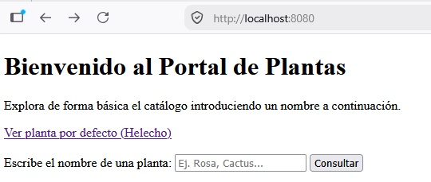
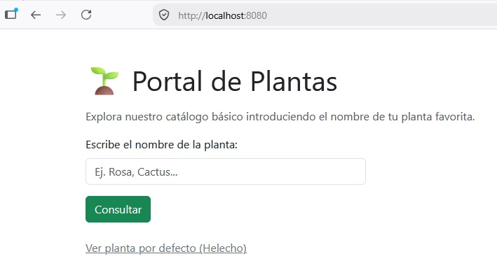
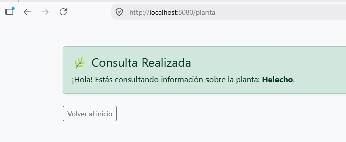
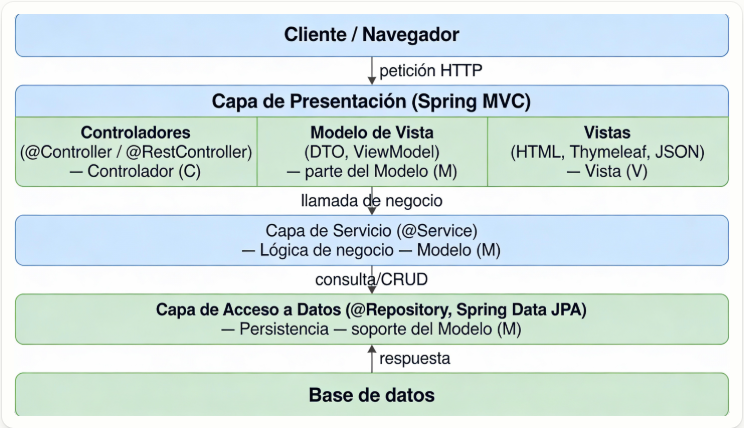
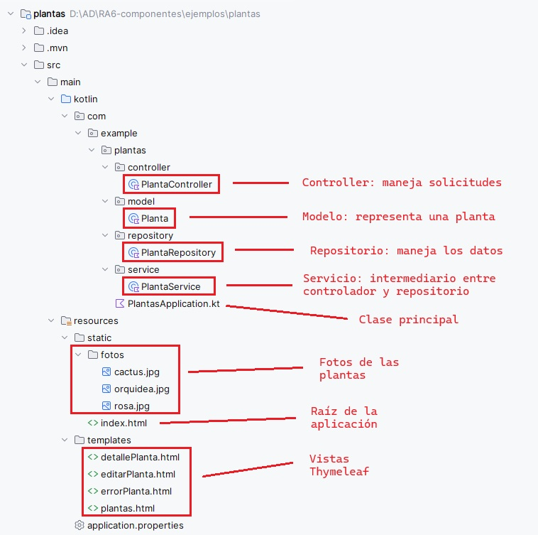

# RA6. Componentes

!!! info "RA6"
    Programa componentes de acceso a datos identificando las características que debe poseer un componente y utilizando herramientas de desarrollo..


<span class="mi_h3">Revisiones</span>

| Revisión | Fecha      | Descripción                                                   |
|----------|------------|---------------------------------------------------------------|
| 1.0      | 25-07-2026 | Adaptación de los materiales a markdown                       |
| 1.1      | 25-07-2026 | Ampliación con preguntas de autoevaluación |


## 1. Introducción

Spring es un framework de código abierto para crear aplicaciones en Java o Kotlin de forma más fácil, rápida y ordenada. Facilita el trabajo de crear objetos, conectar clases, preparar la base de datos y configurar servidores.

Spring se basa principalmente en:

- **Inversión de Control (IoC):** Se encarga de crear y gestionar los objetos de la aplicación.

- **Inyección de Dependencias (DI):** Coloca los objetos donde hacen falta automáticamente.


Además tiene tres pilares:

**1. Autoconfiguración (Spring Boot): prepara el proyecto por ti**

- Servidor web.

- Conexión a base de datos.

- Estructura de proyecto.

- Dependencias necesarias.


**2. Starters: paquetes listos para usar según lo que quieras hacer**

| Starter                        | Descripción                   |
|--------------------------------|-------------------------------|
| spring-boot-starter-web        | para rutas y controladores    |
| spring-boot-starter-thymeleaf  | para páginas HTML             |
| spring-boot-starter-data-jpa   | para BD y CRUD                |


**3. Anotaciones: indican qué hace cada clase**

Las anotaciones son etiquetas especiales que se colocan encima de clases, funciones o atributos para decirle a Spring cómo debe comportarse con ese código. Las anotaciones son, por tanto, la forma en la que Spring entiende la aplicación. Spring tiene muchísimas anotaciones, porque es un framework muy grande y sirve para muchos tipos de proyectos (web MVC, microservicios, seguridad, batch, mensajería, etc.).

En nuestro caso, como vamos a trabajar únicamente con Spring Boot, API REST, vistas HTML y JPA, no es necesario aprender todas las anotaciones que ofrece Spring. Basta con conocer un conjunto reducido de anotaciones básicas, suficientes para desarrollar un backend completo y funcional.

En las siguientes tablas se recogen las anotaciones más importantes que utilizaremos a lo largo del tema (para API REST/vistas HTML + JPA) (a medida que avancemos, irán apareciendo otras anotaciones adicionales que se introducirán solo cuando sean necesarias para la aplicación):

- Anotaciones de arranque de la app

| Anotación                | Dónde se usa           | Para qué sirve                          |
| ------------------------ | ---------------------- | --------------------------------------- |
| @SpringBootApplication | Clase principal        | Marca la clase de arranque de la aplicación Spring Boot y activa la auto-configuración y el escaneo de componentes |

- Anotaciones API REST

| Anotación          | Dónde se usa | Para qué sirve |
| ------------------ |--------------|----------------|
| @RestController    | Clase            | Indica que la clase es un controlador REST y que los métodos devuelven directamente datos (normalmente JSON). |
| @RequestMapping    | Clase o método   | Define la ruta base o una ruta concreta para acceder a un recurso                    |
| @GetMapping        | Método           | Atiende peticiones HTTP **GET** (lectura de datos)                                   |
| @PostMapping       | Método           | Atiende peticiones HTTP **POST** (creación de datos)                                 |
| @PutMapping        | Método           | Atiende peticiones HTTP **PUT** (actualización de datos)                             |
| @DeleteMapping     | Método           | Atiende peticiones HTTP **DELETE** (eliminación de datos)                            |
| @RequestBody       | Parámetro        | Permite recibir datos enviados en el cuerpo de la petición (JSON)                    |
| @PathVariable      | Parámetro        | Permite recoger valores de la URL (por ejemplo, un identificador)                    |


- Anotaciones MVC (vistas)

| Anotación        | Dónde se usa | Para qué sirve |
| ---------------- |--------------|----------------|
| @Controller      | Clase        | Marca una clase como controlador MVC tradicional, devolviendo vistas (HTML con Thymeleaf)       |


- Anotaciones de lógica de negocio

| Anotación       | Dónde se usa | Para qué sirve |
| --------------- |--------------|----------------|
| @Service        | Clase            | Marca una clase como servicio, donde se implementa la lógica de negocio                  |
| @Autowired      | Atributo o constructor | Inyecta automáticamente una dependencia gestionada por Spring                      |


- Anotaciones JPA / Base de datos

| Anotación       | Dónde se usa | Para qué sirve |
| --------------- |--------------|----------------|
| @Entity         | Clase        | Indica que la clase representa una tabla de la base de datos |
| @Table          | Clase        | Define el nombre de la tabla asociada a la entidad  |
| @Id             | Atributo     | Marca el atributo como clave primaria        |
| @GeneratedValue | Atributo     | Indica que el valor de la clave primaria se genera automáticamente |
| @Column         | Atributo     | Configura una columna de la tabla (nombre, restricciones, unicidad, etc.) |
| @OneToMany      | Atributo     | Define una relación uno-a-muchos entre entidades   |
| @ManyToOne      | Atributo     | Define una relación muchos-a-uno entre entidades    |
| @JoinColumn     | Atributo     | Especifica la columna usada como clave foránea en una relación |


- Anotaciones de acceso a datos

| Anotación   | Dónde se usa | Para qué sirve |
| ----------- |--------------|----------------|
| @Repository | Clase o interfaz | Indica que la clase o interfaz se encarga del acceso a datos y de la gestión de excepciones de base de datos |


Los componentes principales de Spring Framework son:

| Componente      | Descripción                                                                             |
|-----------------|-----------------------------------------------------------------------------------------|
| Spring Core     | El núcleo del framework, encargado de la inyección de dependencias                      |
| Spring Boot     | Facilita la creación de aplicaciones basadas en Spring con una configuración mínima     |
| Spring MVC      | Permite el desarrollo de aplicaciones web utilizando el patrón Modelo-Vista-Controlador |
| Spring Data     | Simplifica el acceso a datos con soporte para JPA, MongoDB, Redis, entre otros          |
| Spring Security | Proporciona herramientas para implementar seguridad en aplicaciones                     |
| Spring Cloud    | Ayuda en la construcción de aplicaciones distribuidas y microservicios                  |


## 2. Spring Boot

Para crear una aplicación se necesita crear el proyecto, desarrollar la aplicación y desplegarla en un servidor. **Spring Boot** simplifica las tareas de crear el proyecto y desplegar la aplicación ya que:

- Configura todo automáticamente.

- Trae un servidor web incorporado (permite crear aplicaciones que se ejecutan de forma independiente sin necesidad de un servidor web externo).

- Evita escribir XML.

- Permite arrancar una app con un botón.

- Usa starters (dependencias ya preparadas).

- Permite crear proyectos en segundos.


Para crear un proyecto **Spring Boot** Maven/Gradle con las dependencias necesarias tenemos dos opciones:

- Crear un proyecto Spring Boot utilizando la herramienta Spring Initializr desde la url [https://start.spring.io/](https://start.spring.io/) la cual genera un proyecto base con la estructura de una aplicación Spring Boot en un archivo .zip que podemos abrir directamente desde un IDE.

- Crear un proyecto Spring Boot utilizando un IDE que tenga instalados los plugins necesarios. En el caso de IntelliJ solamente es posible utilizar el plugin de Spring en la versión Ultimate.

Una vez creado el proyecto tendremos las configuraciones y dependencias en los archivos siguientes:

- **application.properties:** configuración de aspectos como las conexiones a base de datos o el puerto por donde acceder a nuestra aplicación.

- **pom.xml:** dependencias necesarias para que la aplicación funcione.


**Dependencia Spring Web**

- Se utiliza para desarrollar aplicaciones web, ya sea basadas en REST o tradicionales con HTML dinámico.

- Incluye un servidor web embebido (por defecto, Tomcat) para ejecutar la aplicación sin necesidad de configurarlo manualmente.

- Facilita el manejo de rutas HTTP (GET, POST, PUT, DELETE, etc.) y parámetros de solicitud a través de métodos en los controladores.

- Usa la biblioteca Jackson (incluida por defecto) para convertir automáticamente objetos Kotlin/Java a JSON y viceversa.

- Ofrece herramientas para manejar errores y excepciones de forma global mediante @ControllerAdvice o controladores personalizados.


**Pasos que sigue la ejecución de la aplicación**

- **Inicio de la aplicación:** Se ejecuta el método main, lo que inicia un servidor web embebido (por defecto, `Tomcat`) en el puerto 8080.

- **Solicitudes HTTP:**  Spring Boot permite funcionar a partir de rutas dinámicas y/o de archivos estáticos.

- **Respuesta:**  La aplicación procesa la solicitud y devuelve un resultado al navegador.


<span class="mis_ejemplos">Ejemplo 1: Aplicación Spring Boot con Spring Web</span>

A continuación se describen los pasos para a crear una aplicación utilizando Spring Web.

<span class="mi_sombreado">**PASO 1: Crear el proyecto**</span>

Accedemos a Spring Initializr desde la url [https://start.spring.io/](https://start.spring.io/), indicamos el nombre de la aplicación y añadimos la dependencia **Spring Web** (el resto de opciones las podemos dejar como se ve en la imagen). Por último hacemos clic en el botón `GENERATE`. Esto hará que se cree el proyecto y se descargue en un archivo .zip.


<span class="mi_sombreado">**PASO 2: Abrir el proyecto y ejecutarlo**</span>

Descomprimimos el archivo obtenido en el paso anterior y lo abrimos con IntelliJ. Vemos que, además de los archivos **application.properties** y **pom.xml** se ha creado automaticamente la clase **Plantas1Application** (con la anotación **@SpringBootApplication**) y la función de extensión **runApplication** que sirve para lanzar la aplicación.


Antes de escribir una sola línea de código en nuestro controlador, vamos a ejecutar la aplicación tal y como viene por defecto. Abrimos el archivo `Plantas1Application.kt` y hacemos clic en el botón de reproducción (Run) de IntelliJ. Veremos por consola la salida de los mensajes de registro de Spring.


> Si el puerto 8080 está ocupado aparecerá un mensaje diciendo que no se puede iniciar el servidor Tomcat. Puedes cambiar el puerto, por ejemplo al 8888, añadiendo la siguiente línea en el archivo `application.properties` (que se encuentra en la carpeta resources del proyecto):
    ```
    server.port=8888
    ```


Abrimos nuestro navegador web y accedemos a la dirección [http://localhost:8080](http://localhost:8080) pero vemos una pantalla de error genérica de Spring llamada "Whitelabel Error Page (404 Not Found)". Este error 404 significa que no hemos programado absolutamente nada para que nuestra applicación responda en esa ruta raíz (/). El servidor está levantado, pero está "vacío" de contenido.


!!! success "Prueba y analiza el ejemplo"
    Realiza los pasos 1 y 2 y verifica que el comportamiento de tu aplicación es el mismo que en el ejemplo.


Hemos comentado anteriormente que Spring Boot permite funcionar a partir de rutas dinámicas y de archivos estáticos. En los pasos siguientes añadiremos esas funcionalidades a nuestra aplicación


<span class="mi_sombreado">**PASO 3: Añadir una ruta dinámica a nuestra aplicación**</span>

Para que nuestra aplicación empiece a hacer algo útil, añadimos una función a la clase principal `Plantas1Application.kt`. Sustituimos su código por el siguiente:

```kotlin
package com.example.plantas1

import org.springframework.boot.autoconfigure.SpringBootApplication
import org.springframework.boot.runApplication

import org.springframework.web.bind.annotation.GetMapping
import org.springframework.web.bind.annotation.RequestParam
import org.springframework.web.bind.annotation.RestController

@SpringBootApplication
@RestController
class Plantas1Application{
    @GetMapping("/planta")
    fun infoPlanta(
        @RequestParam(value = "nombre", defaultValue = "Helecho") nombre: String
    ): String {
        return "¡Hola! Estás consultando información sobre la planta: $nombre."
    }
}

fun main(args: Array<String>) {
	runApplication<Plantas1Application>(*args)
}
```


**Explicación de los cambios realizados:**

* **@RestController**: se utiliza para que Spring reconozca la clase como un controlador que maneja solicitudes HTTP. Combina:
    * @Controller: Define la clase como un controlador web.
    * @ResponseBody: Indica que los métodos devolverán directamente el cuerpo de la respuesta (en este caso, texto plano en lugar de una vista HTML).

* **@GetMapping("/planta")**: Es una anotación de Spring que indica que este método debe manejar las solicitudes HTTP GET que lleguen a la URL `/planta`.
    * Enlaza la URL `/planta` con el método `infoPlanta`.
    * Cada vez que se acceda a la ruta [http://localhost:8080/planta](http://localhost:8080/planta) (asumiendo el puerto predeterminado 8080) en un navegador con un método GET, Spring ejecutará el método `infoPlanta`.

* **@RequestParam**: se usa para extraer un parámetro de la consulta (query parameter) enviado en la URL.
    * El método espera un parámetro de consulta llamado `nombre`.
    * Si el cliente no incluye `nombre` en la solicitud, el valor predeterminado será "Helecho", gracias a defaultValue = "Helecho".


<span class="mi_sombreado">**PASO 4: Volvemos a ejecutar la aplicación**</span>

Ejecutamos la aplicación para levantar el servidor y comprobamos el comportamiento del navegador con estas dos direcciones:


- Sin parámetros: [http://localhost:8080/planta](http://localhost:8080/planta)


- Con parámetro personalizado: [http://localhost:8080/planta?nombre=Rosa](http://localhost:8080/planta?nombre=Rosa)




Nuestra ruta dinámica `/planta` funciona correctamente porque la hemos mapeado de forma explícita mediante `@GetMapping("/planta")`. Pero la ruta raíz [http://localhost:8080](http://localhost:8080) sigue devolviendo la misma pantalla de error. Esto es lógico: hemos programado la ruta `/planta`, pero seguimos sin tener nada programado para la raíz `/`.


!!! success "Prueba y analiza el ejemplo"
    Realiza los pasos 3 y 4 y verifica que el comportamiento de tu aplicación es el mismo que en el ejemplo.


<span class="mi_sombreado">**PASO 5: Añadir una página de inicio HTML**</span>

Como hemos visto en los pasos anteriores, necesitamos que la dirección raíz [http://localhost:8080](http://localhost:8080)  muestre una pantalla de inicio amigable en lugar de un error de "página no encontrada". Para solucionar esto, nos apoyaremos en la carpeta de recursos estáticos de Spring Boot `src/main/resources/static/`. Cualquier archivo que guardemos en esta carpeta (imágenes, CSS, HTML sencillos) será servido directamente por el servidor web sin necesidad de escribir código Java o Kotlin adicional.

Una de las reglas automáticas de Spring Boot es que si guardas un archivo llamado exactamente `index.html` dentro de `static/`, el servidor lo utilizará de forma automática como la página de inicio para la ruta raíz `/`. Vamos a comprobarlo.

Crea el archivo `index.html` dentro de la carpeta `src/main/resources/static/` con el siguiente contenido:

```html
<!DOCTYPE HTML>
<html>
<head>
    <title>Portal de Plantas</title>
    <meta http-equiv="Content-Type" content="text/html; charset=UTF-8" />
</head>
<body>
<h1>Bienvenido al Portal de Plantas</h1>
<p>Explora de forma básica el catálogo introduciendo un nombre a continuación.</p>

<!-- Enlace directo que usa el valor por defecto -->
<a href="/planta">Ver planta por defecto (Helecho)</a>

<br><br>

<!-- Formulario que envía la petición GET al controlador -->
<form action="/planta" method="GET" id="plantForm">
    <div>
        <label for="plantField">Escribe el nombre de una planta:</label>
        <input type="text" name="nombre" id="plantField" placeholder="Ej. Rosa, Cactus...">
        <button type="submit">Consultar</button>
    </div>
</form>
</body>
</html>
```

Ahora, al acceder a [http://localhost:8080/](http://localhost:8080/), el navegador servirá la página de inicio siguiente: 


Al rellenar el cuadro de texto y pulsar "Consultar", el formulario redirigirá automáticamente a `/planta?nombre=valor_introducido`. Devolviendo el mismo resultado que en el pasos 4.


!!! success "Prueba y analiza el ejemplo"
    Realiza el paso 5 y verifica que el comportamiento de tu aplicación es el mismo que en el ejemplo.


<span class="mi_sombreado">**PASO 6: Mejorar el aspecto**</span>

Ahora vamos a darle a nuestra aplicación un aspecto más profesional utilizando `bootstrap`. Podemos encontrar mucha documentacion en internet sobre como utilizarlo. Por ejemplo en:

- [https://getbootstrap.com/docs/5.3/getting-started/introduction/](https://getbootstrap.com/docs/5.3/getting-started/introduction/)
- [https://www.w3schools.com/bootstrap5/](https://www.w3schools.com/bootstrap5/)


Hacemos algunos cambios en nuestro archivo `index.html` en `src/main/resources/static/` para que quede así:

```html
<!DOCTYPE HTML>
<html lang="es">
<head>
    <meta charset="UTF-8">
    <title>Portal de Plantas</title>
    <!-- CDN de Bootstrap -->
    <link href="https://cdn.jsdelivr.net/npm/bootstrap@5.3.2/dist/css/bootstrap.min.css" rel="stylesheet">
</head>
<body>

<!-- Contenedor principal para centrar y dar margen superior -->
<div class="container mt-5">

    <h1 class="mb-3">🌱 Portal de Plantas</h1>
    <p class="text-muted">Explora nuestro catálogo básico introduciendo el nombre de tu planta favorita.</p>

    <!-- Formulario con un ancho máximo sugerido para que no ocupe toda la pantalla -->
    <form action="/planta" method="GET" id="plantForm" class="mb-4" style="max-width: 400px;">
        <div class="mb-3">
            <label for="plantField" class="form-label">Escribe el nombre de la planta:</label>
            <input type="text" name="nombre" id="plantField" class="form-control" placeholder="Ej. Rosa, Cactus..." required>
        </div>
        <button type="submit" class="btn btn-success">Consultar</button>
    </form>

    <a href="/planta" class="link-secondary">Ver planta por defecto (Helecho)</a>

</div>

</body>
</html>
```

**Explicación de los cambios realizados:**

- `<div class="container mt-5">` Agrupa todo el contenido para que no quede pegado a los bordes de la pantalla.
- `class="form-control"` Cambia el cuadro de texto simple por un campo de texto con bordes suaves y que resalta al hacer clic.
- `class="btn btn-success"` Convierte el botón gris por defecto del navegador en un botón verde.
- `class="text-muted"` y `class="link-secondary"` Suavizan el color del texto secundario y del enlace para mejorar la jerarquía visual.


Y sustituimos el código del fichero `Plantas1Application.kt` por el siguiente:

```kotlin
package com.example.plantas1

import org.springframework.boot.autoconfigure.SpringBootApplication
import org.springframework.boot.runApplication
import org.springframework.web.bind.annotation.GetMapping
import org.springframework.web.bind.annotation.RequestParam
import org.springframework.web.bind.annotation.RestController
import org.springframework.http.MediaType // Necesario para especificar el tipo de retorno

@SpringBootApplication
@RestController
class PlantasIntroApplication {

    // Especificamos que este método devuelve HTML para que el navegador lo renderice correctamente
    @GetMapping("/planta", produces = [MediaType.TEXT_HTML_VALUE])
    fun infoPlanta(
        @RequestParam(value = "nombre", defaultValue = "Helecho") nombre: String
    ): String {
        // Usamos una cadena multilínea de Kotlin para escribir HTML de forma limpia
        return """
            <!DOCTYPE HTML>
            <html lang="es">
            <head>
                <meta charset="UTF-8">
                <title>Detalle de Planta</title>
                <!-- CDN de Bootstrap para aplicar el diseño -->
                <link href="https://cdn.jsdelivr.net/npm/bootstrap@5.3.2/dist/css/bootstrap.min.css" rel="stylesheet">
            </head>
            <body class="bg-light">
                <div class="container mt-5">
                    
                    <!-- Alerta de Bootstrap para mostrar la información -->
                    <div class="alert alert-success shadow-sm" role="alert">
                        <h4 class="alert-heading">🌿 Consulta Realizada</h4>
                        <p class="mb-0">
                            ¡Hola! Estás consultando información sobre la planta: <strong>$nombre</strong>.
                        </p>
                    </div>
                    
                    <!-- Botón para regresar al index.html -->
                    <a href="/" class="btn btn-outline-secondary btn-sm mt-2">Volver al inicio</a>
                    
                </div>
            </body>
            </html>
        """.trimIndent()
    }
}

fun main(args: Array<String>) {
    runApplication<PlantasIntroApplication>(*args)
}
```

**Explicación de los cambios realizados:**

- **produces = [MediaType.TEXT_HTML_VALUE]:** Por defecto, un @RestController que devuelve un String lo envía como texto plano (text/plain). Al añadir este parámetro en @GetMapping, le indicamos a Spring que añada la cabecera HTTP Content-Type: text/html para que el navegador interprete las etiquetas HTML y cargue la hoja de estilos de Bootstrap.
- **Cadenas triples (""") de Kotlin:** Permiten escribir código HTML estructurado en múltiples líneas sin tener que concatenar constantemente con símbolos +, facilitando mucho la legibilidad del código fuente de la clase.
- **Diseño minimalista:** Se envuelve el mensaje en un componente alert `alert-success` y se incluye un pequeño botón para volver a la página principal (/), lo que permite navegar entre el formulario y el resultado de forma fluida.


Ahora es aspecto de nuestra aplicación es el que se muestra en las siguientes imágenes:






!!! success "Prueba y analiza el ejemplo"
    Realiza el paso 6 y verifica que el comportamiento de tu aplicación es el mismo que en el ejemplo.


## 3. Spring MVC y Thymeleaf

**Spring MVC** es el módulo de Spring orientado al desarrollo de aplicaciones web siguiendo el patrón **Modelo‑Vista‑Controlador (MVC)**, el cual organiza una aplicación en tres **componentes principales**:

* **Modelo**: Son los datos. Es responsable de:

    * Gestionar el estado de la aplicación.

    * Interactuar con la base de datos u otros servicios para obtener y procesar datos.

    * Proveer datos a la vista.

* **Vista**: Es lo que ve el usuario. Es responsable de:

    * Renderizar información en un formato adecuado, como HTML.

    * Mostrar al usuario los resultados de las acciones ejecutadas.

* **Controlador**: Actúa como intermediario entre el modelo y la vista. Es responsable de:

    * Procesar las solicitudes del usuario (peticiones HTTP).

    * Interactuar con el modelo para obtener o modificar datos.

    * Seleccionar y devolver la vista adecuada para responder al usuario.


Estos tres componentes trabajan de la siguiente forma:

1) El usuario interactúa con la **Vista** (interfaz). Envia un formulario o hace clic en un enlace.

2) La petición es enviada al **Controlador**.

3) El **Controlador** procesa la petición, interactúa con el **Modelo** si es necesario y selecciona la **Vista** que debe renderizar la respuesta.

4) La **Vista** presenta la respuesta al usuario.


Spring MVC forma parte del ecosistema Spring y se organiza siguiendo una arquitectura en capas en la que cada capa tiene una función concreta y se comunica únicamente con las capas adyacentes. Esta arquitectura encaja perfectamente con el patrón MVC (Model–View–Controller) y proporciona toda la infraestructura necesaria para manejar peticiones HTTP, invocar controladores y devolver vistas (HTML, JSON, etc.) lo que permite aplicaciones más mantenibles, escalables y fáciles de entender.

En la siguiente tabla se muestran las capas más habituales en una aplicación Spring con su equivalencia en Spring MVC, sus anotaciones más habituales y la función que realiza cada una de ellas:

**Anotaciones por capa y correspondencia Spring ↔ MVC**

| Capas Spring      | Capa MVC    | Anotaciones  | Función           |
|-------------------|-------------|--------------|-------------------|
| Controller (Web)                    | Controller  | `@Controller`<br>`@RestController`<br>`@RequestMapping`<br>`@GetMapping`<br> `@RequestParam` <br> `@PostMapping`<br>`@PutMapping`<br>`@DeleteMapping` | Recibe peticiones HTTP, gestiona rutas y parámetros, llama a la capa Service y devuelve una vista o una respuesta (JSON)<br>**No contiene lógica de negocio ni acceso a datos**                         |
| Model (Entidades)<br>Service (Negocio)<br>Repository (Persistencia) | Model | `@Entity`, `@Table`, `@Id`<br>`@Service`, `@Transactional`<br>`@Repository` | Contiene las clases que modelan la información del negocio, aplica reglas y validaciones y accede a la base de datos para realizar operaciones CRUD (manteniendo aislada la BD del resto de la aplicación)        |
| View (Representación HTML / JSON)               | View | *(sin anotaciones)* | Representa los datos al usuario:<br>• Archivo HTML con sintaxis específica para contenido dinámico si se utiliza Thymeleaf / JSP 	(Ubicación Thymeleaf: `src/main/resources/templates/`)<br>• Datos en formato JSON / XML en apps REST (si no se utiliza un motor de plantillas). En REST, el JSON actúa como la vista |





**Vistas con Thymeleaf**

Thymeleaf es un motor de plantillas que permite mezclar HTML con datos dinámicos proporcionados por el controlador en Spring MVC. Utiliza atributos especiales que comienzan con th: para manipular estos datos de forma dinámica. La siguiente tabla muestra los atributos Thymeleaf más comunes:

| **Atributo**    | **Descripción**                                                                                        | **Ejemplo**                                                                                           |
| --------------- | ------------------------------------------------------------------------------------------------------ | ----------------------------------------------------------------------------------------------------- |
| **`th:text`**   | Rellena el contenido de un elemento HTML con un valor dinámico.                                        | `<p th:text="${mensaje}">Texto por defecto</p>`                                                       |
| **`th:each`**   | Itera sobre una colección (lista, array, etc.) y genera un nuevo elemento HTML para cada item.         | `<ul><li th:each="planta : ${plantas}" th:text="${planta.nombre}">Nombre de la planta</li></ul>`      |
| **`th:if`**     | Muestra el contenido solo si la condición es verdadera.                                                | `<p th:if="${hayPlantas}">Hay plantas registradas</p>`                                                |
| **`th:unless`** | Muestra el contenido solo si la condición es falsa.                                                    | `<p th:unless="${hayPlantas}">No hay plantas registradas</p>`                                         |
| **`th:href`**   | Construye enlaces dinámicos para el atributo `href` de un enlace `<a>`.                                | `<a th:href="@{/planta/{id}(id=${planta.id})}">Ver detalles</a>`                                      |
| **`th:src`**    | Construye enlaces dinámicos para el atributo `src` de una imagen ``.                              | `` |
| **`th:action`** | Define la URL a la que se enviará un formulario cuando se haga submit.              | `<form th:action="@{/planta/guardar}" method="post"><button type="submit">Guardar</button></form>`    |
| **`th:object`**   | Asocia un objeto del modelo con el formulario, permitiendo vincular automáticamente sus atributos. | `<form th:object="${planta}" th:action="@{/planta/guardar}" method="post">...</form>`                |
| **`th:value`**  | Rellena el valor de un campo de formulario (`input`, `textarea`, etc.) con un valor dinámico.          | `<input type="text" th:value="${planta.nombre}" />`                            |
| **`th:field`**  | Asocia un campo de formulario con un atributo del modelo de Spring, vincula los datos automáticamente. | `<input type="text" th:field="*{nombre}" />`                                     |


<span class="mis_ejemplos">Ejemplo 2: Aplicación utilizando Spring MVC y Thymeleaf</span>

A continuación se describen los pasos para crear una aplicación que es un CRUD sobre una colección de plantas almacenada en memoria y que tiene las siguientes vistas:

- Pantalla de bienvenida desde la que se accede al listado de plantas.
- Pantalla de listado con un botón para añadir plantas nuevas y el listado de plantas con botones para mostrar sus detalles, modificarlos o eliminarla.
- Formulario con campos para modificar la información de un planta o añadir una nueva.


<span class="mi_sombreado">**PASO 1: Crear el proyecto**</span>

Accedemos a Spring Initializr desde la url [https://start.spring.io/](https://start.spring.io/), indicamos el nombre de la aplicación `plantas` y, en este caso, además de la dependencia **Spring Web** necesitamos también **Thymeleaf** (el resto de opciones las podemos dejar como se ve en la imagen). Por último hacemos clic en el botón `GENERATE` para descargar nuestro nuevo proyecto.

Opcionalmente podemos añadir **Spring Boot DevTools** que nos ahorrará tiempo de desarrollo ya que:

- Reinicia automáticamente la aplicación cuando cambias código.

- Recarga las plantillas Thymeleaf sin reiniciar manualmente.

Para tener estas funciones activas, además de añadir la dependencia, hay que configurar IntelliJ para que compile al guardar. Esto se consigue activando las opciones siguientes:

- Build project automatically (Settings → Build, Execution, Deployment → Compiler)

- Allow auto-make to start even if developed application is currently running (Settings → Advanced Settings)

De esta forma, cuando realicemos un cambio en un archivo de código de nuestra aplicación, bastará con guardarlo y recargar el navegador (sin reiniciar la app) para ver los cambios inmediatamente.


Descomprimimos el archivo obtenido en el paso anterior y lo abrimos con IntelliJ. Dejamos el archivo `PlantasApplication.kt` (clase principal) tal como está y añadimos los archivos de nuestra aplicación para que la estructura del proyecto quede como en la siguiente imagen:




<span class="mi_sombreado">**PASO 2: Añadir modelo, repositorio, servicio y controlador**</span>

- Añadimos el **modelo** (representa los datos de la aplicación). Para ello, creamos el archivo `Planta.kt` dentro de la carpeta `src/main/kotlin/com/example/plantas/model/` con el código siguiente:

```kotlin
package com.example.plantas.model

data class Planta(
    var id_planta: Int,
    var nombre: String,
    var tipo: String,
    var altura: Double,
    var foto: String
)
```

**Explicación del código:**

`data class` Es una clase especial de Kotlin diseñada específicamente para almacenar datos. Al usarla, Kotlin genera automáticamente de forma interna los métodos `getters`, `setters`, `toString()`, `equals()` y `copy()`, lo que nos ahorra escribir decenas de líneas de código repetitivo.

| Atributo | Tipo | Descripción                                             |
| :--- | :--- |:--------------------------------------------------------|
| `id_planta` | `Int` | Identificador único de cada planta (clave primaria).    |
| `nombre` | `String` | Nombre común de la planta.                              |
| `tipo` | `String` | Categoría o tipo de planta (ej. Flor, Suculenta).       |
| `altura` | `Double` | Altura máxima estimada en metros.                       |
| `foto` | `String` | Nombre del archivo de imagen asociado (ej. `rosa.jpg`). |


- Añadimos el **repositorio** (gestiona la lista mutable en memoria). Para ello, creamos el archivo `PlantaRepository.kt` dentro de la carpeta `src/main/kotlin/com/example/plantas/repository/` con el código siguiente:

```kotlin
package com.example.plantas.repository

import com.example.plantas.model.Planta
import org.springframework.stereotype.Repository

@Repository
class PlantaRepository {

    // La lista en memoria se traslada aquí y actúa como nuestra "Base de Datos" temporal
    private val plantas = mutableListOf(
        Planta(1, "Rosa", "Flor", 0.5, "rosa.jpg"),
        Planta(2, "Cactus", "Suculenta", 1.2, "cactus.jpg"),
        Planta(5, "Orquídea", "Flor", 0.3, "orquidea.jpg")
    )

    fun findAll(): MutableList<Planta> = plantas

    fun findById(id: Int): Planta? = plantas.find { it.id_planta == id }

    fun save(planta: Planta) {
        val index = plantas.indexOfFirst { it.id_planta == planta.id_planta }
        if (index != -1) {
            // Edición de planta existente
            plantas[index] = planta
        } else {
            // Creación de nueva planta (simulación de ID autoincremental)
            val nuevoId = (plantas.maxOfOrNull { it.id_planta } ?: 0) + 1
            plantas.add(planta.copy(id_planta = nuevoId))
        }
    }
    
    fun deleteById(id_planta: Int) {
        val plantas = findAll()
        plantas.removeIf { it.id_planta == id_planta }
    }
}
```


**Explicación del código:**

`@Repository` Indica a Spring que esta clase se encarga del **acceso directo a los datos** (crear, leer, actualizar y borrar). Además, registra la clase en el contenedor de Spring para que pueda ser inyectada automáticamente donde se necesite.

| Elemento / Método       | Descripción                                                                                                                                                       |
|:------------------------|:------------------------------------------------------------------------------------------------------------------------------------------------------------------|
| `private val plantas`   | Lista mutable (`mutableListOf`) que almacena las plantas en la memoria RAM del servidor, actuando temporalmente como nuestra base de datos.                       |
| `findAll()`             | Recupera y devuelve la lista completa con todas las plantas almacenadas.                                                                                          |
| `findById(id)`          | Busca en la lista y devuelve la planta que coincida con el ID proporcionado, o `null` si no encuentra ninguna.                                                    |
| `save(planta)`          | Comprueba si la planta ya existe buscando su ID. Si existe, la actualiza. Si no existe, calcula de forma automática un nuevo ID secuencial y la añade a la lista. |
| `deleteById(id_planta)` | Comprueba si la planta ya existe buscando su ID. Si existe, pide confirmación antes de eliminarla.                                                                |


- Añadimos el **servicio** (intermediario que aplican cualquier lógica de negocio intermedia antes de acceder a los datos). Para ello, creamos el archivo `PlantaService.kt` dentro de la carpeta `src/main/kotlin/com/example/plantas/service/` con el código siguiente:

```kotlin
package com.example.plantas.service


import com.example.plantas.model.Planta
import com.example.plantas.repository.PlantaRepository
import org.springframework.stereotype.Service

@Service
class PlantaService(private val repository: PlantaRepository) {

    fun listarPlantas(): List<Planta> = repository.findAll()

    fun buscarPorId(id: Int): Planta? = repository.findById(id)

    fun guardar(planta: Planta) = repository.save(planta)

    fun borrar(id_planta: Int) {
        repository.deleteById(id_planta)
    }

}
```

**Explicación del código:**

`@Service` Indica a Spring que esta clase contiene la **lógica de negocio** y las reglas de nuestra aplicación. Actúa como una capa intermedia de seguridad y control entre lo que pide el controlador y lo que hace el repositorio.

`PlantaService(private val repository...)` Inyección de dependencias por constructor. Spring busca automáticamente la clase anotada con `@Repository` y se la proporciona al servicio cuando este se crea, sin necesidad de que hagamos un `new` de forma manual.

| Método              | Descripción                                                                            |
|:--------------------|:---------------------------------------------------------------------------------------|
| `listarPlantas()`   | Solicita al repositorio la lista de todas las plantas y se la devuelve al controlador. |
| `buscarPorId(id)`   | Solicita al repositorio buscar una planta concreta por su identificador.               |
| `guardar(planta)`   | Ordena al repositorio que guarde o actualice la planta correspondiente.                |
| `borrar(id_planta)` | Ordena al repositorio que borre la planta correspondiente.                 |


- Añadimos el **controlador** (recibe las peticiones, llama al servicio y devuelve las vistas.). Para ello, creamos el archivo `PlantaController.kt` dentro de la carpeta `src/main/kotlin/com/example/plantas/controller/` con el código siguiente:

```kotlin

package com.example.plantas.controller

import com.example.plantas.model.Planta
import com.example.plantas.service.PlantaService
import org.springframework.stereotype.Controller
import org.springframework.ui.Model
import org.springframework.web.bind.annotation.*

@Controller
class PlantaController(private val plantaService: PlantaService) {

    // 1. LISTAR
    @GetMapping("/plantas")
    fun mostrarPlantas(model: Model): String {
        model.addAttribute("plantas", plantaService.listarPlantas())
        return "plantas"
    }

    // 2. DETALLE
    @GetMapping("/planta/{id_planta}")
    fun verPlanta(@PathVariable id_planta: Int, model: Model): String {
        val planta = plantaService.buscarPorId(id_planta) ?: return "errorPlanta"
        model.addAttribute("planta", planta)
        return "detallePlanta"
    }

    // 3. FORMULARIO NUEVA PLANTA (pasa un objeto vacío con ID 0)
    @GetMapping("/plantas/nueva")
    fun nuevaPlanta(model: Model): String {
        val plantaVacia = Planta(0, "", "", 0.0, "")
        model.addAttribute("planta", plantaVacia)
        model.addAttribute("titulo", "Nueva Planta")
        return "formPlanta"
    }

    // 4. FORMULARIO EDITAR PLANTA (pasa el objeto existente)
    @GetMapping("/plantas/editar/{id_planta}")
    fun editarPlanta(@PathVariable id_planta: Int, model: Model): String {
        val planta = plantaService.buscarPorId(id_planta) ?: return "redirect:/plantas"
        model.addAttribute("planta", planta)
        model.addAttribute("titulo", "Editar Planta")
        return "formPlanta"
    }

    // 5. PROCESAR GUARDADO (Sirve tanto para crear como para editar)
    @PostMapping("/plantas/guardar")
    fun guardarPlanta(@ModelAttribute planta: Planta): String {
        plantaService.guardar(planta)
        return "redirect:/plantas"
    }

    // 6. PROCESAR BORRADO
    @GetMapping("/plantas/borrar/{id_planta}")
    fun borrarPlanta(@PathVariable id_planta: Int): String {
        plantaService.borrar(id_planta)
        return "redirect:/plantas"
    }
}
```

**Explicación del código:**

`@Controller` Indica a Spring que esta clase es un controlador que maneja peticiones web y devuelve vistas HTML (plantillas de Thymeleaf).

`@GetMapping` Atiende peticiones HTTP **GET** (lectura de datos) para mostrar páginas HTML.

| Función | Descripción                                                                                                                            |
| :--- |:---------------------------------------------------------------------------------------------------------------------------------------|
| `@GetMapping("/plantas")` | Llama al servicio para obtener la lista de todas las plantas y las muestra en `plantas.html`.                                          |
| `@GetMapping("/planta/{id_planta}")` | Solicita al servicio una planta específica por su ID para mostrarla en `detallePlanta.html`. Si no existe, muestra `errorPlanta.html`. |
| `@GetMapping("/planta/editar/{id_planta}")` | Recupera la planta a través del servicio y la carga en el formulario de edición `formPlanta.html`.                                     |

`@PostMapping` Atiende peticiones HTTP **POST** (normalmente el envío de un formulario) para procesar datos.

| Función | Descripción                         |
| :--- |:--------------------------------------|
| `@PostMapping("/planta/guardar")` | Envía los datos modificados al **servicio** para que los actualice en el repositorio. Al terminar, redirige al detalle de la planta con `redirect:/planta/{id_planta}`. Se utiliza `redirect` para evitar el reenvío duplicado de formularios si el usuario refresca la página. |

`Model` Interfaz de Spring utilizada para pasar datos desde el controlador hacia la vista HTML (Thymeleaf).

`@PathVariable` Anotación que se utiliza para extraer y leer parámetros directamente desde la ruta de la URL (en este caso, `{id_planta}`).


<span class="mi_sombreado">**PASO 3: Añadir las vistas con Thymeleaf**</span>

Para nuestra aplicación necesitamos cuatro vistas, una para la lista de plantas, otra para el detalle de una planta, una tercera para avisar en caso de producirse un error y la última un formulario para añadir una planta nueva o para modificar la información de una ya existente. Por tanto tendremos cuatro archivos `html` todos ellos dentro de la carpeta `src/main/resources/templates/`. 


- El archivo que mostrará la lista de plantas será `plantas.html` y su código es el siguiente:

```html
<!DOCTYPE html>
<html xmlns:th="http://www.thymeleaf.org">
<head>
    <meta charset="UTF-8">
    <title>Catálogo de Plantas</title>
    <link href="https://cdn.jsdelivr.net/npm/bootstrap@5.3.2/dist/css/bootstrap.min.css" rel="stylesheet">
</head>
<body class="bg-light">
<div class="container mt-5">
    <div class="d-flex justify-content-between align-items-center mb-4">
        <h1 class="text-success fw-bold">🌿 Catálogo de Plantas</h1>
        <a href="/plantas/nueva" class="btn btn-success">Agregar Nueva Planta</a>
    </div>

    <div th:if="${plantas.size() > 0}" class="table-responsive">
        <table class="table table-striped table-hover align-middle shadow-sm bg-white rounded">
            <thead class="table-success">
            <tr>
                <th>ID</th>
                <th>Nombre</th>
                <th>Tipo</th>
                <th class="text-center">Acciones</th>
            </tr>
            </thead>
            <tbody>
            <tr th:each="planta : ${plantas}">
                <td th:text="${planta.id_planta}">1</td>
                <td th:text="${planta.nombre}">Rosa</td>
                <td th:text="${planta.tipo}">Flor</td>
                <td class="text-center">
                    <a th:href="@{/planta/{id}(id=${planta.id_planta})}" class="btn btn-info btn-sm">Detalles</a>
                    <a th:href="@{/plantas/editar/{id}(id=${planta.id_planta})}" class="btn btn-warning btn-sm">Editar</a>
                    <a th:href="@{/plantas/borrar/{id}(id=${planta.id_planta})}" class="btn btn-danger btn-sm"
                       onclick="return confirm('¿Estás seguro de borrar esta planta?')">Borrar</a>
                </td>
            </tr>
            </tbody>
        </table>
    </div>

    <div th:unless="${plantas.size() > 0}" class="alert alert-warning text-center shadow-sm">
        No se han encontrado plantas registradas en el sistema.
    </div>

    <div class="text-start mt-4">
        <a href="/" class="btn btn-outline-secondary">Volver a la Portada</a>
    </div>
</div>
</body>
</html>
```


- El archivo que mostrará el detalle de una plantas será `detallePlanta.html` y su código es el siguiente:

```html
<!DOCTYPE html>
<html xmlns:th="http://www.thymeleaf.org">
<head>
    <meta charset="UTF-8">
    <title>Detalles de la Planta</title>
    <link href="https://cdn.jsdelivr.net/npm/bootstrap@5.3.2/dist/css/bootstrap.min.css" rel="stylesheet">
</head>
<body class="bg-light">
<div class="container mt-5" style="max-width: 500px;">
    <div class="card shadow-sm border-0 text-center">

        

        <div class="card-body p-4">
            <h1 class="text-success fw-bold mb-3" th:text="${planta.nombre}">Nombre</h1>
            <p class="text-muted fs-5">
                <strong>Tipo:</strong> <span th:text="${planta.tipo}">Flor</span> <br>
                <strong>Altura:</strong> <span th:text="${planta.altura}">1.2</span> metros
            </p>
            <hr>
            <div class="d-flex justify-content-around mt-4">
                <a href="/plantas" class="btn btn-outline-secondary">Volver al listado</a>
                <a th:href="@{/plantas/editar/{id}(id=${planta.id_planta})}" class="btn btn-warning">Editar</a>
            </div>
        </div>
    </div>
</div>
</body>
</html>
```


- El archivo que mostrará el aviso en caso de error será `errorPlanta.html` y su código es el siguiente:

```html
<!DOCTYPE html>
<html xmlns:th="http://www.thymeleaf.org">
<head>
    <meta charset="UTF-8">
    <title>Planta no encontrada</title>
    <link href="https://cdn.jsdelivr.net/npm/bootstrap@5.3.2/dist/css/bootstrap.min.css" rel="stylesheet">
</head>

<body>

<div class="container mt-5">
<h1>Error</h1>

<p>La planta que estás buscando no existe.</p>

<a th:href="@{/plantas}">Volver a la lista de plantas</a>
</div>
</body>
</html>

```


- El archivo que mostrará el formulario para modificar la información de una planta será `formPlanta.html` y su código es el siguiente:

```html
<!DOCTYPE html>
<html xmlns:th="http://www.thymeleaf.org">
<head>
    <meta charset="UTF-8">
    <title th:text="${titulo}">Formulario</title>
    <link href="https://cdn.jsdelivr.net/npm/bootstrap@5.3.2/dist/css/bootstrap.min.css" rel="stylesheet">
</head>
<body class="bg-light">
<div class="container mt-5" style="max-width: 600px;">
    <div class="card shadow-sm border-0">
        <div class="card-header bg-success text-white">
            <h3 class="mb-0" th:text="${titulo}">Formulario de Planta</h3>
        </div>
        <div class="card-body p-4">
            <form th:action="@{/plantas/guardar}" th:object="${planta}" method="post">
                <!-- Campo oculto para el ID -->
                <input type="hidden" th:field="*{id_planta}">

                <div class="mb-3">
                    <label class="form-label fw-bold">Nombre:</label>
                    <input type="text" class="form-control" th:field="*{nombre}" required>
                </div>
                <div class="mb-3">
                    <label class="form-label fw-bold">Tipo:</label>
                    <input type="text" class="form-control" th:field="*{tipo}" required>
                </div>
                <div class="mb-3">
                    <label class="form-label fw-bold">Altura (m):</label>
                    <input type="number" step="0.1" class="form-control" th:field="*{altura}">
                </div>
                <div class="mb-3">
                    <label class="form-label fw-bold">Nombre Foto (ej: rosa.jpg):</label>
                    <input type="text" class="form-control" th:field="*{foto}">
                </div>

                <div class="d-flex justify-content-between">
                    <a href="/plantas" class="btn btn-secondary">Cancelar</a>
                    <button type="submit" class="btn btn-success">Guardar Planta</button>
                </div>
            </form>
        </div>
    </div>
</div>
</body>
</html>
```


**Explicación de las vistas Thymeleaf**

Condicionales:

* th:if muestra un mensaje si hay plantas registradas.

* th:unless muestra un mensaje alternativo si no hay plantas.

Iteración sobre la colección:

* th:each="planta : ${plantas}" recorre la lista de plantas (plantas) y crea un bloque de código html (en este caso el que hay dentro de la etiqueta `<p>`) para cada planta.

Mostrar datos dinámicos:

* th:text="${planta.nombre}" muestra el nombre de la planta.

* th:text="'Tipo: ' + ${planta.tipo}" concatena el texto "Tipo: " con el tipo de la planta.

* th:text="'Altura: ' + ${planta.altura} + ' metros'" muestra la altura de la planta en metros.

Enlaces dinámicos:

* th:href="@{/planta/{id_planta}(id_planta=${planta.id_planta})}" genera un enlace a la página de detalles de la planta usando el id_planta de la planta.

Imágenes dinámicas:

* th:src="@{/fotos/{nombreImagen}(nombreImagen=${planta.foto})}" carga foto de la planta.


Formulario:

* th:action="@{/planta/guardar}" indica la URL a la que se enviarán los datos del formulario cuando se haga submit.

* th:object="${planta}" asocia un objeto del modelo de Spring (Model) con el formulario. En este caso `${planta}` hace referencia a la planta que se pasó al modelo desde el controlador: `model.addAttribute("planta", planta)`. Esto permite usar atributos de planta en los campos del formulario.


<span class="mi_sombreado">**PASO 4: Añadir las fotos de las plantas**</span>

Para poder mostrar las fotos de nuestras plantas en la vista de detalle, hemos guardado las fotos en una carpeta llamada `fotos` dentro de `src/main/resources/static/`.


<span class="mi_sombreado">**PASO 5: Añadir `index.html`**</span>

Además, si queremos que nuestra aplicación responda a [http://localhost:8080](http://localhost:8080) necesitamos un archivo llamado `index.html` dentro de la carpeta `src/main/resources/static/`. Por ejemplo con el siguiente contenido:


```html
<!DOCTYPE HTML>
<html lang="es">
<head>
    <meta charset="UTF-8">
    <meta name="viewport" content="width=device-width, initial-scale=1.0">
    <title>Bienvenido - Botánica</title>
    <!-- Importación de Bootstrap mediante CDN -->
    <link href="https://cdn.jsdelivr.net/npm/bootstrap@5.3.2/dist/css/bootstrap.min.css" rel="stylesheet">
    <style>
        /* Un pequeño toque de personalización para el tema botánico */
        .btn-success-botanic {
            background-color: #2e7d32;
            border-color: #1b5e20;
            color: white;
            font-weight: bold;
            transition: all 0.3s ease;
        }
        .btn-success-botanic:hover {
            background-color: #1b5e20;
            border-color: #0d3c11;
            color: white;
            transform: translateY(-2px);
        }
    </style>
</head>
<body class="bg-light d-flex align-items-center justify-content-center" style="min-height: 100vh;">

<div class="container text-center py-5">
    <div class="row justify-content-center">
        <div class="col-md-8 col-lg-6">

            <!-- Icono representativo -->
            <div class="display-1 text-success mb-4">🌿</div>

            <!-- Título del Portal -->
            <h1 class="fw-bold mb-3">Botánica</h1>

            <p class="fs-5 text-muted mb-5">
                Bienvenido a la aplicación de gestión del vivero. Explora nuestro catálogo de plantas, consulta fichas técnicas, añade nuevas especies o edita los registros de forma cómoda.
            </p>

            <!-- Botón de acceso que redirige al controlador de Thymeleaf -->
            <div class="d-grid gap-2 col-8 mx-auto">
                <a href="/plantas" class="btn btn-success-botanic btn-lg shadow-sm py-3">
                    Entrar al Catálogo
                </a>
            </div>

        </div>
    </div>
</div>

<!-- Script de Bootstrap -->
<script src="https://cdn.jsdelivr.net/npm/bootstrap@5.3.2/dist/js/bootstrap.bundle.min.js"></script>
</body>
</html>
```


Llegados a este punto, tenemos una aplicación web con un CRUD completamente operativo. Pero, como ya aprendiste en el RA1, almacenar la información directamente en la memoria RAM no es una solución para la mayoría de aplicaciones que requieren persistencia de datos. Por tanto el siguieten paso es modificar la aplicación para guardar la información de las plantas en un fichero CSV.

En una aplicación mal diseñada, tendrías que modificar el controlador, las vistas HTML y las rutas de red para adaptarlas a la lectura de archivos. Pero en nuestra aplicación:

1.  El **Controlador** (`PlantaController`) solo sabe que le pide datos a la capa de **Servicio**.
2.  La capa de **Servicio** (`PlantaService`) solo sabe que solicita guardar o listar plantas a la capa de **Repositorio**.

Esto significa que si sustituimos la información en memoria por un archivo físico:

-   **¡No tendremos que modificar ni una sola línea de código en nuestro Controlador!**
-   **¡No tendremos que tocar ninguna de nuestras plantillas HTML de Thymeleaf!**

Toda nuestra interfaz de usuario y nuestras rutas de red seguirán funcionando exactamente igual. Solo necesitaremos programar una nueva versión de nuestro **Repositorio** que lea y escriba en disco.


!!! warning "Reto 1: CRUD (CSV) con Spring MVC y Thymeleaf"
   
    Por equipos el trabajo a realizar es el siguiente:
    1. Rescatad el archivo `.CSV`que utilizasteis en el RA1 y guardadlo en la carpeta de recursos (`src/main/resources/data/plantas.csv`).
    2.  Cread un nuevo repositorio llamado **`PlantaFileRepository`** que reemplace al de memoria. Esta clase deberá usar las librerías de lectura y escritura de archivos de Kotlin (`java.io.File`) para:
    -   **Leer el CSV** y transformarlo en una lista de objetos `Planta` cuando se solicite listar.
    -   **Escribir en el CSV** volcando toda la lista cada vez que se cree, edite o borre una planta.
    3.  Modificad vuestro **`PlantaService`** para que, en lugar de recibir el repositorio de memoria, reciba el nuevo repositorio de archivos.


---
<span class="mi_h3">Autoría</span>

<span class="mi_autoria">
Obra realizada por Begoña Paterna Lluch. Publicada bajo licencia [Creative Commons Atribución/Reconocimiento-CompartirIgual 4.0 Internacional](https://creativecommons.org/licenses/by-sa/4.0/)
</span>
---