# RA6. Componentes

!!! info "RA6"
    Programa componentes de acceso a datos identificando las características que debe poseer un componente y utilizando herramientas de desarrollo.


<span class="mi_h3">Revisiones</span>

| Revisión | Fecha      | Descripción                                                   |
|----------|------------|---------------------------------------------------------------|
| 1.0      | 25-07-2026 | Adaptación de los materiales a markdown                       |
| 1.1      | 28-07-2026 | Ampliación con preguntas de autoevaluación |


## 1. Introducción

Spring es un framework de código abierto para crear aplicaciones en Java o Kotlin de forma más fácil, rápida y ordenada. Facilita el trabajo de crear objetos, conectar clases, preparar la base de datos y configurar servidores.

Spring se basa principalmente en:

- **Inversión de Control (IoC):** Se encarga de crear y gestionar los objetos de la aplicación.

- **Inyección de Dependencias (DI):** Coloca los objetos donde hacen falta automáticamente.


Además tiene tres pilares:

**1. Autoconfiguración (Spring Boot): prepara el proyecto por ti**

- Servidor web.

- Conexión a base de datos.

- Estructura de proyecto.

- Dependencias necesarias.


**2. Starters: paquetes listos para usar según lo que quieras hacer**

| Starter                        | Descripción                   |
|--------------------------------|-------------------------------|
| spring-boot-starter-web        | para rutas y controladores    |
| spring-boot-starter-thymeleaf  | para páginas HTML             |
| spring-boot-starter-data-jpa   | para BD y CRUD                |


**3. Anotaciones: indican qué hace cada clase**

Las anotaciones son etiquetas especiales que se colocan encima de clases, funciones o atributos para decirle a Spring cómo debe comportarse con ese código. Las anotaciones son, por tanto, la forma en la que Spring entiende la aplicación. Spring tiene muchísimas anotaciones, porque es un framework muy grande y sirve para muchos tipos de proyectos (web MVC, microservicios, seguridad, batch, mensajería, etc.).

En nuestro caso, como vamos a trabajar únicamente con Spring Boot, API REST, vistas HTML y JPA, no es necesario aprender todas las anotaciones que ofrece Spring. Basta con conocer un conjunto reducido de anotaciones básicas, suficientes para desarrollar un backend completo y funcional.

En las siguientes tablas se recogen las anotaciones más importantes que utilizaremos a lo largo del tema (para API REST/vistas HTML + JPA) (a medida que avancemos, irán apareciendo otras anotaciones adicionales que se introducirán solo cuando sean necesarias para la aplicación):

- Anotaciones de arranque de la app

| Anotación                | Dónde se usa           | Para qué sirve                          |
| ------------------------ | ---------------------- | --------------------------------------- |
| @SpringBootApplication | Clase principal        | Marca la clase de arranque de la aplicación Spring Boot y activa la auto-configuración y el escaneo de componentes |

- Anotaciones API REST

| Anotación          | Dónde se usa | Para qué sirve |
| ------------------ |--------------|----------------|
| @RestController    | Clase            | Indica que la clase es un controlador REST y que los métodos devuelven directamente datos (normalmente JSON). |
| @RequestMapping    | Clase o método   | Define la ruta base o una ruta concreta para acceder a un recurso                    |
| @GetMapping        | Método           | Atiende peticiones HTTP **GET** (lectura de datos)                                   |
| @PostMapping       | Método           | Atiende peticiones HTTP **POST** (creación de datos)                                 |
| @PutMapping        | Método           | Atiende peticiones HTTP **PUT** (actualización de datos)                             |
| @DeleteMapping     | Método           | Atiende peticiones HTTP **DELETE** (eliminación de datos)                            |
| @RequestBody       | Parámetro        | Permite recibir datos enviados en el cuerpo de la petición (JSON)                    |
| @PathVariable      | Parámetro        | Permite recoger valores de la URL (por ejemplo, un identificador)                    |


- Anotaciones MVC (vistas)

| Anotación        | Dónde se usa | Para qué sirve |
| ---------------- |--------------|----------------|
| @Controller      | Clase        | Marca una clase como controlador MVC tradicional, devolviendo vistas (HTML con Thymeleaf)       |


- Anotaciones de lógica de negocio

| Anotación       | Dónde se usa | Para qué sirve |
| --------------- |--------------|----------------|
| @Service        | Clase            | Marca una clase como servicio, donde se implementa la lógica de negocio                  |
| @Autowired      | Atributo o constructor | Inyecta automáticamente una dependencia gestionada por Spring                      |


- Anotaciones JPA / Base de datos

| Anotación       | Dónde se usa | Para qué sirve |
| --------------- |--------------|----------------|
| @Entity         | Clase        | Indica que la clase representa una tabla de la base de datos |
| @Table          | Clase        | Define el nombre de la tabla asociada a la entidad  |
| @Id             | Atributo     | Marca el atributo como clave primaria        |
| @GeneratedValue | Atributo     | Indica que el valor de la clave primaria se genera automáticamente |
| @Column         | Atributo     | Configura una columna de la tabla (nombre, restricciones, unicidad, etc.) |
| @OneToMany      | Atributo     | Define una relación uno-a-muchos entre entidades   |
| @ManyToOne      | Atributo     | Define una relación muchos-a-uno entre entidades    |
| @JoinColumn     | Atributo     | Especifica la columna usada como clave foránea en una relación |


- Anotaciones de acceso a datos

| Anotación   | Dónde se usa | Para qué sirve |
| ----------- |--------------|----------------|
| @Repository | Clase o interfaz | Indica que la clase o interfaz se encarga del acceso a datos y de la gestión de excepciones de base de datos |


Los componentes principales de Spring Framework son:

| Componente      | Descripción                                                                             |
|-----------------|-----------------------------------------------------------------------------------------|
| Spring Core     | El núcleo del framework, encargado de la inyección de dependencias                      |
| Spring Boot     | Facilita la creación de aplicaciones basadas en Spring con una configuración mínima     |
| Spring MVC      | Permite el desarrollo de aplicaciones web utilizando el patrón Modelo-Vista-Controlador |
| Spring Data     | Simplifica el acceso a datos con soporte para JPA, MongoDB, Redis, entre otros          |
| Spring Security | Proporciona herramientas para implementar seguridad en aplicaciones                     |
| Spring Cloud    | Ayuda en la construcción de aplicaciones distribuidas y microservicios                  |


## 2. Spring Boot

Para crear una aplicación se necesita crear el proyecto, desarrollar la aplicación y desplegarla en un servidor. **Spring Boot** simplifica las tareas de crear el proyecto y desplegar la aplicación ya que:

- Configura todo automáticamente.

- Trae un servidor web incorporado (permite crear aplicaciones que se ejecutan de forma independiente sin necesidad de un servidor web externo).

- Evita escribir XML.

- Permite arrancar una app con un botón.

- Usa starters (dependencias ya preparadas).

- Permite crear proyectos en segundos.


Para crear un proyecto **Spring Boot** Maven/Gradle con las dependencias necesarias tenemos dos opciones:

- Crear un proyecto Spring Boot utilizando la herramienta Spring Initializr desde la url [https://start.spring.io/](https://start.spring.io/) la cual genera un proyecto base con la estructura de una aplicación Spring Boot en un archivo .zip que podemos abrir directamente desde un IDE.

- Crear un proyecto Spring Boot utilizando un IDE que tenga instalados los plugins necesarios. En el caso de IntelliJ solamente es posible utilizar el plugin de Spring en la versión Ultimate.

Una vez creado el proyecto tendremos las configuraciones y dependencias en los archivos siguientes:

- **application.properties:** configuración de aspectos como las conexiones a base de datos o el puerto por donde acceder a nuestra aplicación.

- **pom.xml:** dependencias necesarias para que la aplicación funcione.


**Dependencia Spring Web**

- Se utiliza para desarrollar aplicaciones web, ya sea basadas en REST o tradicionales con HTML dinámico.

- Incluye un servidor web embebido (por defecto, Tomcat) para ejecutar la aplicación sin necesidad de configurarlo manualmente.

- Facilita el manejo de rutas HTTP (GET, POST, PUT, DELETE, etc.) y parámetros de solicitud a través de métodos en los controladores.

- Usa la biblioteca Jackson (incluida por defecto) para convertir automáticamente objetos Kotlin/Java a JSON y viceversa.

- Ofrece herramientas para manejar errores y excepciones de forma global mediante @ControllerAdvice o controladores personalizados.


**Pasos que sigue la ejecución de la aplicación**

- **Inicio de la aplicación:** Se ejecuta el método main, lo que inicia un servidor web embebido (por defecto, `Tomcat`) en el puerto 8080.

- **Solicitudes HTTP:**  Spring Boot permite funcionar a partir de rutas dinámicas y/o de archivos estáticos.

- **Respuesta:**  La aplicación procesa la solicitud y devuelve un resultado al navegador.


<span class="mis_ejemplos">Ejemplo 1: Aplicación Spring Boot con Spring Web</span>

A continuación se describen los pasos para a crear una aplicación utilizando Spring Web.

<span class="mi_sombreado">**PASO 1: Crear el proyecto**</span>

Accedemos a Spring Initializr desde la url [https://start.spring.io/](https://start.spring.io/), indicamos el nombre de la aplicación y añadimos la dependencia **Spring Web** (el resto de opciones las podemos dejar como se ve en la imagen). Por último hacemos clic en el botón `GENERATE`. Esto hará que se cree el proyecto y se descargue en un archivo .zip.


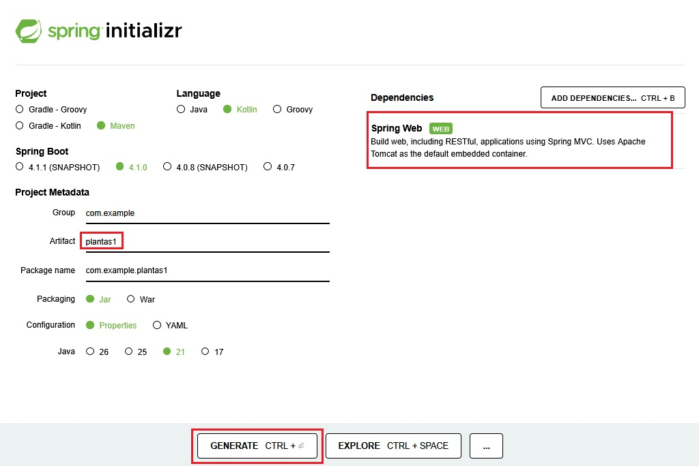


<span class="mi_sombreado">**PASO 2: Abrir el proyecto y ejecutarlo**</span>

Descomprimimos el archivo obtenido en el paso anterior y lo abrimos con IntelliJ. Vemos que, además de los archivos **application.properties** y **pom.xml** se ha creado automaticamente la clase **Plantas1Application** (con la anotación **@SpringBootApplication**) y la función de extensión **runApplication** que sirve para lanzar la aplicación.

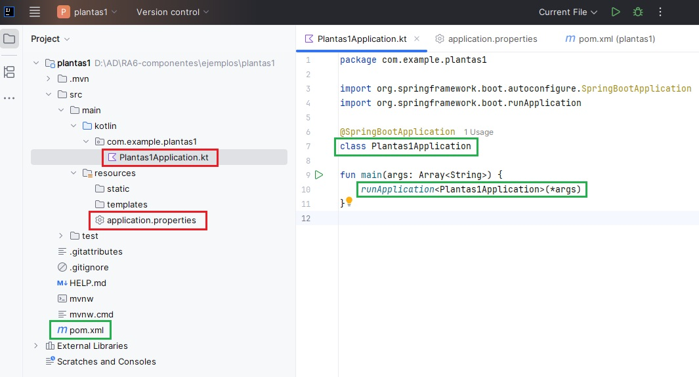


Antes de escribir una sola línea de código en nuestro controlador, vamos a ejecutar la aplicación tal y como viene por defecto. Abrimos el archivo `Plantas1Application.kt` y hacemos clic en el botón de reproducción (Run) de IntelliJ. Veremos por consola la salida de los mensajes de registro de Spring.

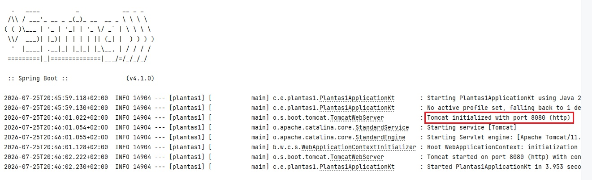

> Si el puerto 8080 está ocupado aparecerá un mensaje diciendo que no se puede iniciar el servidor Tomcat. Puedes cambiar el puerto, por ejemplo al 8888, añadiendo la siguiente línea en el archivo `application.properties` (que se encuentra en la carpeta resources del proyecto):
    ```
    server.port=8888
    ```


Abrimos nuestro navegador web y accedemos a la dirección [http://localhost:8080](http://localhost:8080) pero vemos una pantalla de error genérica de Spring llamada "Whitelabel Error Page (404 Not Found)". Este error 404 significa que no hemos programado absolutamente nada para que nuestra aplicación responda en esa ruta raíz (/). El servidor está levantado, pero está "vacío" de contenido.


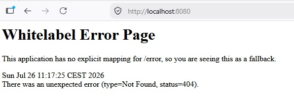

!!! success "Prueba y analiza el ejemplo"
    Realiza los pasos 1 y 2 y verifica que el comportamiento de tu aplicación es el mismo que en el ejemplo.


!!! example "Autoevaluación"

    **Pregunta 1: Tras arrancar nuestra aplicación en IntelliJ, abrimos el navegador y accedemos a `http://localhost:8080/`. El navegador nos muestra la pantalla de error "Whitelabel Error Page" con un código de estado "404 Not Found". ¿Qué significa exactamente este comportamiento?**

    A) La aplicación ha fallado al compilarse o iniciarse debido a un error de sintaxis en el código de nuestra clase principal, por lo que el servidor web embebido se ha detenido de inmediato.
    
    B) El servidor web embebido Tomcat se ha iniciado con éxito, pero la dirección lógica `localhost` no está apuntando correctamente a nuestro propio ordenador.
    
    C) El servidor web embebido Tomcat está funcionando correctamente, pero el framework no encuentra en este momento ninguna regla o recurso estático que se encargue de responder a las peticiones en la dirección raíz (`/`).
    
    D) El navegador web ha bloqueado la conexión porque Spring Boot requiere obligatoriamente que se configure un puerto seguro cifrado (HTTPS) para poder servir páginas, incluso durante el desarrollo local.

    ??? quote "Solución"
    
        ❌ A) Si la aplicación hubiera fallado al compilar o iniciar, el servidor no estaría activo. En ese caso, el navegador mostraría un error de conexión genérico del sistema operativo ("Conexión rechazada" o "No se puede acceder a este sitio web"), en lugar de una pantalla estructurada de Spring Boot (Whitelabel Error Page).
        
        ❌ B) La dirección `localhost` (que se resuelve a la IP de bucle local `127.0.0.1`) es un estándar que siempre apunta al propio dispositivo físico del usuario. El hecho de que se devuelva una página de error de Spring demuestra que la conexión con el servidor local sí se ha establecido.
        
        ✅ C) El error 404 (Not Found) es una respuesta HTTP estructurada generada por el propio framework. Esto confirma que el servidor Tomcat se ha levantado con éxito, pero nos avisa de que aún no hemos mapeado ningún recurso (ni una vista HTML en la carpeta de recursos ni una ruta dinámica en un controlador) para responder a la ruta raíz `/` de nuestra aplicación.
        
        ❌ D) Durante la etapa de desarrollo local, Spring Boot se ejecuta perfectamente bajo el protocolo HTTP no cifrado y el puerto estándar 8080. No es necesario configurar certificados SSL (HTTPS) para levantar o depurar la aplicación en local de forma inicial.


    **Pregunta 2: Queremos modificar el puerto de red por defecto (8080) en el que se ejecuta nuestra aplicación de Spring Boot para utilizar el puerto 8888. ¿Cómo debemos realizar esta configuración?**

    A) Debemos buscar el archivo `pom.xml` y añadir una dependencia de Maven llamada `<port>8888</port>` dentro del bloque de dependencias principales.
    
    B) Debemos abrir el archivo `application.properties` (en `src/main/resources/`) y añadir la línea `server.port=8888`.
    
    C) Debemos modificar la función `main` en `Plantas1Application.kt` y pasarle el valor numérico `8888` como argumento al método `runApplication`.
    
    D) No es posible cambiar el puerto durante el desarrollo local; el puerto 8080 está configurado de forma inalterable en el servidor embebido Tomcat que incluye Spring Boot.

    ??? quote "Solución"
    
        ❌ A) El archivo `pom.xml` se utiliza de forma exclusiva para gestionar las dependencias de librerías del proyecto y coordinar su construcción con Maven, no para configurar propiedades dinámicas del servidor en tiempo de ejecución.
        
        ✅ B) El archivo `application.properties` es el archivo central de configuración de una aplicación Spring Boot. Al añadir la clave `server.port=8888`, el framework intercepta esta propiedad durante el inicio y ordena al servidor Tomcat embebido que escuche peticiones en el nuevo puerto asignado en lugar de usar el predeterminado (8080).
        
        ❌ C) La función `runApplication<Plantas1Application>(*args)` inicializa el contexto de la aplicación de Spring y le transmite los argumentos recibidos por consola, pero no expone de manera directa parámetros para la configuración de puertos en su llamada.
        
        ❌ D) El puerto del servidor web embebido es altamente configurable. Podemos modificar el puerto por motivos de seguridad o por pura necesidad técnica si otro programa (como una base de datos local o un contenedor Docker) ya está ocupando el puerto 8080 en nuestra máquina de desarrollo.


Hemos comentado anteriormente que Spring Boot permite funcionar a partir de rutas dinámicas y de archivos estáticos. En los pasos siguientes añadiremos esas funcionalidades a nuestra aplicación


<span class="mi_sombreado">**PASO 3: Añadir una ruta dinámica a nuestra aplicación**</span>

Para que nuestra aplicación empiece a hacer algo útil, añadimos una función a la clase principal `Plantas1Application.kt`. Sustituimos su código por el siguiente:

```kotlin
package com.example.plantas1

import org.springframework.boot.autoconfigure.SpringBootApplication
import org.springframework.boot.runApplication

import org.springframework.web.bind.annotation.GetMapping
import org.springframework.web.bind.annotation.RequestParam
import org.springframework.web.bind.annotation.RestController

@SpringBootApplication
@RestController
class Plantas1Application{
    @GetMapping("/planta")
    fun infoPlanta(
        @RequestParam(value = "nombre", defaultValue = "Helecho") nombre: String
    ): String {
        return "¡Hola! Estás consultando información sobre la planta: $nombre."
    }
}

fun main(args: Array<String>) {
	runApplication<Plantas1Application>(*args)
}
```


**Explicación de los cambios realizados:**

* **@RestController**: se utiliza para que Spring reconozca la clase como un controlador que maneja solicitudes HTTP. Combina:
    * @Controller: Define la clase como un controlador web.
    * @ResponseBody: Indica que los métodos devolverán directamente el cuerpo de la respuesta (en este caso, texto plano en lugar de una vista HTML).

* **@GetMapping("/planta")**: Es una anotación de Spring que indica que este método debe manejar las solicitudes HTTP GET que lleguen a la URL `/planta`.
    * Enlaza la URL `/planta` con el método `infoPlanta`.
    * Cada vez que se acceda a la ruta [http://localhost:8080/planta](http://localhost:8080/planta) (asumiendo el puerto predeterminado 8080) en un navegador con un método GET, Spring ejecutará el método `infoPlanta`.

* **@RequestParam**: se usa para extraer un parámetro de la consulta (query parameter) enviado en la URL.
    * El método espera un parámetro de consulta llamado `nombre`.
    * Si el cliente no incluye `nombre` en la solicitud, el valor predeterminado será "Helecho", gracias a defaultValue = "Helecho".


<span class="mi_sombreado">**PASO 4: Volvemos a ejecutar la aplicación**</span>

Ejecutamos la aplicación para levantar el servidor y comprobamos el comportamiento del navegador con estas dos direcciones:


- Sin parámetros: [http://localhost:8080/planta](http://localhost:8080/planta)

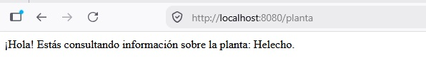


- Con parámetro personalizado: [http://localhost:8080/planta?nombre=Rosa](http://localhost:8080/planta?nombre=Rosa)

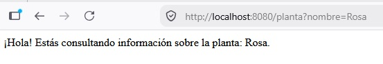


Nuestra ruta dinámica `/planta` funciona correctamente porque la hemos mapeado de forma explícita mediante `@GetMapping("/planta")`. Pero la ruta raíz [http://localhost:8080](http://localhost:8080) sigue devolviendo la misma pantalla de error. Esto es lógico: hemos programado la ruta `/planta`, pero seguimos sin tener nada programado para la raíz `/`.


!!! success "Prueba y analiza el ejemplo"
    Realiza los pasos 3 y 4 y verifica que el comportamiento de tu aplicación es el mismo que en el ejemplo.


!!! example "Autoevaluación"

    **Pregunta 3: En el código del Paso 3 de la aplicación, el método `infoPlanta` declara el parámetro `@RequestParam(value = "nombre", defaultValue = "Helecho") nombre: String`. Si abrimos el navegador y accedemos a `http://localhost:8080/planta` (omitiendo por completo el parámetro de consulta en la URL), ¿cuál será el comportamiento de la aplicación?**
 
    A) El servidor lanzará una excepción de tipo `MissingServletRequestParameterException` y se mostrará un error de estado "400 Bad Request" en el navegador al no haber enviado un parámetro obligatorio.
    
    B) El programa se ejecutará correctamente y mostrará por pantalla el mensaje utilizando el valor por defecto: *"¡Hola! Estás consultando información sobre la planta: Helecho."*

    C) El parámetro se resolverá como un valor `null` en Kotlin, lo que provocará un error de ejecución de inmediato al intentar concatenar un objeto nulo en un tipo de dato no anulable (`String`).
    
    D) El servidor web Tomcat bloqueará la solicitud de forma automática por motivos de seguridad, ya que no se permiten peticiones HTTP GET que carezcan de parámetros en su URL.

    ??? quote "Solución"
     
        ❌ A) Por defecto, todos los parámetros anotados con `@RequestParam` son obligatorios. Sin embargo, al configurar la propiedad `defaultValue`, esta obligatoriedad se desactiva implícitamente, ya que el framework siempre dispone de un valor que asignar en caso de ausencia. No se producirá ningún error de tipo 400.
     
        ✅ B) El atributo `defaultValue` le indica a Spring Boot que, si el cliente no proporciona el parámetro `nombre` en la URL de su petición, debe asignar de forma automática el valor de texto `"Helecho"` a la variable. La aplicación se ejecuta con éxito y muestra el valor predeterminado.

        ❌ C) En Kotlin, la variable `nombre` se ha declarado de tipo `String` (tipo no anulable). Spring Boot garantiza la seguridad frente a nulos asignándole el valor configurado en el `defaultValue` en caso de que la URL no lo traiga. Si quisiéramos que fuera verdaderamente opcional y nulo, deberíamos declararlo como `String?` y prescindir del valor por defecto.
        
        ❌ D) El protocolo HTTP y el servidor Tomcat admiten perfectamente cualquier combinación de parámetros en peticiones GET (incluyendo peticiones limpias sin ningún parámetro). No existe ninguna restricción técnica ni de seguridad en el protocolo por este motivo.


    **Pregunta 4: En el código de nuestra clase principal `Plantas1Application` hemos utilizado la anotación `@RestController`. ¿Cuál es la diferencia principal entre utilizar `@RestController` y la anotación `@Controller` tradicional?**

    A) Con `@RestController`, los métodos de la clase devuelven directamente los datos en el cuerpo de la respuesta HTTP (como texto plano o JSON), mientras que con `@Controller` se espera devolver el nombre lógico de una vista HTML (como una plantilla de Thymeleaf).
    
    B) La anotación `@RestController` es de uso exclusivo para lenguajes de programación modernos como Kotlin, mientras que `@Controller` solo se puede emplear cuando programamos la aplicación en Java tradicional.
    
    C) `@RestController` permite que el servidor de aplicaciones Tomcat escuche peticiones en múltiples puertos de forma simultánea, mientras que `@Controller` limita la ejecución del servidor a un único puerto de red.
    
    D) No existe ninguna diferencia técnica real entre ambas; `@RestController` es simplemente una anotación antigua que ha quedado obsoleta con la llegada de las últimas versiones de Spring Boot.

    ??? quote "Solución"
    
        ✅ A) La anotación de conveniencia `@RestController` combina internamente `@Controller` y `@ResponseBody`. Esto significa que cualquier cadena de texto u objeto devuelto por sus funciones se escribirá directamente en el flujo de la respuesta HTTP (lo cual es idóneo para APIs REST). Por el contrario, un `@Controller` tradicional interpreta el texto devuelto como la ruta de un archivo de plantilla que debe renderizarse (como un archivo `.html`).
        
        ❌ B) Ambas anotaciones forman parte del núcleo del módulo Spring Web y son totalmente compatibles tanto en Java como en Kotlin. El comportamiento del framework es independiente del lenguaje de la JVM utilizado para escribir el código fuente.
        
        ❌ C) La configuración de los puertos de red es responsabilidad del servidor web embebido (Tomcat) y se define en el archivo `application.properties`. Ninguna anotación de controlador tiene la capacidad de influir sobre el socket del servidor a ese nivel.
        
        ❌ D) Ambas anotaciones están completamente vigentes y se utilizan a diario en entornos profesionales. La separación de conceptos es fundamental: se utiliza `@RestController` para endpoints que envían datos brutos (normalmente JSON) y `@Controller` clásico para servir interfaces de usuario completas con plantillas dinámicas.


<span class="mi_sombreado">**PASO 5: Añadir una página de inicio HTML**</span>

Como hemos visto en los pasos anteriores, necesitamos que la dirección raíz [http://localhost:8080](http://localhost:8080)  muestre una pantalla de inicio amigable en lugar de un error de "página no encontrada". Para solucionar esto, nos apoyaremos en la carpeta de recursos estáticos de Spring Boot `src/main/resources/static/`. Cualquier archivo que guardemos en esta carpeta (imágenes, CSS, HTML sencillos) será servido directamente por el servidor web sin necesidad de escribir código Java o Kotlin adicional.

Una de las reglas automáticas de Spring Boot es que si guardas un archivo llamado exactamente `index.html` dentro de `static/`, el servidor lo utilizará de forma automática como la página de inicio para la ruta raíz `/`. Vamos a comprobarlo.

Crea el archivo `index.html` dentro de la carpeta `src/main/resources/static/` con el siguiente contenido:

```html
<!DOCTYPE HTML>
<html>
<head>
    <title>Portal de Plantas</title>
    <meta http-equiv="Content-Type" content="text/html; charset=UTF-8" />
</head>
<body>
<h1>Bienvenido al Portal de Plantas</h1>
<p>Explora de forma básica el catálogo introduciendo un nombre a continuación.</p>

<!-- Enlace directo que usa el valor por defecto -->
<a href="/planta">Ver planta por defecto (Helecho)</a>

<br><br>

<!-- Formulario que envía la petición GET al controlador -->
<form action="/planta" method="GET" id="plantForm">
    <div>
        <label for="plantField">Escribe el nombre de una planta:</label>
        <input type="text" name="nombre" id="plantField" placeholder="Ej. Rosa, Cactus...">
        <button type="submit">Consultar</button>
    </div>
</form>
</body>
</html>
```

Ahora, al acceder a [http://localhost:8080/](http://localhost:8080/), el navegador servirá la página de inicio siguiente: 


Al rellenar el cuadro de texto y pulsar "Consultar", el formulario redirigirá automáticamente a `/planta?nombre=valor_introducido`. Devolviendo el mismo resultado que en el pasos 4.


!!! success "Prueba y analiza el ejemplo"
    Realiza el paso 5 y verifica que el comportamiento de tu aplicación es el mismo que en el ejemplo.


!!! example "Autoevaluación"

    **Pregunta 5: Para crear la página de inicio, hemos guardado el archivo `index.html` en la ruta `src/main/resources/static/`. Si en esa misma carpeta guardamos un archivo de imagen llamado `logo.png`, ¿cuál será la dirección correcta para acceder a él desde el navegador?**

    A) Tendremos que crear obligatoriamente un controlador en Kotlin con la ruta `@GetMapping("/static/logo.png")` para que lea el archivo del disco y lo envíe.
    
    B) Deberemos acceder obligatoriamente mediante la ruta `http://localhost:8080/static/logo.png`, ya que el nombre de la carpeta contenedora debe aparecer en la URL.
    
    C) El archivo no se podrá mostrar porque la carpeta `static/` está programada para servir de forma exclusiva archivos que tengan la extensión `.html`.
    
    D) Podremos acceder a él de forma directa introduciendo en la barra del navegador la dirección `http://localhost:8080/logo.png`.

    ??? quote "Solución"
    
        ❌ A) Una de las grandes ventajas de la carpeta `static/` es que no requiere escribir código de controlador para servir archivos. Spring Boot se encarga de mapear y exponer el contenido de este directorio de manera automática en la raíz de la aplicación.
        
        ❌ B) Aunque en la estructura física del proyecto el archivo resida dentro de la carpeta `static`, de cara al exterior este directorio de recursos no se escribe en la URL de navegación, ya que Spring Boot mapea de forma transparente todo su contenido sobre el recurso raíz (`/`).
        
        ❌ C) La carpeta de recursos estáticos de Spring Boot admite cualquier tipo de recurso que el navegador sea capaz de interpretar o descargar (ficheros `.css`, scripts `.js`, imágenes de todo tipo, PDFs, fuentes tipográficas, etc.), no existiendo ninguna limitación a los documentos HTML.
        
        ✅ D) Todo archivo que se ubique dentro de la ruta física `src/main/resources/static/` se expone públicamente directo en la raíz del servidor. Por tanto, el archivo de imagen `logo.png` se servirá de inmediato al escribir su nombre justo detrás del host y del puerto configurado.


    **Pregunta 6: En el formulario HTML de nuestro archivo `index.html`, ¿qué elemento o atributo es el responsable directo de que Spring Boot sepa que el texto escrito por el usuario debe asignarse al parámetro `nombre` de nuestra función `infoPlanta`?**

    A) El atributo `id="plantField"` de la etiqueta `<input>`, que debe llamarse igual que la variable de Kotlin para que el framework realice la vinculación.
    
    B) El atributo `action="/planta"` de la etiqueta `<form>`, ya que es el encargado de enlazar de forma automática todos los campos del formulario con la base de datos.
    
    C) El atributo `name="nombre"` de la etiqueta `<input>`, cuyo valor debe coincidir exactamente con el nombre esperado por la anotación `@RequestParam` de nuestro controlador.
    
    D) El atributo `id="plantForm"` de la etiqueta `<form>`, que asocia de forma interna la estructura del formulario con nuestra clase controladora de Spring Boot.

    ??? quote "Solución"
    
        ❌ A) El atributo `id` se utiliza en desarrollo web exclusivamente para identificar de forma unívoca a un elemento concreto dentro de la estructura de la página (para aplicarle estilos CSS o manipularlo con Javascript), pero el navegador nunca lo envía al servidor al procesar el formulario.
        
        ❌ B) El atributo `action` de un formulario solo indica al navegador a qué dirección de red (URL) debe enviar los datos cuando el usuario pulse el botón de envío, pero no influye en cómo se etiquetan las variables individuales que viajan en la petición.
        
        ✅ C) Cuando un formulario se envía, el navegador web construye la petición HTTP emparejando la información en formato de "clave y valor" utilizando únicamente el atributo `name` de cada campo de entrada. Por este motivo, es imprescindible que el valor de `name` en el HTML coincida con el nombre que espera recibir nuestro método mediante `@RequestParam`.
        
        ❌ D) El identificador de la etiqueta `<form>` sirve para dar estilo u organizar la estructura de la página, pero el framework Spring Boot es completamente ajeno a este valor y no lo utiliza en ningún momento para vincular los parámetros de consulta.


<span class="mi_sombreado">**PASO 6: Mejorar el aspecto**</span>

Ahora vamos a darle a nuestra aplicación un aspecto más profesional utilizando `Bootstrap`. Podemos encontrar mucha documentacion en internet sobre como utilizarlo. Por ejemplo en:

- [https://getbootstrap.com/docs/5.3/getting-started/introduction/](https://getbootstrap.com/docs/5.3/getting-started/introduction/)
- [https://www.w3schools.com/bootstrap5/](https://www.w3schools.com/bootstrap5/)


Hacemos algunos cambios en nuestro archivo `index.html` en `src/main/resources/static/` para que quede así:

```html
<!DOCTYPE HTML>
<html lang="es">
<head>
    <meta charset="UTF-8">
    <title>Portal de Plantas</title>
    <!-- CDN de Bootstrap -->
    <link href="https://cdn.jsdelivr.net/npm/bootstrap@5.3.2/dist/css/bootstrap.min.css" rel="stylesheet">
</head>
<body>

<!-- Contenedor principal para centrar y dar margen superior -->
<div class="container mt-5">

    <h1 class="mb-3">🌱 Portal de Plantas</h1>
    <p class="text-muted">Explora nuestro catálogo básico introduciendo el nombre de tu planta favorita.</p>

    <!-- Formulario con un ancho máximo sugerido para que no ocupe toda la pantalla -->
    <form action="/planta" method="GET" id="plantForm" class="mb-4" style="max-width: 400px;">
        <div class="mb-3">
            <label for="plantField" class="form-label">Escribe el nombre de la planta:</label>
            <input type="text" name="nombre" id="plantField" class="form-control" placeholder="Ej. Rosa, Cactus..." required>
        </div>
        <button type="submit" class="btn btn-success">Consultar</button>
    </form>

    <a href="/planta" class="link-secondary">Ver planta por defecto (Helecho)</a>

</div>

</body>
</html>
```

**Explicación de los cambios realizados:**

- `<div class="container mt-5">` Agrupa todo el contenido para que no quede pegado a los bordes de la pantalla.
- `class="form-control"` Cambia el cuadro de texto simple por un campo de texto con bordes suaves y que resalta al hacer clic.
- `class="btn btn-success"` Convierte el botón gris por defecto del navegador en un botón verde.
- `class="text-muted"` y `class="link-secondary"` Suavizan el color del texto secundario y del enlace para mejorar la jerarquía visual.


Y sustituimos el código del fichero `Plantas1Application.kt` por el siguiente:

```kotlin
package com.example.plantas1

import org.springframework.boot.autoconfigure.SpringBootApplication
import org.springframework.boot.runApplication
import org.springframework.web.bind.annotation.GetMapping
import org.springframework.web.bind.annotation.RequestParam
import org.springframework.web.bind.annotation.RestController
import org.springframework.http.MediaType // Necesario para especificar el tipo de retorno

@SpringBootApplication
@RestController
class PlantasIntroApplication {

    // Especificamos que este método devuelve HTML para que el navegador lo renderice correctamente
    @GetMapping("/planta", produces = [MediaType.TEXT_HTML_VALUE])
    fun infoPlanta(
        @RequestParam(value = "nombre", defaultValue = "Helecho") nombre: String
    ): String {
        // Usamos una cadena multilínea de Kotlin para escribir HTML de forma limpia
        return """
            <!DOCTYPE HTML>
            <html lang="es">
            <head>
                <meta charset="UTF-8">
                <title>Detalle de Planta</title>
                <!-- CDN de Bootstrap para aplicar el diseño -->
                <link href="https://cdn.jsdelivr.net/npm/bootstrap@5.3.2/dist/css/bootstrap.min.css" rel="stylesheet">
            </head>
            <body class="bg-light">
                <div class="container mt-5">
                    
                    <!-- Alerta de Bootstrap para mostrar la información -->
                    <div class="alert alert-success shadow-sm" role="alert">
                        <h4 class="alert-heading">🌿 Consulta Realizada</h4>
                        <p class="mb-0">
                            ¡Hola! Estás consultando información sobre la planta: <strong>$nombre</strong>.
                        </p>
                    </div>
                    
                    <!-- Botón para regresar al index.html -->
                    <a href="/" class="btn btn-outline-secondary btn-sm mt-2">Volver al inicio</a>
                    
                </div>
            </body>
            </html>
        """.trimIndent()
    }
}

fun main(args: Array<String>) {
    runApplication<PlantasIntroApplication>(*args)
}
```

**Explicación de los cambios realizados:**

- `produces = [MediaType.TEXT_HTML_VALUE]` Por defecto, un @RestController que devuelve un String lo envía como texto plano (text/plain). Al añadir este parámetro en @GetMapping, le indicamos a Spring que añada la cabecera HTTP Content-Type: text/html para que el navegador interprete las etiquetas HTML y cargue la hoja de estilos de Bootstrap.
- `Cadenas triples (""") de Kotlin` Permiten escribir código HTML estructurado en múltiples líneas sin tener que concatenar constantemente con símbolos +, facilitando mucho la legibilidad del código fuente de la clase.
- `Diseño minimalista` Se envuelve el mensaje en un componente alert `alert-success` y se incluye un pequeño botón para volver a la página principal (/), lo que permite navegar entre el formulario y el resultado de forma fluida.


Ahora es aspecto de nuestra aplicación es el que se muestra en las siguientes imágenes:


!!! success "Prueba y analiza el ejemplo"
    Realiza el paso 6 y verifica que el comportamiento de tu aplicación es el mismo que en el ejemplo.


!!! example "Autoevaluación"

    **Pregunta 7: En el archivo `Plantas1Application.kt` modificamos nuestro controlador dinámico para que devuelva un bloque de texto HTML. Para lograrlo, configuramos su anotación como `@GetMapping("/planta", produces = [MediaType.TEXT_HTML_VALUE])`. ¿Qué ocurriría si omitiéramos el parámetro `produces` y dejáramos la anotación simplemente como `@GetMapping("/planta")`?**

    A) El navegador web mostraría la página en "texto plano", es decir, veríamos literalmente escritas en la pantalla todas las etiquetas (como `<html>`, `<h1>`, etc.) en lugar de ver la página web interpretada y estilizada con Bootstrap.
    
    B) Se produciría un error de compilación en Kotlin porque el framework exige obligatoriamente declarar el tipo de medio de retorno para poder compilar textos que hagan uso de las comillas triples.
    
    C) El servidor web embebido Tomcat lanzaría un error interno del servidor de código 500 (Internal Server Error) debido a que no sabría con qué codificación de caracteres procesar la respuesta.
    
    D) No pasaría absolutamente nada; las versiones modernas de los navegadores web ignoran por completo este parámetro y detectan de manera inteligente que se trata de código HTML basándose en la primera etiqueta.

    ??? quote "Solución"
    
        ✅ A) Por defecto, un `@RestController` que retorna un objeto de tipo `String` envía la respuesta HTTP con la cabecera `Content-Type: text/plain`. Al añadir `produces = [MediaType.TEXT_HTML_VALUE]`, obligamos a Spring a enviar la cabecera `Content-Type: text/html`. Sin esta cabecera específica, el navegador interpreta que está recibiendo texto sin formato y nos muestra de forma literal las etiquetas HTML en pantalla en lugar de interpretarlas y pintarlas en su interfaz.
        
        ❌ B) El compilador de Kotlin es completamente independiente al comportamiento de la librería Spring Web. Compilará perfectamente la cadena de texto multilínea con o sin el parámetro en la anotación, ya que para Kotlin se trata de un método convencional que devuelve una variable de tipo `String`.
        
        ❌ C) El servidor Tomcat procesará la petición de forma adecuada y el controlador devolverá un código de estado HTTP exitoso (200 OK) con la cadena de texto correspondiente. No se producirá ningún fallo en el backend que deba catalogarse con un código de error de la familia 500.
        
        ❌ D) Aunque algunos navegadores web antiguos realizaban tareas de análisis de contenido para intentar adivinar el formato (*MIME sniffing*), las especificaciones de seguridad actuales de los navegadores modernos exigen respetar de forma estricta la cabecera de tipo enviada por el servidor para evitar la ejecución de código malicioso, por lo que el parámetro es totalmente necesario.


    **Pregunta 8: En el método `infoPlanta` de nuestro controlador dinámico, utilizamos las comillas triples (`"""`) al principio y al final del bloque HTML devuelto, seguido de la llamada a la función `.trimIndent()`. ¿Cuál es la finalidad de utilizar esta sintaxis en Kotlin?**

    A) Permite cifrar el código HTML en memoria antes de ser enviado por la red, protegiendo los datos de nuestra aplicación frente a posibles ataques de interceptación.
    
    B) Facilita la escritura de bloques de texto que ocupan varias líneas sin tener que usar molestos caracteres de escape (como `\"` o `\n`) ni concatenar líneas con el símbolo `+`, eliminando además la sangría común del editor de código.
    
    C) Obliga a Spring Boot a procesar el código HTML mediante el motor de plantillas Thymeleaf antes de entregarlo al cliente, haciendo que la carga de las vistas sea mucho más rápida.
    
    D) Es una sintaxis que requiere de forma obligatoria el framework Spring Boot para poder buscar de forma automática las clases de Bootstrap dentro de la cadena de texto de Kotlin.

    ??? quote "Solución"
    
        ❌ A) Las comillas triples de Kotlin no realizan ningún tipo de cifrado ni codificación de seguridad sobre la cadena de texto. Su uso es puramente estético y organizativo para facilitar la lectura del código fuente por parte del desarrollador.
        
        ✅ B) Las comillas triples (`"""`) habilitan lo que en Kotlin se conoce como "cadenas de texto en bruto" (*raw strings*). En ellas se pueden escribir comillas dobles y saltos de línea con total libertad sin necesidad de escaparlos. Por su parte, la función `.trimIndent()` detecta la sangría mínima común de todo el bloque escrito en nuestro IDE y la elimina, de modo que el código HTML se genera limpio y alineado a la izquierda.
        
        ❌ C) El motor de plantillas de Thymeleaf solo procesa archivos ubicados en el directorio `templates` a través de un controlador tradicional. Al estar utilizando un `@RestController`, el texto devuelto con las comillas triples se envía directo al cliente sin pasar por ningún motor de plantillas.
        
        ❌ D) Spring Boot y las clases de Bootstrap se comportan exactamente igual independientemente de cómo se construya la cadena de texto en Kotlin. El framework no analiza el contenido del texto para buscar clases de CSS ni requiere de esta sintaxis de forma exclusiva para funcionar.


## 3. Spring MVC y Thymeleaf

**Spring MVC** es el módulo de Spring orientado al desarrollo de aplicaciones web siguiendo el patrón **Modelo‑Vista‑Controlador (MVC)**, el cual organiza una aplicación en tres **componentes principales**:

* **Modelo**: Son los datos. Es responsable de:

    * Gestionar el estado de la aplicación.

    * Interactuar con la base de datos u otros servicios para obtener y procesar datos.

    * Proveer datos a la vista.

* **Vista**: Es lo que ve el usuario. Es responsable de:

    * Renderizar información en un formato adecuado, como HTML.

    * Mostrar al usuario los resultados de las acciones ejecutadas.

* **Controlador**: Actúa como intermediario entre el modelo y la vista. Es responsable de:

    * Procesar las solicitudes del usuario (peticiones HTTP).

    * Interactuar con el modelo para obtener o modificar datos.

    * Seleccionar y devolver la vista adecuada para responder al usuario.


Estos tres componentes trabajan de la siguiente forma:

1) El usuario interactúa con la **Vista** (interfaz). Envia un formulario o hace clic en un enlace.

2) La petición es enviada al **Controlador**.

3) El **Controlador** procesa la petición, interactúa con el **Modelo** si es necesario y selecciona la **Vista** que debe renderizar la respuesta.

4) La **Vista** presenta la respuesta al usuario.


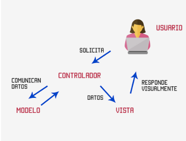


Spring MVC forma parte del ecosistema Spring y se organiza siguiendo una arquitectura en capas en la que cada capa tiene una función concreta y se comunica únicamente con las capas adyacentes. Esta arquitectura encaja perfectamente con el patrón MVC (Model–View–Controller) y proporciona toda la infraestructura necesaria para manejar peticiones HTTP, invocar controladores y devolver vistas (HTML, JSON, etc.) lo que permite aplicaciones más mantenibles, escalables y fáciles de entender.

En la siguiente tabla se muestran las capas más habituales en una aplicación Spring con su equivalencia en Spring MVC, sus anotaciones más habituales y la función que realiza cada una de ellas:

**Anotaciones por capa y correspondencia Spring ↔ MVC**

| Capas Spring      | Capa MVC    | Anotaciones  | Función           |
|-------------------|-------------|--------------|-------------------|
| Controller (Web)                    | Controller  | `@Controller`<br>`@RestController`<br>`@RequestMapping`<br>`@GetMapping`<br> `@RequestParam` <br> `@PostMapping`<br>`@PutMapping`<br>`@DeleteMapping` | Recibe peticiones HTTP, gestiona rutas y parámetros, llama a la capa Service y devuelve una vista o una respuesta (JSON)<br>**No contiene lógica de negocio ni acceso a datos**                         |
| Model (Entidades)<br>Service (Negocio)<br>Repository (Persistencia) | Model | `@Entity`, `@Table`, `@Id`<br>`@Service`, `@Transactional`<br>`@Repository` | Contiene las clases que modelan la información del negocio, aplica reglas y validaciones y accede a la base de datos para realizar operaciones CRUD (manteniendo aislada la BD del resto de la aplicación)        |
| View (Representación HTML / JSON)               | View | *(sin anotaciones)* | Representa los datos al usuario:<br>• Archivo HTML con sintaxis específica para contenido dinámico si se utiliza Thymeleaf / JSP 	(Ubicación Thymeleaf: `src/main/resources/templates/`)<br>• Datos en formato JSON / XML en apps REST (si no se utiliza un motor de plantillas). En REST, el JSON actúa como la vista |


**Vistas con Thymeleaf**

Thymeleaf es un motor de plantillas que permite mezclar HTML con datos dinámicos proporcionados por el controlador en Spring MVC. Utiliza atributos especiales que comienzan con th: para manipular estos datos de forma dinámica. La siguiente tabla muestra los atributos Thymeleaf más comunes:

| **Atributo**    | **Descripción**                                                                                        | **Ejemplo**                                                                                           |
| --------------- | ------------------------------------------------------------------------------------------------------ | ----------------------------------------------------------------------------------------------------- |
| **`th:text`**   | Rellena el contenido de un elemento HTML con un valor dinámico.                                        | `<p th:text="${mensaje}">Texto por defecto</p>`                                                       |
| **`th:each`**   | Itera sobre una colección (lista, array, etc.) y genera un nuevo elemento HTML para cada item.         | `<ul><li th:each="planta : ${plantas}" th:text="${planta.nombre}">Nombre de la planta</li></ul>`      |
| **`th:if`**     | Muestra el contenido solo si la condición es verdadera.                                                | `<p th:if="${hayPlantas}">Hay plantas registradas</p>`                                                |
| **`th:unless`** | Muestra el contenido solo si la condición es falsa.                                                    | `<p th:unless="${hayPlantas}">No hay plantas registradas</p>`                                         |
| **`th:href`**   | Construye enlaces dinámicos para el atributo `href` de un enlace `<a>`.                                | `<a th:href="@{/planta/{id}(id=${planta.id})}">Ver detalles</a>`                                      |
| **`th:src`**    | Construye enlaces dinámicos para el atributo `src` de una imagen ``.                              | `` |
| **`th:action`** | Define la URL a la que se enviará un formulario cuando se haga submit.              | `<form th:action="@{/planta/guardar}" method="post"><button type="submit">Guardar</button></form>`    |
| **`th:object`**   | Asocia un objeto del modelo con el formulario, permitiendo vincular automáticamente sus atributos. | `<form th:object="${planta}" th:action="@{/planta/guardar}" method="post">...</form>`                |
| **`th:value`**  | Rellena el valor de un campo de formulario (`input`, `textarea`, etc.) con un valor dinámico.          | `<input type="text" th:value="${planta.nombre}" />`                            |
| **`th:field`**  | Asocia un campo de formulario con un atributo del modelo de Spring, vincula los datos automáticamente. | `<input type="text" th:field="*{nombre}" />`                                     |


<span class="mis_ejemplos">Ejemplo 2: Aplicación utilizando Spring MVC y Thymeleaf</span>

A continuación se describen los pasos para crear una aplicación que es un CRUD sobre una colección de plantas almacenada en memoria y que tiene las siguientes vistas:

- Pantalla de bienvenida desde la que se accede al listado de plantas.
- Pantalla de listado con un botón para añadir plantas nuevas y el listado de plantas con botones para mostrar sus detalles, modificarlos o eliminarla.
- Formulario con campos para modificar la información de un planta o añadir una nueva.


<span class="mi_sombreado">**PASO 1: Crear el proyecto**</span>

Accedemos a Spring Initializr desde la url [https://start.spring.io/](https://start.spring.io/), indicamos el nombre de la aplicación `plantas` y, en este caso, además de la dependencia **Spring Web** necesitamos también **Thymeleaf** (el resto de opciones las podemos dejar como se ve en la imagen). Por último hacemos clic en el botón `GENERATE` para descargar nuestro nuevo proyecto.

Opcionalmente podemos añadir **Spring Boot DevTools** que nos ahorrará tiempo de desarrollo ya que:

- Reinicia automáticamente la aplicación cuando cambias código.

- Recarga las plantillas Thymeleaf sin reiniciar manualmente.

Para tener estas funciones activas, además de añadir la dependencia, hay que configurar IntelliJ para que compile al guardar. Esto se consigue activando las opciones siguientes:

- Build project automatically (Settings → Build, Execution, Deployment → Compiler)

- Allow auto-make to start even if developed application is currently running (Settings → Advanced Settings)

De esta forma, cuando realicemos un cambio en un archivo de código de nuestra aplicación, bastará con guardarlo y recargar el navegador (sin reiniciar la app) para ver los cambios inmediatamente.

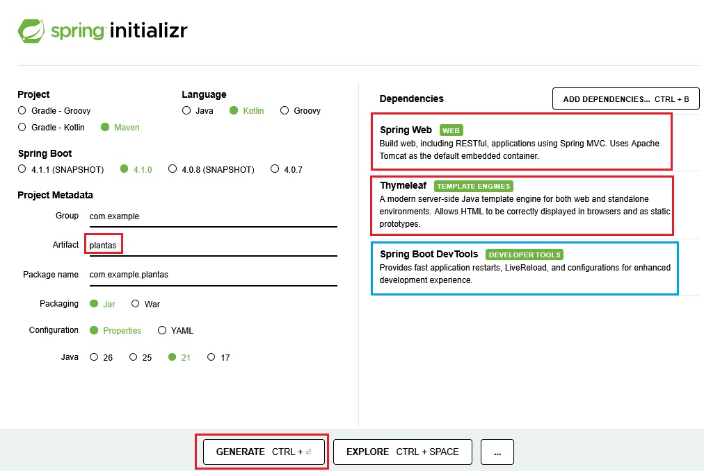

Descomprimimos el archivo obtenido en el paso anterior y lo abrimos con IntelliJ. Dejamos el archivo `PlantasApplication.kt` (clase principal) tal como está y añadimos los archivos de nuestra aplicación para que la estructura del proyecto quede como en la siguiente imagen:

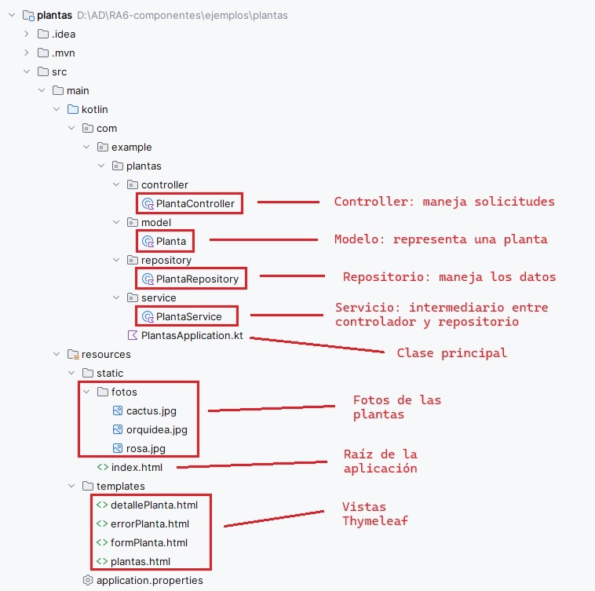


<span class="mi_sombreado">**PASO 2: Añadir modelo, repositorio, servicio y controlador**</span>

<span class="mi_h3">Añadir el modelo</span>

El **modelo** representa los datos de la aplicación. Creamos el archivo `Planta.kt` dentro de la carpeta `src/main/kotlin/com/example/plantas/model/` con el código siguiente:

```kotlin
package com.example.plantas.model

data class Planta(
    var id_planta: Int,
    var nombre: String,
    var tipo: String,
    var altura: Double,
    var foto: String
)
```

**Explicación del código:**

`data class` Es una clase especial de Kotlin diseñada específicamente para almacenar datos. Al usarla, Kotlin genera automáticamente de forma interna los métodos `getters`, `setters`, `toString()`, `equals()` y `copy()`, lo que nos ahorra escribir decenas de líneas de código repetitivo.

| Atributo | Tipo | Descripción                                             |
| :--- | :--- |:--------------------------------------------------------|
| `id_planta` | `Int` | Identificador único de cada planta (clave primaria).    |
| `nombre` | `String` | Nombre común de la planta.                              |
| `tipo` | `String` | Categoría o tipo de planta (ej. Flor, Suculenta).       |
| `altura` | `Double` | Altura máxima estimada en metros.                       |
| `foto` | `String` | Nombre del archivo de imagen asociado (ej. `rosa.jpg`). |


<span class="mi_h3">Añadir el repositorio</span>

El **repositorio** gestiona la lista mutable en memoria. Creamos el archivo `PlantaRepository.kt` dentro de la carpeta `src/main/kotlin/com/example/plantas/repository/` con el código siguiente:

```kotlin
package com.example.plantas.repository

import com.example.plantas.model.Planta
import org.springframework.stereotype.Repository

@Repository
class PlantaRepository {

    // La lista en memoria se traslada aquí y actúa como nuestra "Base de Datos" temporal
    private val plantas = mutableListOf(
        Planta(1, "Rosa", "Flor", 0.5, "rosa.jpg"),
        Planta(2, "Cactus", "Suculenta", 1.2, "cactus.jpg"),
        Planta(5, "Orquídea", "Flor", 0.3, "orquidea.jpg")
    )

    fun findAll(): MutableList<Planta> = plantas

    fun findById(id: Int): Planta? = plantas.find { it.id_planta == id }

    fun save(planta: Planta) {
        val index = plantas.indexOfFirst { it.id_planta == planta.id_planta }
        if (index != -1) {
            // Edición de planta existente
            plantas[index] = planta
        } else {
            // Creación de nueva planta (simulación de ID autoincremental)
            val nuevoId = (plantas.maxOfOrNull { it.id_planta } ?: 0) + 1
            plantas.add(planta.copy(id_planta = nuevoId))
        }
    }
    
    fun deleteById(id_planta: Int) {
        plantas.removeAll { it.id_planta == id_planta }
    }
}
```


**Explicación del código:**

`@Repository` Indica a Spring que esta clase se encarga del **acceso directo a los datos** (crear, leer, actualizar y borrar). Además, registra la clase en el contenedor de Spring para que pueda ser inyectada automáticamente donde se necesite.

| Elemento / Método       | Descripción                                                                                                                                   |
|:------------------------|:----------------------------------------------------------------------------------------------------------------------------------------------|
| `private val plantas`   | Lista mutable (`mutableListOf`) que almacena las plantas en la memoria RAM del servidor, actuando temporalmente como nuestra base de datos.   |
| `findAll()`             | Recupera y devuelve la lista completa con todas las plantas almacenadas.                                                                      |
| `findById(id)`          | Busca en la lista y devuelve la planta que coincida con el ID proporcionado, o `null` si no encuentra ninguna.                                |
| `save(planta)`          | Comprueba si la planta ya existe buscando su ID. Si existe, la actualiza. Si no existe, calcula de forma automática un nuevo ID secuencial y la añade a la lista. |
| `deleteById(id_planta)` | Elimina de la lista (en memoria) la planta que coincida con el ID proporcionado       |


<span class="mi_h3">Añadir el servicio</span>

El **servicio** hace de intermediario entre el controlador y repositorio. Creamos el archivo `PlantaService.kt` dentro de la carpeta `src/main/kotlin/com/example/plantas/service/` con el código siguiente:

```kotlin
package com.example.plantas.service


import com.example.plantas.model.Planta
import com.example.plantas.repository.PlantaRepository
import org.springframework.stereotype.Service

@Service
class PlantaService(private val repository: PlantaRepository) {

    fun listarPlantas(): List<Planta> = repository.findAll()

    fun buscarPorId(id: Int): Planta? = repository.findById(id)

    fun guardar(planta: Planta) = repository.save(planta)

    fun borrar(id_planta: Int) {
        repository.deleteById(id_planta)
    }

}
```

**Explicación del código:**

`@Service` Indica a Spring que esta clase contiene la **lógica de negocio** y las reglas de nuestra aplicación. Actúa como una capa intermedia de seguridad y control entre lo que pide el controlador y lo que hace el repositorio.

`PlantaService(private val repository...)` Inyección de dependencias por constructor. Spring busca automáticamente la clase anotada con `@Repository` y se la proporciona al servicio cuando este se crea, sin necesidad de que hagamos un `new` de forma manual.

| Método              | Descripción                                                                            |
|:--------------------|:---------------------------------------------------------------------------------------|
| `listarPlantas()`   | Solicita al repositorio la lista de todas las plantas y se la devuelve al controlador. |
| `buscarPorId(id)`   | Solicita al repositorio buscar una planta concreta por su identificador.               |
| `guardar(planta)`   | Ordena al repositorio que guarde o actualice la planta correspondiente.                |
| `borrar(id_planta)` | Ordena al repositorio que borre la planta correspondiente.                 |


<span class="mi_h3">Añadir el controlador</span>

El **controlador** recibe las peticiones, llama al servicio y devuelve las vistas. Creamos el archivo `PlantaController.kt` dentro de la carpeta `src/main/kotlin/com/example/plantas/controller/` con el código siguiente:

```kotlin

package com.example.plantas.controller

import com.example.plantas.model.Planta
import com.example.plantas.service.PlantaService
import org.springframework.stereotype.Controller
import org.springframework.ui.Model
import org.springframework.web.bind.annotation.*

@Controller
class PlantaController(private val plantaService: PlantaService) {

    // 1. LISTAR
    @GetMapping("/plantas")
    fun mostrarPlantas(model: Model): String {
        model.addAttribute("plantas", plantaService.listarPlantas())
        return "plantas"
    }

    // 2. DETALLE
    @GetMapping("/planta/{id_planta}")
    fun verPlanta(@PathVariable id_planta: Int, model: Model): String {
        val planta = plantaService.buscarPorId(id_planta) ?: return "errorPlanta"
        model.addAttribute("planta", planta)
        return "detallePlanta"
    }

    // 3. FORMULARIO NUEVA PLANTA (pasa un objeto vacío con ID 0)
    @GetMapping("/plantas/nueva")
    fun nuevaPlanta(model: Model): String {
        val plantaVacia = Planta(0, "", "", 0.0, "")
        model.addAttribute("planta", plantaVacia)
        model.addAttribute("titulo", "Nueva Planta")
        return "formPlanta"
    }

    // 4. FORMULARIO EDITAR PLANTA (pasa el objeto existente)
    @GetMapping("/plantas/editar/{id_planta}")
    fun editarPlanta(@PathVariable id_planta: Int, model: Model): String {
        val planta = plantaService.buscarPorId(id_planta) ?: return "redirect:/plantas"
        model.addAttribute("planta", planta)
        model.addAttribute("titulo", "Editar Planta")
        return "formPlanta"
    }

    // 5. PROCESAR GUARDADO (Sirve tanto para crear como para editar)
    @PostMapping("/plantas/guardar")
    fun guardarPlanta(@ModelAttribute planta: Planta): String {
        plantaService.guardar(planta)
        return "redirect:/plantas"
    }

    // 6. PROCESAR BORRADO
    @GetMapping("/plantas/borrar/{id_planta}")
    fun borrarPlanta(@PathVariable id_planta: Int): String {
        plantaService.borrar(id_planta)
        return "redirect:/plantas"
    }
}
```

**Explicación del código:**

`@Controller` Indica a Spring que esta clase es un controlador que maneja peticiones web y devuelve vistas HTML (plantillas de Thymeleaf).

`@GetMapping` Atiende peticiones HTTP **GET** (lectura de datos) para mostrar páginas HTML.

| Función                                      | Descripción                                                                                                                            |
|:---------------------------------------------|:---------------------------------------------------------------------------------------------------------------------------------------|
| `@GetMapping("/plantas")`                    | Llama al servicio para obtener la lista de todas las plantas y las muestra en `plantas.html`.                                          |
| `@GetMapping("/plantas/{id_planta}")`        | Solicita al servicio una planta específica por su ID para mostrarla en `detallePlanta.html`. Si no existe, muestra `errorPlanta.html`. |
| `@GetMapping("/plantas/editar/{id_planta}")` | Recupera la planta a través del servicio y la carga en el formulario de edición `formPlanta.html`.                                     |

`@PostMapping` Atiende peticiones HTTP **POST** (normalmente el envío de un formulario) para procesar datos.

| Función                            | Descripción                         |
|:-----------------------------------|:--------------------------------------|
| `@PostMapping("/plantas/guardar")` | Envía los datos modificados al **servicio** para que los actualice en el repositorio. Al terminar, redirige al detalle de la planta con `redirect:/planta/{id_planta}`. Se utiliza `redirect` para evitar el reenvío duplicado de formularios si el usuario refresca la página. |

`Model` Interfaz de Spring utilizada para pasar datos desde el controlador hacia la vista HTML (Thymeleaf).

`@PathVariable` Anotación que se utiliza para extraer y leer parámetros directamente desde la ruta de la URL (en este caso, `{id_planta}`).


<span class="mi_sombreado">**PASO 3: Añadir las vistas con Thymeleaf**</span>

Para nuestra aplicación necesitamos cuatro vistas, una para la lista de plantas, otra para el detalle de una planta, una tercera para el formulario que sirve para añadir una planta nueva o para modificar la información de una ya existente y una última para avisar en caso de producirse un error. Por tanto tendremos cuatro archivos `html` todos ellos dentro de la carpeta `src/main/resources/templates/`. 


<span class="mi_h3">Lista de plantas</span>

El archivo que mostrará la lista de plantas será `plantas.html` y su código es el siguiente:

```html
<!DOCTYPE html>
<html xmlns:th="http://www.thymeleaf.org">
<head>
    <meta charset="UTF-8">
    <title>Catálogo de Plantas</title>
    <link href="https://cdn.jsdelivr.net/npm/bootstrap@5.3.2/dist/css/bootstrap.min.css" rel="stylesheet">
</head>
<body class="bg-light">
<div class="container mt-5">
    <div class="d-flex justify-content-between align-items-center mb-4">
        <h1 class="text-success fw-bold">🌿 Catálogo de Plantas</h1>
        <a href="/plantas/nueva" class="btn btn-success">Agregar Nueva Planta</a>
    </div>

    <div th:if="${plantas.size() > 0}" class="table-responsive">
        <table class="table table-striped table-hover align-middle shadow-sm bg-white rounded">
            <thead class="table-success">
            <tr>
                <th>ID</th>
                <th>Nombre</th>
                <th>Tipo</th>
                <th class="text-center">Acciones</th>
            </tr>
            </thead>
            <tbody>
            <tr th:each="planta : ${plantas}">
                <td th:text="${planta.id_planta}">1</td>
                <td th:text="${planta.nombre}">Rosa</td>
                <td th:text="${planta.tipo}">Flor</td>
                <td class="text-center">
                    <a th:href="@{/planta/{id}(id=${planta.id_planta})}" class="btn btn-info btn-sm">Detalles</a>
                    <a th:href="@{/plantas/editar/{id}(id=${planta.id_planta})}" class="btn btn-warning btn-sm">Editar</a>
                    <a th:href="@{/plantas/borrar/{id}(id=${planta.id_planta})}" class="btn btn-danger btn-sm"
                       onclick="return confirm('¿Estás seguro de borrar esta planta?')">Borrar</a>
                </td>
            </tr>
            </tbody>
        </table>
    </div>

    <div th:unless="${plantas.size() > 0}" class="alert alert-warning text-center shadow-sm">
        No se han encontrado plantas registradas en el sistema.
    </div>

    <div class="text-start mt-4">
        <a href="/" class="btn btn-outline-secondary">Volver a la Portada</a>
    </div>
</div>
</body>
</html>
```


<span class="mi_h3">Detalle de una plantas</span>

El archivo que mostrará el detalle de una plantas será `detallePlanta.html` y su código es el siguiente:

```html
<!DOCTYPE html>
<html xmlns:th="http://www.thymeleaf.org">
<head>
    <meta charset="UTF-8">
    <title>Detalles de la Planta</title>
    <link href="https://cdn.jsdelivr.net/npm/bootstrap@5.3.2/dist/css/bootstrap.min.css" rel="stylesheet">
</head>
<body class="bg-light">
<div class="container mt-5" style="max-width: 500px;">
    <div class="card shadow-sm border-0 text-center">

        

        <div class="card-body p-4">
            <h1 class="text-success fw-bold mb-3" th:text="${planta.nombre}">Nombre</h1>
            <p class="text-muted fs-5">
                <strong>Tipo:</strong> <span th:text="${planta.tipo}">Flor</span> <br>
                <strong>Altura:</strong> <span th:text="${planta.altura}">1.2</span> metros
            </p>
            <hr>
            <div class="d-flex justify-content-around mt-4">
                <a href="/plantas" class="btn btn-outline-secondary">Volver al listado</a>
                <a th:href="@{/plantas/editar/{id}(id=${planta.id_planta})}" class="btn btn-warning">Editar</a>
            </div>
        </div>
    </div>
</div>
</body>
</html>
```


<span class="mi_h3">Formulario nueva / modificación</span>

El archivo que mostrará el formulario para pedir los datos de una nueva planta o modificar la información de una existente será `formPlanta.html` y su código es el siguiente:

```html
<!DOCTYPE html>
<html xmlns:th="http://www.thymeleaf.org">
<head>
    <meta charset="UTF-8">
    <title th:text="${titulo}">Formulario</title>
    <link href="https://cdn.jsdelivr.net/npm/bootstrap@5.3.2/dist/css/bootstrap.min.css" rel="stylesheet">
</head>
<body class="bg-light">
<div class="container mt-5" style="max-width: 600px;">
    <div class="card shadow-sm border-0">
        <div class="card-header bg-success text-white">
            <h3 class="mb-0" th:text="${titulo}">Formulario de Planta</h3>
        </div>
        <div class="card-body p-4">
            <form th:action="@{/plantas/guardar}" th:object="${planta}" method="post">
                <!-- Campo oculto para el ID -->
                <input type="hidden" th:field="*{id_planta}">

                <div class="mb-3">
                    <label class="form-label fw-bold">Nombre:</label>
                    <input type="text" class="form-control" th:field="*{nombre}" required>
                </div>
                <div class="mb-3">
                    <label class="form-label fw-bold">Tipo:</label>
                    <input type="text" class="form-control" th:field="*{tipo}" required>
                </div>
                <div class="mb-3">
                    <label class="form-label fw-bold">Altura (m):</label>
                    <input type="number" step="0.1" class="form-control" th:field="*{altura}">
                </div>
                <div class="mb-3">
                    <label class="form-label fw-bold">Nombre Foto (ej: rosa.jpg):</label>
                    <input type="text" class="form-control" th:field="*{foto}">
                </div>

                <div class="d-flex justify-content-between">
                    <a href="/plantas" class="btn btn-secondary">Cancelar</a>
                    <button type="submit" class="btn btn-success">Guardar Planta</button>
                </div>
            </form>
        </div>
    </div>
</div>
</body>
</html>
```


<span class="mi_h3">Aviso en caso de error</span>

El archivo que mostrará el aviso en caso de error será `errorPlanta.html` y su código es el siguiente:

```html
<!DOCTYPE html>
<html xmlns:th="http://www.thymeleaf.org">
<head>
    <meta charset="UTF-8">
    <title>Planta no encontrada</title>
    <link href="https://cdn.jsdelivr.net/npm/bootstrap@5.3.2/dist/css/bootstrap.min.css" rel="stylesheet">
</head>

<body>

<div class="container mt-5">
<h1>Error</h1>

<p>La planta que estás buscando no existe.</p>

<a th:href="@{/plantas}">Volver a la lista de plantas</a>
</div>
</body>
</html>

```


**Explicación de las vistas Thymeleaf**

Condicionales:

* th:if muestra un mensaje si hay plantas registradas.

* th:unless muestra un mensaje alternativo si no hay plantas.

Iteración sobre la colección:

* th:each="planta : ${plantas}" recorre la lista de plantas (plantas) y crea un bloque de código html (en este caso el que hay dentro de la etiqueta `<p>`) para cada planta.

Mostrar datos dinámicos:

* th:text="${planta.nombre}" muestra el nombre de la planta.

* th:text="'Tipo: ' + ${planta.tipo}" concatena el texto "Tipo: " con el tipo de la planta.

* th:text="'Altura: ' + ${planta.altura} + ' metros'" muestra la altura de la planta en metros.

Enlaces dinámicos:

* th:href="@{/planta/{id_planta}(id_planta=${planta.id_planta})}" genera un enlace a la página de detalles de la planta usando el id_planta de la planta.

Imágenes dinámicas:

* th:src="@{/fotos/{nombreImagen}(nombreImagen=${planta.foto})}" carga foto de la planta.


Formulario:

* th:action="@{/planta/guardar}" indica la URL a la que se enviarán los datos del formulario cuando se haga submit.

* th:object="${planta}" asocia un objeto del modelo de Spring (Model) con el formulario. En este caso `${planta}` hace referencia a la planta que se pasó al modelo desde el controlador: `model.addAttribute("planta", planta)`. Esto permite usar atributos de planta en los campos del formulario.


<span class="mi_sombreado">**PASO 4: Añadir las fotos de las plantas**</span>

Para poder mostrar las fotos de nuestras plantas en la vista de detalle, hemos guardado las fotos en una carpeta llamada `fotos` dentro de `src/main/resources/static/`.


<span class="mi_sombreado">**PASO 5: Añadir la página de inicio**</span>

Además, si queremos que nuestra aplicación responda a [http://localhost:8080](http://localhost:8080) necesitamos un archivo llamado `index.html` dentro de la carpeta `src/main/resources/static/`. Por ejemplo, con el siguiente contenido:


```html
<!DOCTYPE HTML>
<html lang="es">
<head>
    <meta charset="UTF-8">
    <meta name="viewport" content="width=device-width, initial-scale=1.0">
    <title>Bienvenido - Botánica</title>
    <!-- Importación de Bootstrap mediante CDN -->
    <link href="https://cdn.jsdelivr.net/npm/bootstrap@5.3.2/dist/css/bootstrap.min.css" rel="stylesheet">
    <style>
        /* Un pequeño toque de personalización para el tema botánico */
        .btn-success-botanic {
            background-color: #2e7d32;
            border-color: #1b5e20;
            color: white;
            font-weight: bold;
            transition: all 0.3s ease;
        }
        .btn-success-botanic:hover {
            background-color: #1b5e20;
            border-color: #0d3c11;
            color: white;
            transform: translateY(-2px);
        }
    </style>
</head>
<body class="bg-light d-flex align-items-center justify-content-center" style="min-height: 100vh;">

<div class="container text-center py-5">
    <div class="row justify-content-center">
        <div class="col-md-8 col-lg-6">

            <!-- Icono representativo -->
            <div class="display-1 text-success mb-4">🌿</div>

            <!-- Título del Portal -->
            <h1 class="fw-bold mb-3">Botánica</h1>

            <p class="fs-5 text-muted mb-5">
                Bienvenido a la aplicación de gestión del vivero. Explora nuestro catálogo de plantas, consulta fichas técnicas, añade nuevas especies o edita los registros de forma cómoda.
            </p>

            <!-- Botón de acceso que redirige al controlador de Thymeleaf -->
            <div class="d-grid gap-2 col-8 mx-auto">
                <a href="/plantas" class="btn btn-success-botanic btn-lg shadow-sm py-3">
                    Entrar al Catálogo
                </a>
            </div>

        </div>
    </div>
</div>

<!-- Script de Bootstrap -->
<script src="https://cdn.jsdelivr.net/npm/bootstrap@5.3.2/dist/js/bootstrap.bundle.min.js"></script>
</body>
</html>
```


A continuación se muestran las pantallas de la aplicación:

- Pantalla de bienvenida 

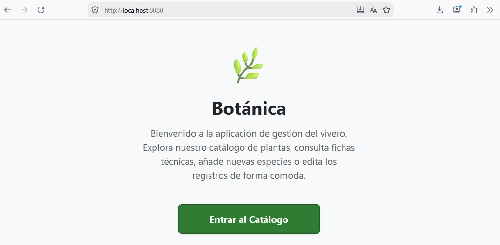


- Listado de plantas

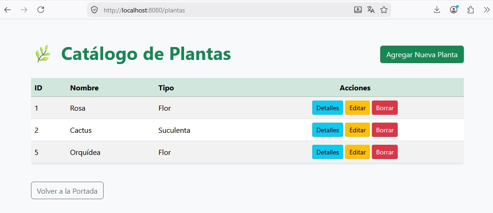


- Formulario para añadir una planta nueva

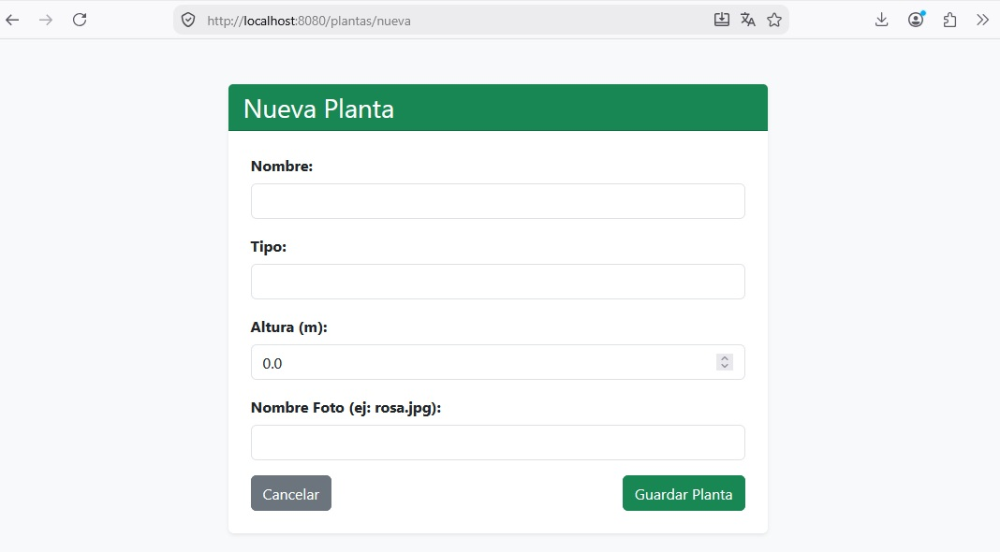


- Detalles de una planta existente

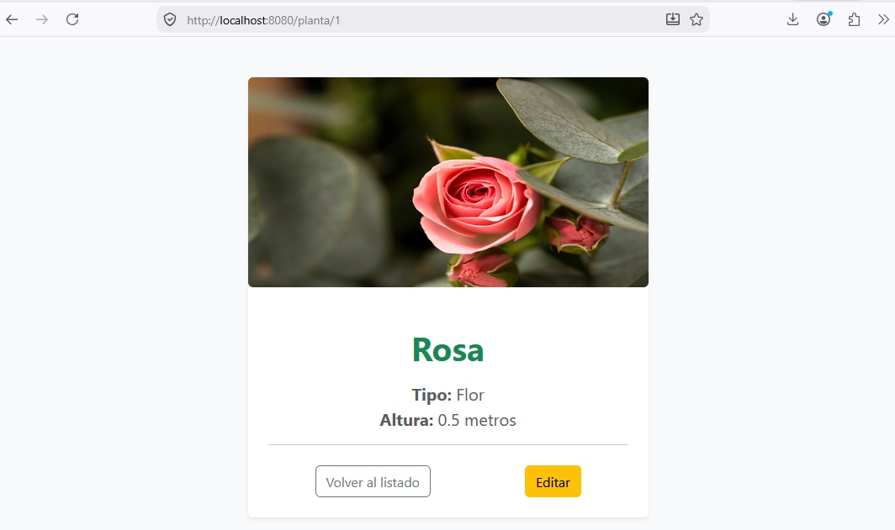


- Formulario para modificar la información de una planta existente

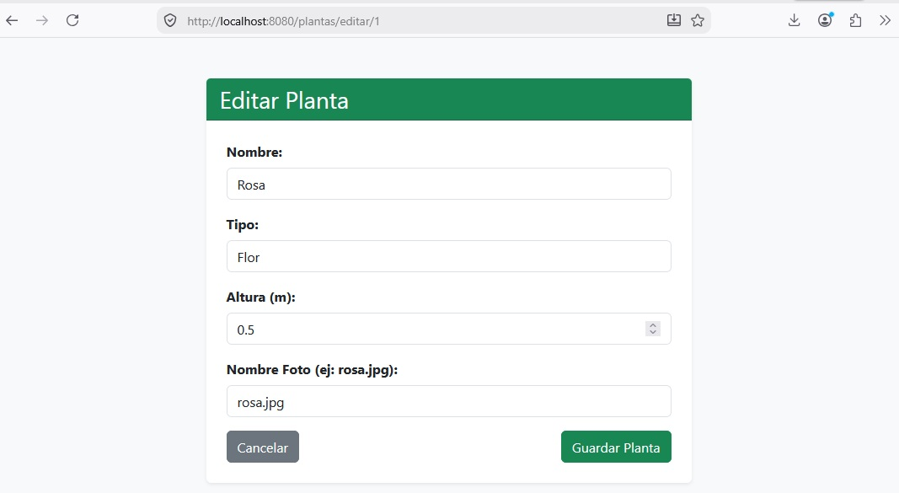


- Mensaje de confirmación de borrado de una planta

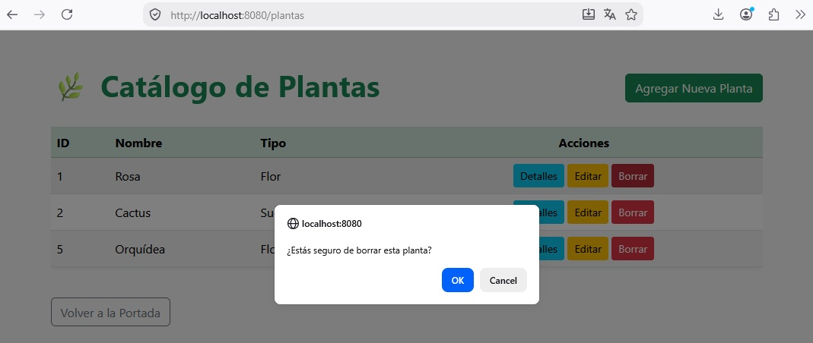


!!! success "Prueba y analiza el ejemplo"
    Prueba el código del ejemplo y verifica que el comportamiento es correcto.


!!! example "Autoevaluación"

    **Pregunta 9: En nuestro `PlantaRepository.kt` declaramos la variable `private val plantas = mutableListOf(...)` en memoria. ¿Cuál será el ciclo de vida de los datos almacenados (plantas añadidas, editadas o borradas) utilizando este enfoque?**

    A) Los datos permanecerán activos únicamente mientras la aplicación web esté ejecutándose. Si reiniciamos el servidor en IntelliJ, todos los cambios se perderán y la lista volverá a su estado inicial.
    
    B) Spring Boot guarda de manera automática la lista mutable en una base de datos relacional oculta en el disco duro, de modo que los cambios se conservan permanentemente entre reinicios.
    
    C) Los datos se perderán de forma inmediata cada vez que el usuario cierre la pestaña activa de su navegador web, pero se mantendrán intactos si detenemos y arrancamos de nuevo el servidor en IntelliJ.
    
    D) Kotlin almacena los objetos de tipo `Planta` en la memoria caché global de la JVM para siempre, por lo que los datos persistirán indefinidamente de forma nativa sin necesidad de recurrir a archivos o bases de datos externas.

    ??? quote "Solución"
    
        ✅ A) El repositorio almacena la lista mutable en la memoria RAM (volátil) del ordenador donde corre el servidor. Al detener el proceso de ejecución, esa memoria se libera. Al arrancar de nuevo la aplicación, la variable se inicializa desde cero con los tres registros declarados de forma predeterminada en el código.
        
        ❌ B) Spring Boot no asume decisiones de persistencia física de forma automática a menos que configuremos un motor de base de datos o almacenamiento en ficheros de manera explícita en nuestro proyecto. La lista mutable del repositorio reside exclusivamente en memoria.
        
        ❌ C) El ciclo de vida de la memoria RAM del servidor de Spring es independiente al navegador del cliente. Cerrar el navegador no borra los datos en memoria del servidor; solo se pierden si el proceso de IntelliJ se apaga o se detiene.
        
        ❌ D) Aunque la JVM gestiona los objetos en memoria mediante su recolector de basura, no existe ningún mecanismo de persistencia nativa e inmutable en Kotlin para las variables locales una vez finaliza el hilo de ejecución de la aplicación.


    **Pregunta 10: La clase `PlantaService` declara en su constructor la variable `private val repository: PlantaRepository`. ¿Cómo recibe el servicio la instancia de este repositorio para poder hacer uso de sus métodos?**

    A) Kotlin genera de forma implícita un bloque de inicialización `init` donde hace una llamada directa al constructor `PlantaRepository()` para crear la instancia que necesita el servicio.
    
    B) Spring Boot detecta que la clase `PlantaRepository` tiene la anotación `@Repository` y se encarga de inyectar automáticamente la instancia creada en el constructor del servicio al inicializar la aplicación.
    
    C) El servidor web Tomcat busca archivos con el nombre `PlantaRepository` en el disco duro de la máquina y carga sus métodos dinámicamente utilizando reflexión avanzada de Java.
    
    D) Es necesario que el controlador instancie de forma explícita ambas clases en su código y las vincule llamando manualmente a un método de asignación o de tipo *setter*.

    ??? quote "Solución"
    
        ❌ A) Aunque Kotlin genera automáticamente el mapeo del constructor primario, no realiza ninguna creación de objetos de clases externas por su cuenta si no se lo ordenamos. Es el framework de Spring el encargado de gestionar las instancias.
        
        ✅ B) Este comportamiento es el núcleo de la Inyección de Dependencias (DI) de Spring. Al marcar la clase con `@Repository`, se registra como un componente (*bean*) administrado por el contenedor del framework. Al iniciar, Spring busca el constructor de `PlantaService` y, al comprobar que requiere un `PlantaRepository`, le asocia e inyecta de manera transparente la instancia que ya tiene gestionada.
        
        ❌ C) El servidor Tomcat se encarga exclusivamente de resolver las conexiones de red HTTP y hospedar la aplicación, pero es totalmente ajeno a las dependencias internas de las clases de Kotlin o Spring.
        
        ❌ D) Uno de los propósitos principales de utilizar Spring Boot es evitar que tengamos que instanciar manualmente las dependencias en cascada (usando `new` o constructores manuales), logrando un diseño de bajo acoplamiento entre capas.


    **Pregunta 11: En el controlador, el método `guardarPlanta` procesa el formulario mediante `@PostMapping` y devuelve la cadena `"redirect:/plantas"`. ¿Cuál es la razón técnica de realizar una redirección tras guardar datos en lugar de cargar la vista del listado directamente?**

    A) Thymeleaf no admite el procesamiento de formularios de tipo POST si no se le redirige obligatoriamente a una página estática del directorio `static/`.
    
    B) Se utiliza para forzar al sistema de persistencia en memoria a realizar un vaciado preventivo de la memoria RAM de la JVM antes de que el usuario vuelva a listar los elementos.
    
    C) La redirección es un paso obligatorio en Spring MVC para evitar que el navegador web lance un error interno de protocolo HTTP 500 al recibir peticiones que no sean GET.
    
    D) Aplica el patrón de desarrollo "Post-Redirect-Get" (PRG) para evitar que, si el usuario refresca la página (F5) en su navegador, se vuelva a enviar el formulario de forma accidental y se duplique la acción de guardado en la aplicación.

    ??? quote "Solución"
    
        ❌ A) Thymeleaf puede procesar cualquier tipo de redirección o plantilla dinámica de forma exitosa. Las páginas de la carpeta `static/` son estáticas y no procesan datos de servidor, por lo que redirigir allí rompería el flujo dinámico de la web.
        
        ❌ B) El almacenamiento en memoria de la lista mutable se gestiona de forma directa en Kotlin y no guarda relación con la lógica de redirecciones de las cabeceras HTTP que gestiona el navegador del usuario.
        
        ❌ C) Spring MVC permite responder a una petición POST cargando un HTML directamente sin necesidad de redirigir. No se produce ningún error de protocolo, pero se introduce una mala experiencia de usuario y fallos potenciales en el estado de los datos.
        
        ✅ D) El patrón PRG es una buena práctica del desarrollo web clásico. Si tras un envío de formulario (POST) el servidor responde cargando el HTML del listado de forma directa, la URL activa del navegador del usuario seguirá siendo la del formulario de envío. Si el usuario pulsa F5 para recargar la página, el navegador repetirá la petición POST, provocando que los datos se guarden dos veces (creando una planta duplicada). Al responder con una redirección a una petición GET (`redirect:/plantas`), la barra de direcciones cambia y el refresco de pantalla es totalmente seguro.


    **Pregunta 12: En la ruta `@GetMapping("/planta/{id_planta}")`, ¿cuál es la función de la anotación `@PathVariable` en el parámetro `id_planta: Int` de la función de nuestro controlador?**

    A) Extrae el valor numérico escrito directamente en ese segmento dinámico de la URL de la petición para poder buscar la planta correspondiente a través del servicio.
    
    B) Lee un parámetro oculto en el cuerpo de la petición que ha sido transmitido mediante el envío de un formulario de tipo POST.
    
    C) Declara una variable local temporal dentro del motor de Thymeleaf para poder marcar visualmente la fila de la tabla seleccionada por el usuario.
    
    D) Indica a Spring Boot que el parámetro de la ruta es opcional y que, en caso de que no se especifique, debe cargarse por defecto un valor de tipo nulo.

    ??? quote "Solución"
    
        ✅ A) La anotación `@PathVariable` asocia una variable dinámica delimitada por llaves en la ruta de red (en este caso, `{id_planta}`) con un parámetro de la función de Kotlin. Si un usuario accede a `/planta/2`, Spring Boot extrae el carácter `"2"`, realiza la conversión de tipo a un valor entero (`Int`) y se lo proporciona al método para que podamos buscar la planta con id 2 en el listado.
        
        ❌ B) Para leer parámetros del cuerpo de una petición enviados por un formulario se utilizan anotaciones de tipo `@ModelAttribute` o `@RequestParam`, ya que esos datos viajan estructurados en la petición HTTP y no expuestos en la dirección URL.
        
        ❌ C) La anotación `@PathVariable` pertenece de forma exclusiva al controlador del lado de servidor de Spring Boot, no teniendo ninguna validez ni funcionalidad dentro del código HTML de la vista del cliente.
        
        ❌ D) Los parámetros de ruta marcados como `@PathVariable` son requeridos de forma estricta por el enrutador de Spring Boot para que la petición coincida con el controlador. Si se omite el parámetro en la URL, el servidor responderá con una pantalla de error 404 (recurso no encontrado).


    **Pregunta 13: En el archivo `formPlanta.html`, la etiqueta de formulario declara `th:object="${planta}"` y las etiquetas de entrada usan la sintaxis `th:field="*{nombre}"`. ¿Qué función realiza el símbolo de asterisco (`*`) en la expresión del campo?**

    A) Indica a Thymeleaf que la variable pertenece a una tabla relacional mapeada en una base de datos externa de persistencia permanente.
    
    B) Actúa como una expresión de selección atajo ("selection expression") para evaluar la propiedad de forma relativa con respecto al objeto vinculado al formulario en `th:object`.
    
    C) Sirve para indicarle al navegador que el campo del formulario es de carácter obligatorio y debe validarse antes de realizar el envío de los datos.
    
    D) Es un operador comodín que realiza una búsqueda recursiva para localizar propiedades con ese nombre en cualquier clase del modelo del proyecto.

    ??? quote "Solución"
    
        ❌ A) Thymeleaf es un motor de renderizado de vistas y desconoce por completo la existencia de tablas relacionales o de bases de datos. El asterisco es una sintaxis de enlace de datos orientada exclusivamente a la visualización de datos en el cliente.
        
        ✅ B) En las plantillas de Thymeleaf, la expresión con asterisco (`*{...}`) se utiliza para evaluar propiedades con respecto a un objeto previamente seleccionado (el objeto declarado en la etiqueta superior mediante `th:object="${planta}"`). Escribir `th:field="*{nombre}"` es una forma simplificada y limpia de escribir `th:field="${planta.nombre}"`, lo cual ahorra código y previene errores al manejar formularios con muchos campos.
        
        ❌ C) La validación y obligatoriedad de los campos de entrada de un formulario en HTML se configura mediante el atributo estándar `required` de las etiquetas de entrada de HTML5, no afectando el uso de un asterisco en Thymeleaf a esta validación.
        
        ❌ D) Thymeleaf requiere que las propiedades existan de forma explícita dentro del objeto vinculado. No realiza búsquedas con comodines ni asocia variables de forma ambigua por motivos de seguridad y tipado.


    **Pregunta 14: En el formulario de la plantilla `formPlanta.html`, incluimos el campo oculto `<input type="hidden" th:field="*{id_planta}">`. ¿Qué comportamiento se produciría al intentar guardar los cambios de una planta existente si eliminásemos este campo del formulario?**

    A) Los datos de la planta se guardarían correctamente en el listado pero el sistema los archivaría en un fichero temporal en disco de forma automática.
    
    B) Se producirá un error de compilación inmediato en la plantilla de Thymeleaf porque el formulario exige que todas las variables del modelo estén visibles en pantalla.
    
    C) El navegador web bloquearía la petición por motivos de seguridad al detectar un desajuste de propiedades entre las etiquetas HTML y el modelo de Kotlin.
    
    D) El repositorio interpretaría el envío como la inserción de una planta totalmente nueva (al recibir un ID cero o nulo) y crearía un registro duplicado en lugar de actualizar el existente.

    ??? quote "Solución"
    
        ❌ A) El repositorio no realiza archivados automáticos en ficheros temporales si se le omite el identificador de los objetos en la petición de guardado.
        
        ❌ B) Thymeleaf no restringe la visibilidad de los atributos de un objeto en pantalla. Podemos omitir la representación visual de tantas propiedades como queramos en la plantilla sin que el compilador del motor proteste por ello.
        
        ❌ C) Los navegadores web procesan los formularios de forma estándar sin auditar de manera inteligente el tipado o consistencia lógica de las clases de Kotlin del servidor.
        
        ✅ D) El ID de la planta es la clave para diferenciar una operación de creación de una de actualización. Al editar una planta, necesitamos que viaje su ID original de forma transparente. Como es un campo de tipo `hidden`, el usuario no lo ve en la pantalla, pero viaja incrustado en los datos de la petición POST. Al omitir este campo, el objeto llega al controlador con su identificador por defecto (cero), lo que provoca que el método `save` del repositorio asuma que es una planta nueva, asignándole un nuevo ID secuencial y duplicándola en el listado en lugar de modificar la existente.


    **Pregunta 15: En la plantilla HTML `plantas.html`, utilizamos la línea `<tr th:each="planta : ${plantas}">`. ¿Qué representa exactamente la variable de contexto `${plantas}` (con el símbolo `$`) y de dónde procede su información?**

    A) Es una variable local declarada directamente en la propia plantilla HTML mediante una función de Javascript que inicia el bucle sobre la tabla de la página.
    
    B) Es una ruta de red física que apunta al archivo `Planta.kt` del modelo para indicar a Thymeleaf qué tipo de objeto debe instanciar en cada fila.
    
    C) Es el atributo que el controlador añadió previamente al modelo mediante la instrucción `model.addAttribute("plantas", ...)` antes de llamar y devolver la vista.
    
    D) Es una palabra clave reservada de Thymeleaf que hace referencia automática a cualquier estructura de tipo lista que se encuentre declarada dentro del repositorio.

    ??? quote "Solución"
    
        ❌ A) Thymeleaf es un motor de plantillas de servidor. La expresión `${plantas}` se resuelve e interpreta en el servidor de Spring Boot antes de enviar el archivo al navegador, por lo que no es una variable del lado del cliente ni de Javascript.
        
        ❌ B) La expresión `${}` no hace referencia a rutas físicas de archivos de Kotlin ni a imports de clases, sino a variables de datos que han sido depositadas explícitamente en el mapa de contexto de la vista.
        
        ✅ C) La interfaz `Model` de Spring actúa como una caja de transporte de información. Cuando el método de nuestro controlador ejecuta `model.addAttribute("plantas", plantaService.listarPlantas())`, guarda la lista de objetos bajo la clave de texto `"plantas"`. Thymeleaf recupera esa variable mediante su lenguaje de expresiones para poder pintar las filas de la tabla dinámicamente.
        
        ❌ D) Thymeleaf no tiene conexión directa con la capa de datos (Repository). No puede leer variables de Kotlin que no hayan sido transferidas de forma voluntaria a la capa de presentación mediante el objeto `Model` del controlador.


    **Pregunta 16: En nuestro diseño arquitectónico por capas, el controlador llama de forma indirecta al repositorio a través de la capa `PlantaService`. Si en este ejemplo el servicio se limita a delegar las funciones directamente al repositorio, ¿por qué es una buena práctica de diseño mantener esta capa intermedia?**

    A) Porque es una restricción técnica obligatoria de la JVM de Java para poder compilar de forma segura proyectos basados en Spring MVC.
    
    B) Porque de este modo se permite que el controlador se conecte con los archivos físicos del disco duro sin tener que pasar por las clases del modelo.
    
    C) Porque desacopla el controlador del acceso directo a los datos, permitiendo añadir en el futuro reglas de negocio (validaciones, seguridad o transacciones) sin tener que alterar el controlador ni las vistas.
    
    D) Porque mejora drásticamente el rendimiento de lectura del servidor al almacenar en segundo plano las peticiones de listados en una cola de la base de datos.

    ??? quote "Solución"
    
        ❌ A) No existe ninguna limitación en Java o Kotlin que impida a un controlador llamar directamente a un repositorio si se desea hacer. La separación en capas es una decisión de arquitectura de diseño de software voluntaria para crear sistemas limpios.
        
        ❌ B) La capa de servicio es de lógica de negocio y no tiene relación directa con el sistema de archivos del sistema operativo. De hecho, el acceso físico a los datos sigue siendo responsabilidad del repositorio.
        
        ✅ C) La capa de servicio (Service) es la propietaria legítima de las reglas de negocio de nuestra aplicación. Mantener esta capa intermedia, incluso en fases iniciales donde solo delega funciones de forma directa, nos garantiza una arquitectura limpia y escalable. Si en el futuro decidimos que no se permiten plantas con alturas negativas o que solo los usuarios administradores pueden borrar registros, implementaremos esa lógica en el servicio de forma centralizada sin tocar el controlador ni alterar la interfaz web.
        
        ❌ D) La capa de servicio no gestiona cachés de red ni colas de mensajes del servidor web por sí misma. El rendimiento del servidor Tomcat se mantiene idéntico independientemente del número de capas lógicas definidas en el backend.


Llegados a este punto, tenemos una aplicación web con un CRUD completamente operativo. Pero, como ya vimos en el RA1, almacenar la información directamente en la memoria RAM no es una solución para la mayoría de aplicaciones que requieren persistencia de datos. Por tanto el siguiente paso sería modificar la aplicación para guardar la información de las plantas en un fichero CSV.

En una aplicación mal diseñada, habría que modificar el controlador, las vistas HTML y las rutas de red para adaptarlas a la lectura de archivos. Pero en nuestra aplicación:

1.  El **Controlador** (`PlantaController`) solo sabe que le pide datos a la capa de **Servicio**.
2.  La capa de **Servicio** (`PlantaService`) solo sabe que solicita guardar o listar plantas a la capa de **Repositorio**.

Esto significa que si sustituimos la información en memoria por un archivo físico:

-   **¡No tendremos que modificar ni una sola línea de código en nuestro Controlador!**
-   **¡No tendremos que tocar ninguna de nuestras plantillas HTML de Thymeleaf!**

Toda nuestra interfaz de usuario y nuestras rutas de red seguirán funcionando exactamente igual. Solo necesitaremos programar una nueva versión de nuestro **Repositorio** que lea y escriba en disco.


!!! warning "Reto 1: CRUD con Spring MVC y Thymeleaf sobre un CSV"
   
    El trabajo a realizar por cada equipo es el siguiente:

    1. Crear un nuevo proyecto utilizando Spring Initializr con las mismas dependencias que el `Ejemplo 2`.
    2. Guardar el archivo `.csv` que se utilizó en el RA1 en la carpeta de recursos (`src/main/resources/data/`). 
    3. Modificar el repositorio para que use las librerías de lectura y escritura de archivos de Kotlin (`java.io.File`) para:
        -   **Leer el CSV** y transformarlo en una lista de objetos cuando se solicite listar.
        -   **Escribir en el CSV** volcando toda la lista cada vez que se cree, edite o borre un registro.
    4. Modificar el servicio para que, en lugar de recibir el repositorio de memoria, reciba el nuevo repositorio de archivos.
    5. Utilizar Bootstrap para que el estilo del proyecto quede totalmente diferente del `Ejemplo 2`.  


!!! danger "Entrega"

    Sigue las instrucciones disponibles en la tarea de Aules. 


---
<span class="mi_h3">Autoría</span>

<span class="mi_autoria">
Obra realizada por Begoña Paterna Lluch. Publicada bajo licencia [Creative Commons Atribución/Reconocimiento-CompartirIgual 4.0 Internacional](https://creativecommons.org/licenses/by-sa/4.0/)
</span>
---