# DBeaver

Revisiones

| Revisión | Fecha      | Descripción                                 |
|----------|------------|---------------------------------------------|
| 1.0      | 11-10-2025 | Adaptación de los materiales a markdown     |
| 1.1      | 13-08-2026 | Ampliación con sección de conexión a SQLite |

Introducción

**DBeaver** es una herramienta gráfica y gratuita que permite gestionar múltiples bases de datos de forma visual. Algunas de las acciones que podemos realizar con esta herramienta son las siguientes:

- Explorar la estructura de la base de datos (tablas, vistas, claves, relaciones…).

- Consultar datos.

- Modificar tablas, añadir registros o ejecutar scripts SQL sin salir del proyecto.

- Probar consultas antes de implementarlas en el programa.

## Conexión a SQLite

Los siguientes pasos ilustran como conectar a una BD llamada **florabotanica.sqlite** ubicada en la carpeta `datos` dentro de la raíz de nuestro proyecto:

- Hacer clic en el botón **Nueva conexión** (ícono de enchufe) o ir al menú `Archivo > Nueva conexión`.

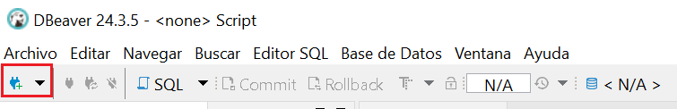

- Seleccionar el tipo de base de datos **SQlite** y pulsar **Siguiente**.

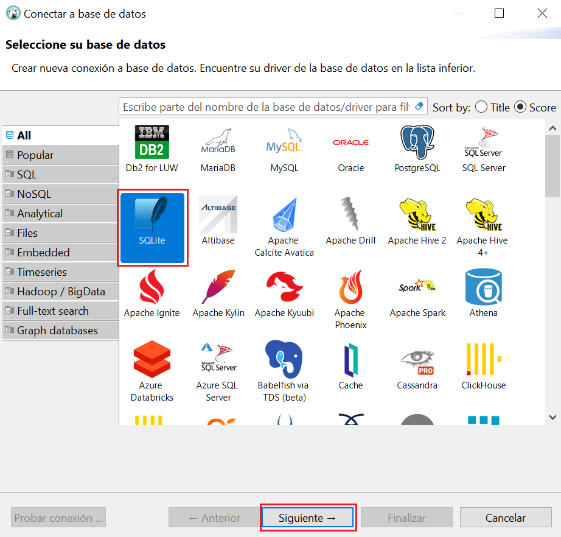

- Introducir la ruta de la BD y hacer clic en el botón *probar conexión*

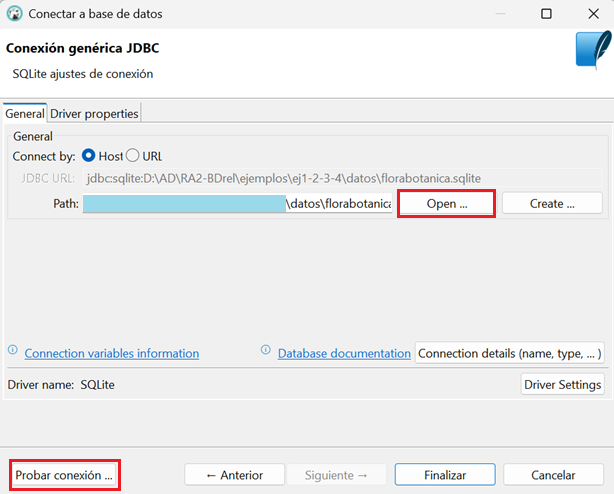

Si todo está correcto, aparecerá un mensaje de éxito.  

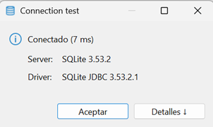

Si DBeaver necesita un controlador (driver), ofrecerá su descarga automáticamente.
    
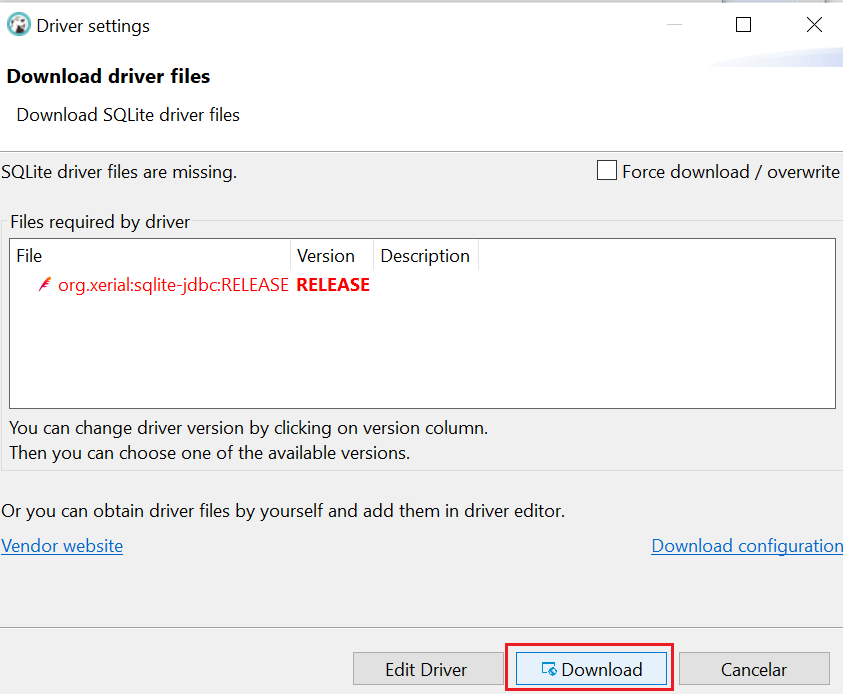

Si la descarga falla, descargar el archivo **sqlite-jdbc-3.50.3.0.jar** manualmente desde https://github.com/xerial/sqlite-jdbc/releases y editar el driver para añadirlo:

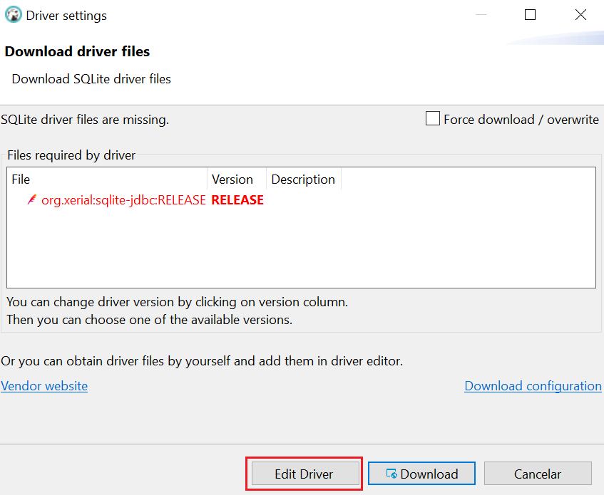

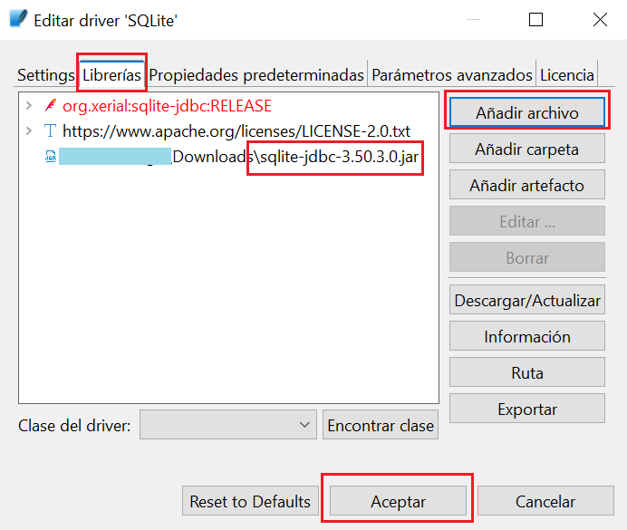

- Hacer clic en **Finalizar*. La nueva conexión aparecerá en el panel lateral izquierdo.  
Desde allí puedes realizar operaciones como, por ejemplo, visualizar datos (tablas, vistas, funciones y procedimientos), ejecutar sentencias SQL, operar con registros (consultar y modificar) o exportar datos en distintos formatos.

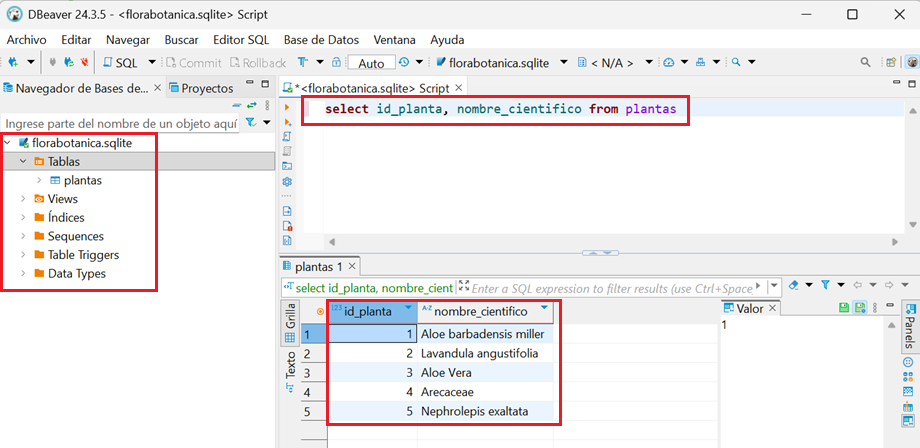

## Conexión a MySQL

Los siguientes pasos ilustran como conectar a una BD *MySQL*:

- Hacer clic en el botón `Nueva conexión` (ícono de enchufe) o entrar al menú `Archivo > Nueva conexión`

- Seleccionar `MySQL` y pulsar en el botón `Siguiente`

- Indicar los datos del `servidor`, `usuario` y `contraseña`. Para ver todas las bases de datos a las que el usuario puede acceder marcar la casilla `Show all database`y no indicar nada en la casilla `database` 

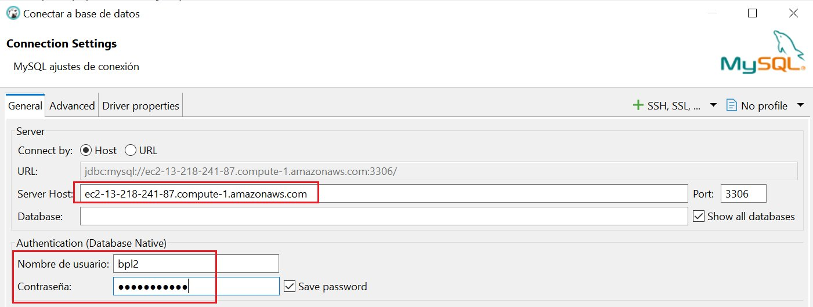

> Si aparece `Error "Public Key Retrieval is not allowed"` hacer clic con el botón derecho en la conexión y seleccionar `Editar conexión` luego ir a la pestaña `Driver Properties` y cambiar la propiedad `allowPublicKeyRetrieval` a `TRUE` (por defecto está a `false`). Por último hacer clic en el botón `Aceptar`.
> 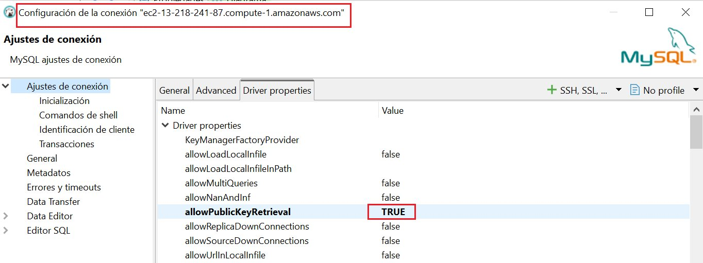

        

- Una vez conectado se visualizarán las bases de datos del servidor:

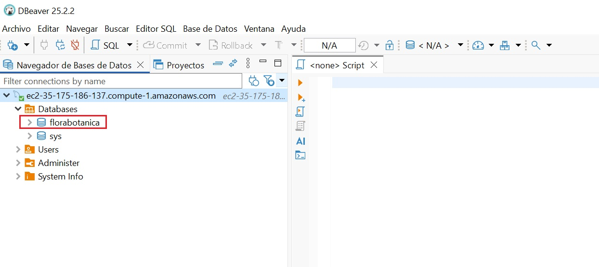

Ver funciones y procedimientos almacenados

Para poder ver el código de una función o un procedimiento almacenado en nuestra BD seguir estos pasos:

- Desplegar el apartado Procedures de la BD.

- Hacer clic con el botón derecho sobre la función o procedimiento, entrar en `Generar SQL` y luego en `DDL`.

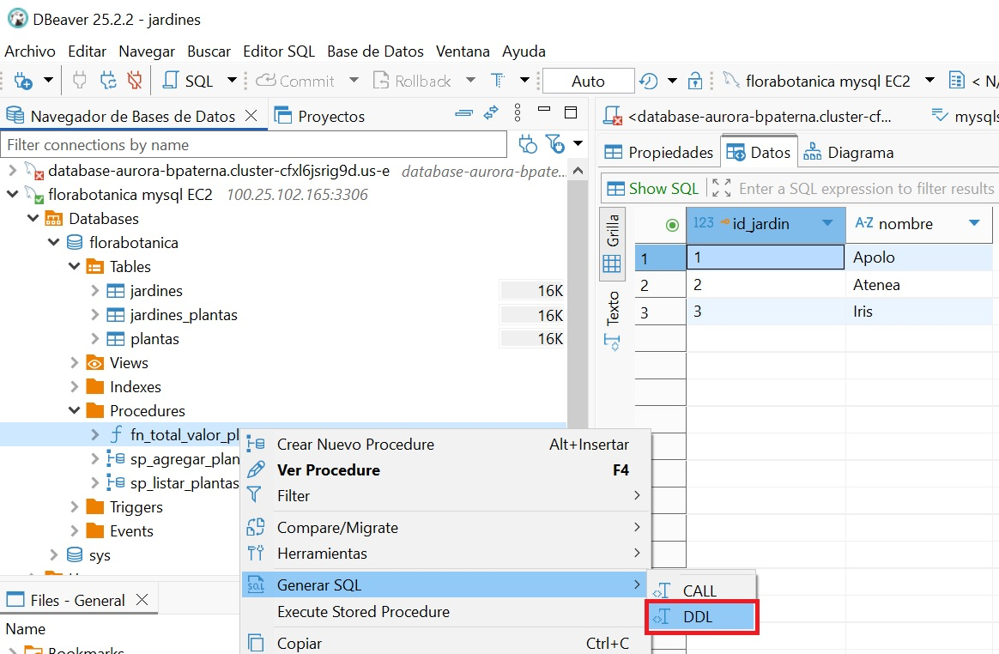

El código de la fución o procedimiento aparecerá en una ventana nueva.

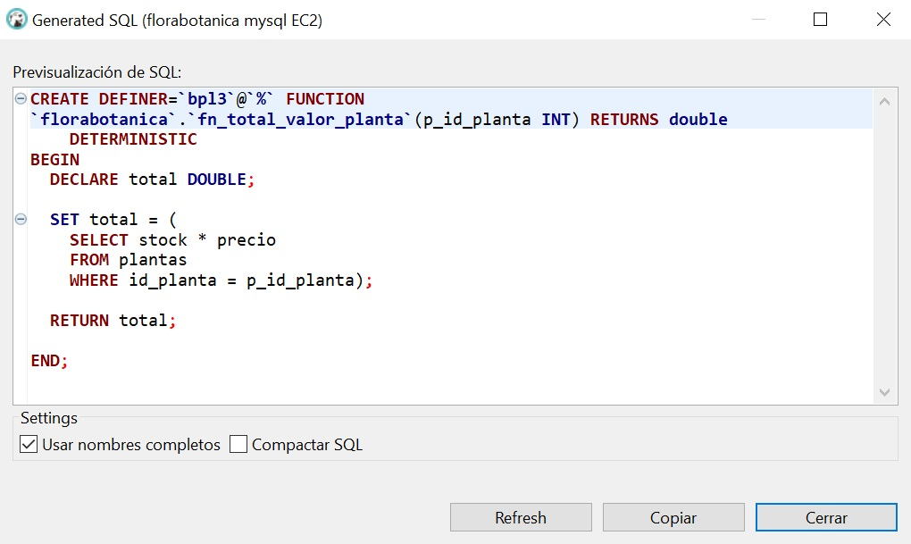

---

Autoría

Obra realizada por Begoña Paterna Lluch. Publicada bajo licencia [Creative Commons Atribución/Reconocimiento-CompartirIgual 4.0 Internacional](https://creativecommons.org/licenses/by-sa/4.0/)

---
