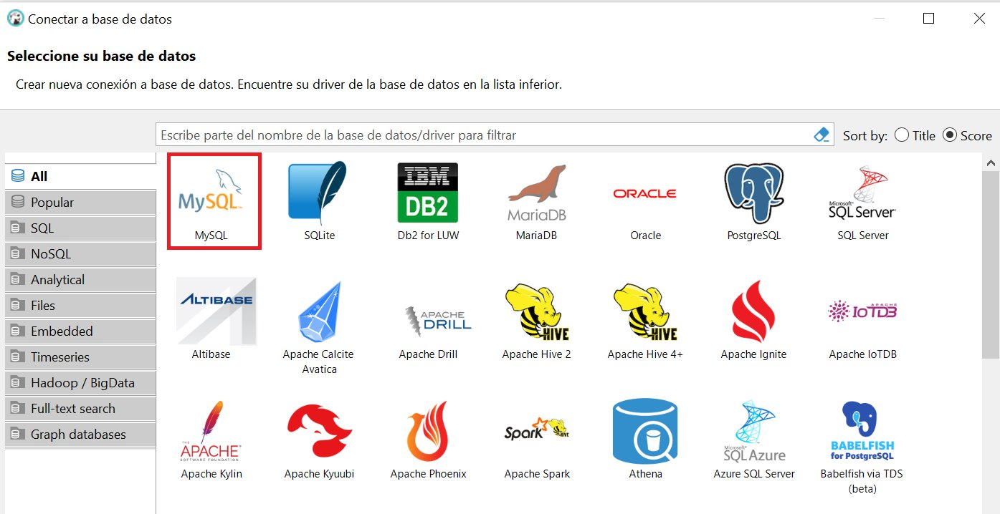
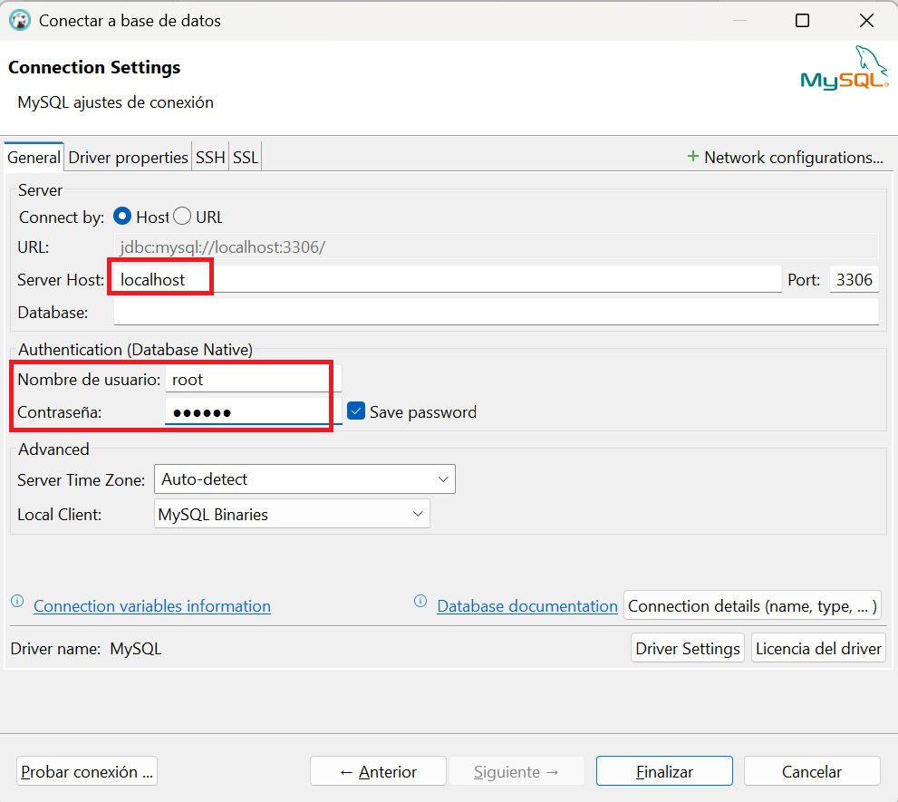
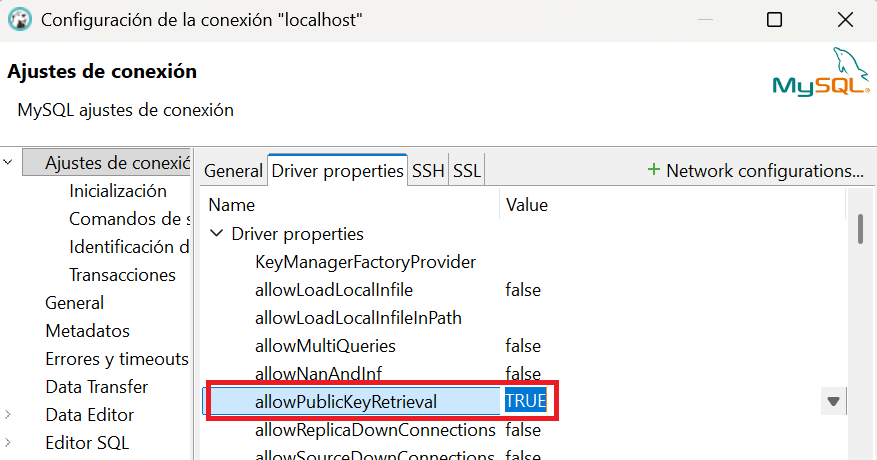
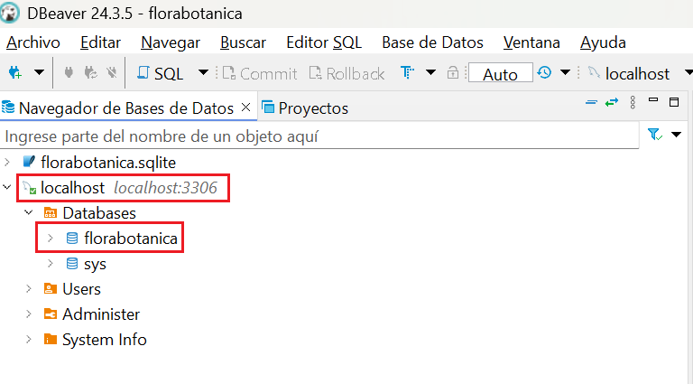
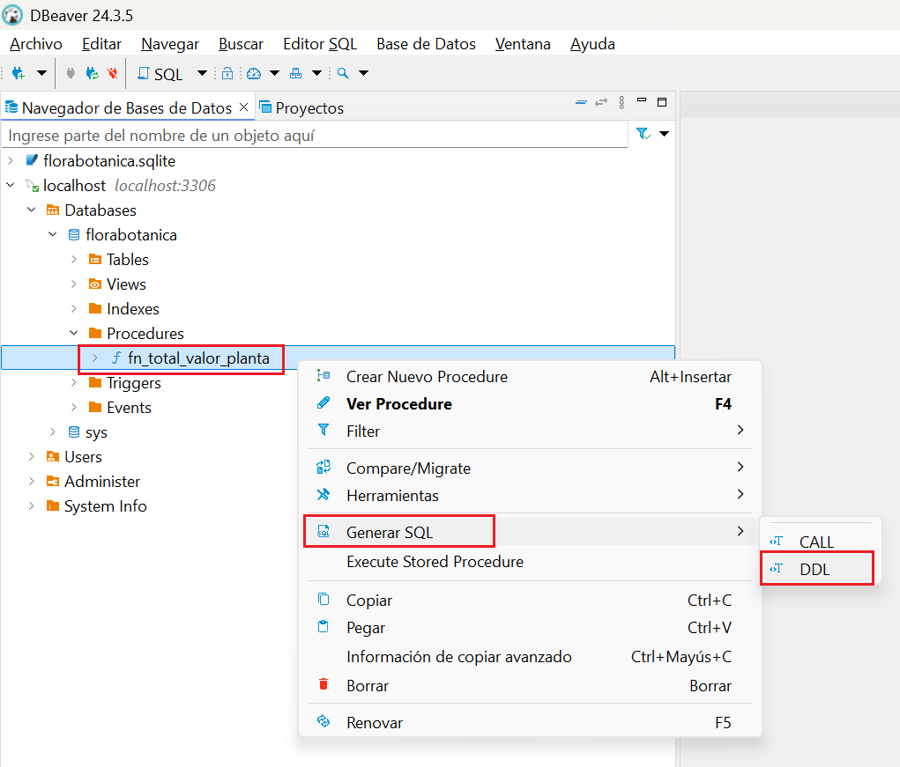
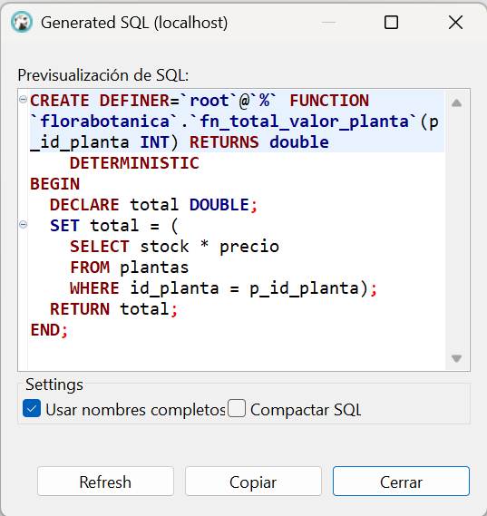
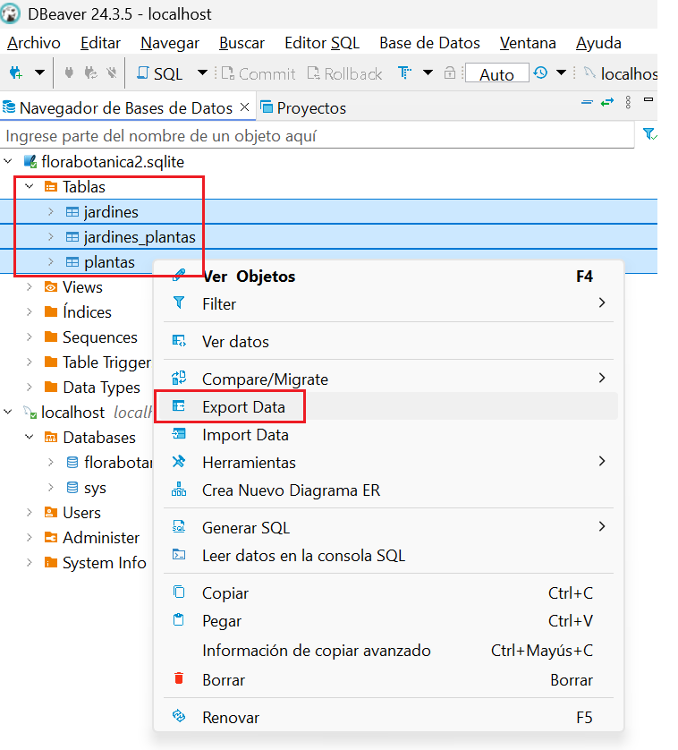
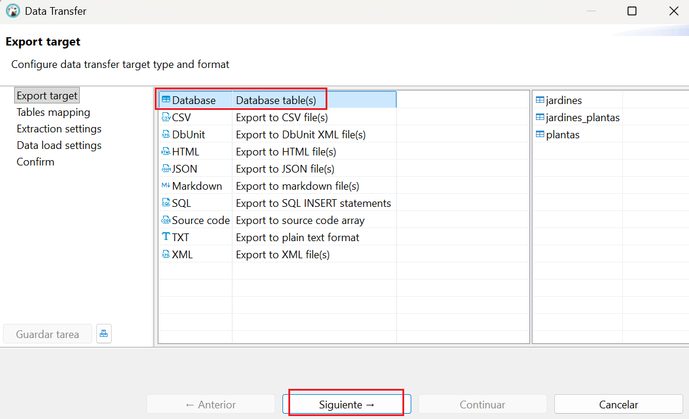
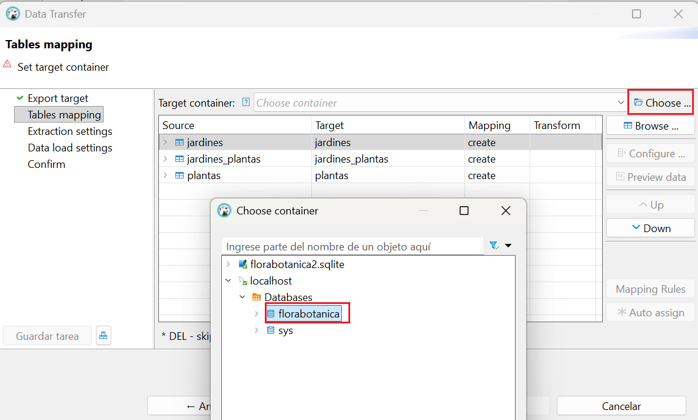
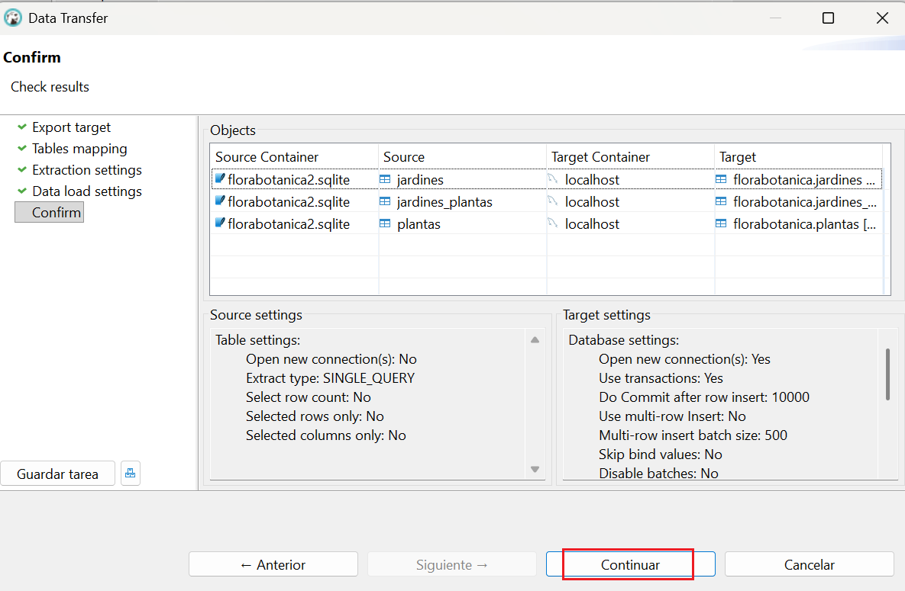

# DBeaver

Revisiones

| Revisión | Fecha      | Descripción                                 |
|----------|------------|---------------------------------------------|
| 1.0      | 11-10-2025 | Adaptación de los materiales a markdown     |
| 1.1      | 14-08-2026 | Ampliación con sección de conexión a SQLite |

Introducción

**DBeaver** es una herramienta gráfica y gratuita que permite gestionar múltiples bases de datos de forma visual. Algunas de las acciones que podemos realizar con esta herramienta son las siguientes:

- Explorar la estructura de la base de datos (tablas, vistas, claves, relaciones…).
- Consultar datos.
- Modificar tablas, añadir registros o ejecutar scripts SQL.
- Probar consultas antes de implementarlas en el programa.
- Exportar datos en distintos formatos.

## Conexión a SQLite

Los siguientes pasos muestran como conectar a una BD llamada **florabotanica.sqlite**:

- Hacer clic en el botón **Nueva conexión** (enchufe) o ir al menú *Archivo > Nueva conexión*:

- Seleccionar **SQlite** y pulsar **Siguiente**:

- Introducir la ruta de la BD y hacer clic en el botón **probar conexión**:

Si todo está correcto, aparecerá un mensaje de éxito:

> Si DBeaver necesita un controlador (driver), ofrecerá su descarga automáticamente (hacer clic en el botón **Download**):
> 
>
> Si la descarga falla, harrá que descargar el archivo **sqlite-jdbc-3.50.3.0.jar** manualmente desde https://github.com/xerial/sqlite-jdbc/releases y editar el driver para añadirlo:
> 
> 

- Una vez la prueba de conexión sea satisfactoria, cerrar el mensaje y hacer clic en el botón **Finalizar**. La nueva conexión aparecerá en el panel lateral izquierdo y podremos trabajar sobre la BD:

## Conexión a MySQL

Los siguientes pasos muestran como conectar a una BD **MySQL**:

- Hacer clic en el botón **Nueva conexión** (enchufe) o ir al menú *Archivo > Nueva conexión*:

- Seleccionar **MySQL** y pulsar en el botón **Siguiente**:

- Indicar los datos del `servidor`, `usuario` y `contraseña`. Para ver todas las bases de datos a las que el usuario puede acceder marcar la casilla `Show all database`y no indicar nada en la casilla `database`:

> Si aparece `Error "Public Key Retrieval is not allowed"` hacer clic con el botón derecho en la conexión y seleccionar **Editar conexión** luego ir a la pestaña **Driver Properties** y cambiar la propiedad `allowPublicKeyRetrieval` a `TRUE` (por defecto está a `false`). Por último hacer clic en el botón **Aceptar**:
> 

- Una vez conectado se visualizarán las BD del servidor a las que el usuario indicado en la conexión tiene acceso:

Ver funciones y procedimientos almacenados

Para poder ver el código de una función o un procedimiento almacenado en nuestra BD MySQL seguir estos pasos:

- Desplegar el apartado Procedures de la BD.

- Hacer clic con el botón derecho sobre la función o procedimiento, entrar en `Generar SQL` y luego en `DDL`:

El código de la fución o procedimiento aparecerá en una ventana nueva:

## Migrar SQLite a MySQL

DBeaber permite migrar de forma rápida las tablas de nuestra BD SQLite y la información que contienen a una BD MySQL, a continuación se describen los pasos a seguir:

1. Crear ambas conexiones, a la BD SQLite y también al servidor MySQL.
2. En el panel izquierdo, hacer clic derecho sobre la BD SQLite (o seleccionar las tablas que se quieran migrar) y elige Exportar datos (Export Data).

3. En el asistente de exportación, seleccionar **Base de datos** como destino y hacer clic en el botón  `Siguiente`.

4. Elige la conexión de la BD MySQL como destino.

5. Hacer clic en el botón `Siguiente` varias veces hasta llegar a la pantalla final y en ella hacer clic en el botón `Continuar`. Espera a que termine el proceso de crear las tablas con los tipos de datos equivalentes en MySQL y transferir la información.

---

Autoría

Obra realizada por Begoña Paterna Lluch. Publicada bajo licencia [Creative Commons Atribución/Reconocimiento-CompartirIgual 4.0 Internacional](https://creativecommons.org/licenses/by-sa/4.0/)

---
